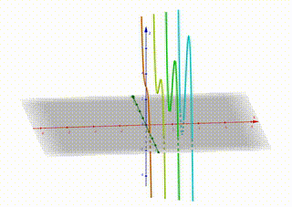

## 最速降线
以最速降线为例：一个小球从 $A$ 点$(x_1, y_1)$ 移动到 $B$ 点 $(x_2, y_2)$，它耗时最少的路径是怎么样的？不妨设 $(x_1,y_1)$ 为 $(0,0)$ 点，记为 A 点，

首先，我们求当小球位于 $(x,y)$ 时，它的位移微分：

$$
ds = \sqrt{(dx)^2+(dy)^2}
$$

其次，我们求当小球位于 $(x,y)$ 时，它的速度：

$$
\frac{1}{2} mv^2 = mg \delta h
$$

$$
v = \sqrt{2gh} = \sqrt{2g(y-y_1)} = \sqrt{2gy}
$$

所以，我们求当小球位于 $(x,y)$ 时，走过 `ds` 所需的时间：

$$
dt = \frac{ds}{v} = \frac{\sqrt{(dx)^2+(dy)^2}}{\sqrt{2gy}}
$$

提取出分子里的 $dx$ 可得：

$$
dt = \frac{\sqrt{1+(\frac{dy}{dx})^2}}{\sqrt{2gy}} dx
$$

通常，我们记 $\frac{dy}{dx} = y'$，所以：

$$
dt = \frac{\sqrt{1+(y')^2}}{\sqrt{2gy}} dx
$$

所以，从 $A$ 点到 $B$ 点的总耗时是：

$$
T = \int_{0}^{T} dt = \int_{x_1}^{x_2} \frac{\sqrt{1+(y')^2}}{\sqrt{2gy}} dx
$$

先放一下，因为到这一步我们没法解下去了，怎么求 $T$？更遑论 $T$ 的最小值了。

## Euler-Lagrange Equation
### 核心思想
其实 Euler-Lagrange Equation 的核心思想就是反推。

对类似最速降线的问题，我们有什么？

1. 一个积分式子，这个积分式子代表了系统中的某种属性，例如在最速降线中，这个积分式子代表的就是 $A$ 点到 $B$ 点的时间。
2. 这个属性最终需要满足的一个条件，例如属性有最小值。

我们要求的是什么？

* $y$ 和 $x$ 之间的关系。

<!--

正常的解法是先去求这个积分方程，然后去算这个属性的最小值，可能可以，得出 $y$ 和 $x$ 的关系。

但是现在的情况是，我本身就不知道 $y$ 和 $x$ 的关系，我就求不出这个属性的最小值，求不出这个属性的最小值，我就不知道 $y$ 和 $x$ 的关系，像是“鸡生蛋，蛋生鸡”的问题。但是事实真的是这样吗？我们是不是可以

-->

这个问题很奇怪，常见的问题是：我知道 $y$ 和 $x$ 的关系，然后我求得这个属性的值。也就是第二个条件其实是常规问题的最后一步，而我们需要求的东西是常规问题的中间步骤。而第二个条件在从前向后的推导中用不上，我们就对它束手无策。那转变思路，我们是不是可以让这个最后一步向我们这个方向推进一下，从结果反地推回来。也就是说，我们转变目标，先不求这个条件的最小值，我们先求如果要满足这个属性是最小值时，我们需要达到什么条件。这就是我所说的“反推”

那么，我们再来看挡在路中间的 “$y$ 和 $x$ 之间的关系”，这是啥？我们该如何表述这种关系？就像学微积分一样，我们先从离散的点开始：

* $y_1 = f_1(x)$
* $y_2 = f_2(x)$
* $y_3 = f_3(x)$
* $y_4 = f_4(x)$
* ...

我们可以看到，这种所谓的 “$y$ 和 $x$ 之间的关系” 被我们用不同的 $f$ 的下标给区分开来了，也就是说，$x$ 映射到 $y$ 关系可以是 $f_1$, $f_2$, $f_3$, ... 我们可以记这种关系为 $f_i$，也就是

$$
y_i = f_i(x)
$$

如何理解这种奇怪的表示，来张图：

[geogebra 原始图 点我下载](./figures/f_i.ggb)

这四条曲线是
$$
z = \frac{1}{5} y^3 - x y + 3 \text{, where } x = 0,1,2,3
$$

（由于 geogebra 中只能是 z 轴作为纵轴，所以请将 图中的 $z$ 当作 $y$，图中的 $y$ 当作 $x$，图中的 $x$ 当作 $i$ ）

我们可以看到，当 $i$ 取不同值时，$y$ 和 $x$ 之间成不同的关系。这个 $i$ 其实就是多出的一个维度。

回到我们的问题，我们想知道，在 $i$ 取何值时，我们的属性（记作 $P$）可以取到极值。发现没有，除了常规的 $x$ 和 $y$ 这两个维度之外，多了两个维度，$i$ 和 $P$：随着 $i$ 的变化 $P$ 会发生变化。用数学的式子表示就是：

$$
P = g(i)
$$

很自然地，当 $i$ 取何值时，$P$ 取极值这个问题可以用求导来解，也就是：

$$
\frac{dP}{di}
$$

要求导，我们肯定得知道 $g(i)$ 的形式。

---

什么是“属性”呢？属性就像一个加权和，权重是什么呢？像是空间中的场，密布在这片空间中，不同的位置（或受其他因素影响）会有不同的属性值。当选择某一条路径时，你就会受到这条路径上的“场”的影响，最终加起来得到最后的属性。

比如，最简单的场：均匀的场，空间中每一处的加权均是 $1$ ，那么从 A 点到 B 点的属性是什么？就是 $A$ 到 $B$ 之间作一条线，然后这条线被向第三个方向整体偏移 $1$，属性就是这条曲线到 $x-y$ 平面的积分，对一个均匀的场来说，这个积分就是，曲线的长度乘以高度，什么时候积分最小？取线段时。

等于其实属性是，在路径走到 $(x,y)$ 点时，这点的属性乘以这点附近的路径微元

$$
dP = g(\ldots) ds
$$

$$
P = \int g ds
$$

就像在最速降线中，

$$
dt = \frac{1}{v}ds
$$

其中，$g = \frac{1}{v} = \frac{1}{\sqrt{2gy}}$，而 $ds$ 往往可以写成 $\sqrt{1+dy'} dx$，也就是 $ds$ 中包含了路径是怎么样的。$P$ 可以写成

$$
P = \int g(y) f(y') dx
$$

可以将 $g$ 和 $f$ 整合起来，并且以更通用的形式表示：

$$
P = \int f(y,y',y'',\ldots,x) dx
$$

---

从前文，我们可以知道 $i$ 是 $y_i$ 中的下标，它代表 $y(x)$ 取不同的表达式，所以上面的式子又可以写成

$$
P_i = \int f(y_i,y_i',y_i'',\ldots,x) dx
$$

那么 $P$ 关于 $i$ 的导数又是什么呢？

$$
\begin{aligned}
\frac{dP_i}{di}
&= \frac{d}{di} \int_{x_1}^{x_2} f(y_i,y_i',y_i'',\ldots,x) dx \\
&= \int_{x_1}^{x_2} \frac{\partial f}{ \partial y_i} \frac{dy_i}{di} + 
   \frac{\partial f}{ \partial y_i'} \frac{dy_i'}{di} + \ldots dx
\end{aligned}
$$

* 先不写二阶导往上的，
* $y_i$ 项没啥好处理的
* $\partial y_i'$ 在分母也没什么好处理的

而 $d y_i'$ 在分子可以玩些花样，它首先可以写成 $d (\frac{dy_i}{dx})$，我们再假设它的性质足够好，可以和 $\frac{d}{di}$ 互换顺序，第二项就成了

$$
\begin{aligned}
& \int_{x_1}^{x_2} \frac{\partial f}{ \partial y_i'} \frac{dy_i'}{di} dx \\
=& \int_{x_1}^{x_2} \frac{\partial f}{ \partial y_i'} \frac{d}{di} \frac{d}{dx}y_i dx \\
=& \int_{x_1}^{x_2} \frac{\partial f}{ \partial y_i'} \frac{d}{dx} \frac{d}{di} y_idx \\
=& \int_{x_1}^{x_2} \frac{\partial f}{ \partial y_i'} \frac{d}{dx} \frac{d y_i}{di}dx \\
=& \int_{A}^{B} \frac{\partial f}{ \partial y_i'} d(\frac{d y_i}{di}) \\
=& (\frac{\partial f}{ \partial y_i'} \frac{d y_i}{di})|_{A}^B -
   \int_{A}^{B} \frac{d y_i}{di} d(\frac{\partial f}{ \partial y_i'} ) \\
\end{aligned}
$$

因为，在 A，B 两点，由边界条件可知，$y_i$ 在 $i$ 方向上，是不变的，所有的 $y_i$ 都得满足经过 A，B 两点。虽然，在 $x$ 方向上 $y_i$ 的导数的确可以不为 $0$，也就是 $\frac{dy_i}{dx} \neq 0$，但 $\frac{dy_i}{di} \equiv 0$，所以第一项为 $0$

$$
\begin{aligned}
& (\frac{\partial f}{ \partial y_i'} \frac{d y_i}{di})|_{A}^B -
   \int_{x_1}^{x_2} \frac{d y_i}{di} d(\frac{\partial f}{ \partial y_i'} ) \\
=&  - \int_{x_1}^{x_2} \frac{d y_i}{di} \frac{d}{dx}(\frac{\partial f}{ \partial y_i'} ) dx\\
\end{aligned}
$$

那么原来的 $\frac{dP_i}{di}$

$$
\begin{aligned}
\frac{dP_i}{di}
&= \frac{d}{di} \int_{x_1}^{x_2} f(y_i,y_i',y_i'',\ldots,x) dx \\
&= \int_{x_1}^{x_2} \frac{\partial f}{ \partial y_i} \frac{dy_i}{di} + 
   \frac{\partial f}{ \partial y_i'} \frac{dy_i'}{di} + \ldots dx \\
&= \int_{x_1}^{x_2} \frac{\partial f}{ \partial y_i} \frac{dy_i}{di}
  - \frac{d y_i}{di} \frac{d}{dx}(\frac{\partial f}{ \partial y_i'} ) +\ldots dx\\
&= \int_{x_1}^{x_2} \frac{dy_i}{di}
   (\frac{\partial f}{ \partial y_i} 
  - \frac{d}{dx}(\frac{\partial f}{ \partial y_i'}) )
  +\ldots dx\\
\end{aligned}
$$

对于任意的 $y_i$，在 $A$ 到 $B$ 的路径中 $\frac{dy_i}{di}$ 不一定等于0，而且大部分都不等于 $0$，因为我需要 $y_i$ 之间是不同的，否则我就找不到最优解了，所以为使 $\frac{dP_i}{di}=0$，下式必须为 $0$

$$
\frac{\partial f}{ \partial y_i} - \frac{d}{dx}(\frac{\partial f}{ \partial y_i'}) 
$$

而这就是 Euler-Lagrange 方程。对于高阶项，同理可以推得：

$$
\frac{\partial f}{ \partial y_i}
- \frac{d}{dx}(\frac{\partial f}{ \partial y_i'})
+ \frac{d}{dx}\frac{d}{dx}(\frac{\partial f}{ \partial y_i''} )
- \frac{d}{dx}\frac{d}{dx}\frac{d}{dx}(\frac{\partial f}{ \partial y_i'''} )
+ \ldots
$$

### 总结一下
当路径变化时，这个系统的属性满足：

$$
P = \int f(y,y',y'',\ldots,x) dx
$$

当路径满足以下条件时，系统属性 P 会处于稳态。

$$
\frac{\partial f}{ \partial y_i} - \frac{d}{dx}(\frac{\partial f}{ \partial y_i'}) = 0
$$

### 变更形式
我们上面讨论的是 $y(x)$ 也就是 $y$ 受 $x$ 变化而变化，给出的是一条路径。很多时候， $y$ 和 $x$ 可以是关于时间 $t$ 的变量，也就是 $y(t)$ 和 $x(t)$，那么上面这个属性的形式就变成了(多元的证法应该是一样的 TODO)：

$$
P = \int f(y,y',y'',\ldots,x,x',x'',\ldots) dt
$$

$$
\left\{\begin{matrix}
\frac{\partial f}{ \partial x_i} - \frac{d}{dt}(\frac{\partial f}{ \partial x_i'}) = 0 \\
\frac{\partial f}{ \partial y_j} - \frac{d}{dt}(\frac{\partial f}{ \partial y_j'}) = 0
\end{matrix}\right.
$$

这个 $f$ 就是我们说的拉格朗日量 $\mathcal{L}$，这个 $P$ 就是常说作用量（先不管这个名字）的 $S$

---
### 拉格朗日量
我们凑巧地发现，当 $\mathcal{L}$(就是我们推导的 $f$) 是这个形式，

$$
\mathcal{L} = T - U
$$

page 268

时，拉格朗日公式(那个等于0的式子)等价于牛顿的 $F=m\dot{x}$。那么此时对 $\mathcal{L}$ 关于时间 $t$ 求积分有什么含义吗？啥含义都没有。但是我们知道的是，它代表的是系统的某种属性，这种属性是稳定的，什么是稳定的？在各个变量方向的变化下它都是极致点，所以我可以对它关于时间（$t$）求导数，关于位置（$x$ 或者 $y$）求导数，这些导数都应该是 $0$ 。
从而我们得出

当 $P$ 关于位置求导数时，最终推得 $\frac{d}{dt} p = 0$($p$ 是动量)，满足动量守恒

当 $P$ 关于时间求导数时，最终推得 $\frac{d}{dt} (\sum p_i \dot{q_i} - \mathcal{L})$($p$ 是动量)满足能量守恒

