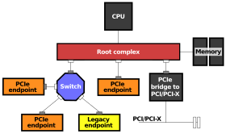

## PCIe 基础介绍
Wikipedia 上对 [PCI_Express](https://zh.wikipedia.org/wiki/PCI_Express) 的介绍
如下：

> Peripheral Component Interconnect Express，简称 PCI-E，官方简称 PCIe，是计算机总线的一个重要分支，它沿用既有的 PCI 编程概念及信号标准，并且构建了更加高速的串行通信系统标准。目前这一标准由 PCI-SIG 组织制定和维护。PCIe 仅应用于内部互连。由于 PCIe 是基于既有的 PCI 系统，所以只需修改物理层而无须修改软件就可将现有 PCI 系统转换为 PCIe。


### 版本、传输通道数和速率
我们在买固态硬盘和显卡的时候，经常需要确定 PCIe 的 **版本** 和 **通道数(x几)**，那这两个和速率有什么关系？

首先，什么是 PCIe 的版本和通道数：

* 版本：无疑就是 PCIe 技术迭代之后，速率有了极大地提升。例如：`PCIe 3.0`
* 通道数：lane 数，一条 lane 对应两组“差分信号对”，一组差分信号对用于传输 TX，另一组用于传输 RX。由于 PCIe 是串行传输，多条 lane 的数据传输是由 PCIe 上层应用来自行做 IO 多路复用的。例如：`x4`。

其次，上边两个参数和速率有什么关系？同一版本，通道数每增一个速率就翻倍。版本每增一个，速率几乎翻倍（除了 PCIe 1.0 到 PCIe 2.0）

不同版本对应的速率关系：

| Version | Transfer rate per lane(GT/s) | Line code | Throughput for `x1`                               |
|---------|------------------------------|-----------|---------------------------------------------------|
| 1.0     | 2.5                          | 8b/10b    | `2.5 Gib/s*(8b/10b)=2.0 Gib/s=0.250 GiB/s`        |
| 2.0     | 5.0                          | 8b/10b    | `5.0 Gib/s*(8b/10b)=4.0 Gib/s=0.500 GiB/s`        |
| 3.0     | 8.0                          | 128b/130b | `8.0 Gib/s*(128b/130b)=7.88 Gib/s=0.985 GiB/s`    |
| 4.0     | 16.0                         | 128b/130b | `16.0 Gib/s*(128b/130b)=15.753 Gib/s=1.969 GiB/s` |
| 5.0     | 32.0                         | 128b/130b | `32.0 Gib/s*(128b/130b)=31.508 Gib/s=3.938 GiB/s` |

* Tips:
    + 1 GT/s 表示每秒有 1*10^9 次传输，一次传输传输 1 个bit
    + 为了避免多个低信号连续传输无法被区分，我们使用 8b/10b 等 Line code 来编码。所以实际传输速率的计算，如最后一列所写：


而通道数的增长就非常简单了，直接对应版本的 `x1` 的速率上乘几。

### 设备类别
PCIe 是一种信号传输协议，信号的传输必有设备，那么，涉及到 PCIe 信号的设备种类有哪些：

| 类别         | 类似于      | 上游信号      | 下游信号             | 用途               | 例子/体现在                      |
|--------------|-------------|---------------|----------------------|--------------------|----------------------------------|
| Root Complex | PCIe 主设备 | CPU、内存连接 | 下游收发 PCIe 信号。 | 主机收发 PCIe 信号 | 在主板北桥或 SOC 内部            |
| Switch       | PCIe hub    | PCIe 信号     | PCIe 信号            | 用于扩展 PCIe 口   | 在主板北桥                       |
| Endpoint     | PCIe 从设备 | PCIe 信号     | 下游为其他信号       | 实际功能设备       | 固态硬盘、显卡、RTL8168 网卡芯片 |

* Tips:
    + Root Complex 中的上游信号: 和 CPU 连接大概是用于发送中断以及 DMA 控制，和内存连接的大概是用于 DMA 数据搬运。

他们的关系[如图](https://en.wikipedia.org/wiki/Root_complex)：




## `lspci` 介绍
正如开头所说， PCIe 相对于 PCI 只是物理层上发生了变动，上层软件完全一样，所以我们可以使用 `lspci` 来读取设备上 PCIe 的信息。也就是说虽然 PCIe 没有总线的概念，物理上是点对点协议，但是由于上层软件是兼容的，所以，仍然会有总线的概念。在后面选择设备时会用到总线的概念，但是它只是一个虚的概念。

我们将用 `lspci` 命令来获取常见的 `PCIe` 的信息，主要包括以下几个方面：

1. 获取设备的总线号和设备号，用于选择设备
2. 获取 PCIe 插槽/设备的 *版本号* 和 *传输通道数*

### 常用参数

* `s`: select
* `v`: verbose
* `vv`: more verbose
* `vvv`: even more verbose
* `t`: tree view

### 选择 PCI 设备（ `lspci -t`）
#### `lspci`
在选择 PCI 设备前，我们先看一下不带任何参数的 `lspci`，它的输出如下：

```console
$ lspci
...
03:08.0 PCI bridge: PLX Technology, Inc. PEX 8747 48-Lane, 5-Port PCI Express Gen 3 (8.0 GT/s) Switch (rev ca)
03:10.0 PCI bridge: PLX Technology, Inc. PEX 8747 48-Lane, 5-Port PCI Express Gen 3 (8.0 GT/s) Switch (rev ca)
04:00.0 VGA compatible controller: NVIDIA Corporation GP102 [TITAN X] (rev a1)
04:00.1 Audio device: NVIDIA Corporation GP102 HDMI Audio Controller (rev a1)
05:00.0 VGA compatible controller: NVIDIA Corporation GP102 [TITAN X] (rev a1)
05:00.1 Audio device: NVIDIA Corporation GP102 HDMI Audio Controller (rev a1)
...
```

由于 PCIe 借用的 PCI 的软件，因此沿用了 PCI 的这四种属性：`domain`, `bus`, `device`, `function` 我们可以通过这四个参数确定或者说选择一个 PCI 设备上的一个功能。他们也就是上述输出中的第一列。其中由于 domain number 基本是一样的，为 `0`，所以这里省略了只有当带上 `-t` 的时候会看到这个 domain number。完整的定位一个 PCI 设备和功能的格式是：

```
domain:bus:device.function
```

对于下面这个设备

```
04:00.0 VGA compatible controller: NVIDIA Corporation GP102 [TITAN X] (rev a1)
 |  | |
 |  | \- function
 |  \--- device
 \------ bus
```

它的各个属性如下：

* `domain`: 0 ( 被省略了 )
* `bus`: 04
* `device`: 00
* `function`: 0


#### `lspci -s xx`
上一节中说到，可以由这个四个属性确定一个 PCI 设备功能。它有什么用呢？当我们使用 `vvv` 显示更多详细信息而不选择特定设备时，`lspci` 会反给我们一大串的输出，你会发现太多了，都不知道看哪个，用 `-s` 来选择一下会对结果输出有极大的简化。对上面那个设备我们可以用以下命令来选择输出：

```console
$ lspci -s 0:03:08.0
03:08.0 PCI bridge: PLX Technology, Inc. PEX 8747 48-Lane, 5-Port PCI Express Gen 3 (8.0 GT/s) Switch (rev ca)
$ lspci -s 03:08.0
03:08.0 PCI bridge: PLX Technology, Inc. PEX 8747 48-Lane, 5-Port PCI Express Gen 3 (8.0 GT/s) Switch (rev ca)
```

你可以用 `-vvv` 来输出更多详细信息。我们会在读取 PCIe 版本和带宽的时候用到这个参数。

### PCIe 树状结构的输出解析，确定设备和槽（ `lspci -t`）
`lspci -t` 给出的树状结构表示的是它的物理连接方式（ `bus` 是虚拟的含义），我们可以通过它来查询一个 PCIe 外设是插在哪个 PCIe 的槽上，当我们要扩容，或者要替换外设时，我们需要选择版本、通道匹配的 PCI 外设，我们可以通过这个命令来查看 PCIe 槽最大支持的版本和通道数，避免不匹配带来的性能缺失。同时，我们将看到 `domain`, `bus`, `device`, `function` 属性在树状结构中的表示。

以下是 `lspci -tv` 的输出：

```console
$ lspci -tv
-+-[0000:ff]-+-08.0  Intel Corporation Xeon E7 v4/Xeon E5 v4/Xeon E3 v4/Xeon D QPI Link 0
 |           +-...
 \-[0000:00]-+-00.0  Intel Corporation Xeon E7 v4/Xeon E5 v4/Xeon E3 v4/Xeon D DMI2
             +-01.0-[01]--
             +-02.0-[02-05]----00.0-[03-05]--+-08.0-[04]--+-00.0  NVIDIA Corporation GP102 [TITAN X]
             |                               |            \-00.1  NVIDIA Corporation GP102 HDMI Audio Controller
             |                               \-10.0-[05]--+-00.0  NVIDIA Corporation GP102 [TITAN X]
             |                                            \-00.1  NVIDIA Corporation GP102 HDMI Audio Controller
             +-03.0-[06-09]----00.0-[07-09]--+-08.0-[08]--+-00.0  NVIDIA Corporation GP102 [TITAN X]
             |                               |            \-00.1  NVIDIA Corporation GP102 HDMI Audio Controller
             |                               \-10.0-[09]--+-00.0  NVIDIA Corporation GP102 [TITAN X]
             |                                            \-00.1  NVIDIA Corporation GP102 HDMI Audio Controller
             +-05.0  Intel Corporation Xeon E7 v4/Xeon E5 v4/Xeon E3 v4/Xeon D Map/VTd_Misc/System Management
             +-...
```

在 `lspci -t` 中，domain 和 bus 被用中括号包裹起来，例如第一行的 `[0000:ff]` 表示 domain 为 0000，bus 为 ff。

我们来一点一点看一下这棵子树

```
-+-
 \-[0000:00]-+
             +
             +-02.0-[02-05]----00.0-[03-05]--+-08.0-[04]--+-00.0  NVIDIA Corporation GP102 [TITAN X]
                                             |            \-00.1  NVIDIA Corporation GP102 HDMI Audio Controller
                                             \-10.0-[05]--+-00.0  NVIDIA Corporation GP102 [TITAN X]
                                                          \-00.1  NVIDIA Corporation GP102 HDMI Audio Controller
```

* `[0000:00]`:
    + domain: 0000
    + bus: 00
* `[0000:00]-+-02.0-[02-05]----00.0-[03-05]--+-08.0-[04]--+-00.0`
    + `[0000:00]-+-02.0-[02-05]`
        - `[0000:00]-+-02.0`
            * 02 的设备挂在 `[0000:00]`，即它的“索引”是 **`00:02`**
        - `02.0-[02-05]`
            * 02-05 (即 02、03、04、05) 这些 bus 挂在 `00:02` 这个设备的 `.0` 功能上
    + `[02-05]----00.0-[03-05]`
        - `[02-05]----00.0`
            * `00` 这个设备挂在 bus 02 上，（03-05 bus 号是给后续的桥用的），即它的“索引”是 **`02:00`**
        + `00.0-[03-05]`
            - 03-05 (即 03、04、05) 这些 bus 挂在 `02:00` 这个设备的 `.0` 功能上
    + `[03-05]--+-08.0-[04]`
        - `[03-05]--+-08.0`
            * `08` 这个设备挂在 bus 03 上，（04 05 bus 号是给后续的桥用的），即它的“索引”是 **`03:08`**
        - `08.0-[04]`
            - 04 bus 挂在 `03:08` 这个设备的 `.0` 功能上
    + `[04]--+-00.0`
        * `00` 这个设备挂在 bus 04 上，即它的“索引”是 **`04:00`**，也就是 `GP102 [TITAN X]` 显卡
    + `00.0` 和 `00.1` 是 `GP102 [TITAN X]` 显卡的两个 Function

为了不让上述的解析过长，我将上述涉及的设备列在这里，可以通过 `lspci -s`，来选择输出

```
00:02.0 PCI bridge: Intel Corporation Xeon E7 v4/Xeon E5 v4/Xeon E3 v4/Xeon D PCI Express Root Port 2 (rev 01) -> 它是一个 Root Complex。
02:00.0 PCI bridge: PLX Technology, Inc. PEX 8747 48-Lane, 5-Port PCI Express Gen 3 (8.0 GT/s) Switch (rev ca) -> 它是一个 switch。
03:08.0 PCI bridge: PLX Technology, Inc. PEX 8747 48-Lane, 5-Port PCI Express Gen 3 (8.0 GT/s) Switch (rev ca) -> 它是一个 switch。
04:00.0 VGA compatible controller: NVIDIA Corporation GP102 [TITAN X] (rev a1)                                 -> 显卡的 VGA 功能
04:00.1 Audio device: NVIDIA Corporation GP102 HDMI Audio Controller (rev a1)                                  -> 显卡的 HDMI 功能
```

所以回到本节开头的问题，`04:00` 的显卡插在哪个 PCIe 槽上呢？`03:08.0` 这个 switch 芯片上。

### 获取 PCI 设备的详细信息
终于到了获取 PCI 设备速率的时候了，我们将查看 `04:00` 显卡和 `03:08.0` 插槽，注意 Capabilities 信息需要 root 来读取。以下是 `03:08.0` 和 `04:00` 的完整输出。

```console
# lspci -vvv -s 03:08.0
03:08.0 PCI bridge: PLX Technology, Inc. PEX 8747 48-Lane, 5-Port PCI Express Gen 3 (8.0 GT/s) Switch (rev ca) (prog-if 00 [Normal decode])
        Control: I/O+ Mem+ BusMaster+ SpecCycle- MemWINV- VGASnoop- ParErr- Stepping- SERR+ FastB2B- DisINTx+
        Status: Cap+ 66MHz- UDF- FastB2B- ParErr- DEVSEL=fast >TAbort- <TAbort- <MAbort- >SERR- <PERR- INTx-
        Latency: 0, Cache Line Size: 32 bytes
        Interrupt: pin A routed to IRQ 34
        NUMA node: 0
        Bus: primary=03, secondary=04, subordinate=04, sec-latency=0
        I/O behind bridge: 00006000-00006fff [size=4K]
        Memory behind bridge: c4000000-c50fffff [size=17M]
        Prefetchable memory behind bridge: 0000033fe0000000-0000033ff1ffffff [size=288M]
        Secondary status: 66MHz- FastB2B- ParErr- DEVSEL=fast >TAbort- <TAbort- <MAbort- <SERR- <PERR-
        BridgeCtl: Parity- SERR+ NoISA- VGA- VGA16+ MAbort- >Reset- FastB2B-
                PriDiscTmr- SecDiscTmr- DiscTmrStat- DiscTmrSERREn-
        Capabilities: [40] Power Management version 3
                Flags: PMEClk- DSI- D1- D2- AuxCurrent=0mA PME(D0+,D1-,D2-,D3hot+,D3cold+)
                Status: D0 NoSoftRst+ PME-Enable- DSel=0 DScale=0 PME-
        Capabilities: [48] MSI: Enable+ Count=1/8 Maskable+ 64bit+
                Address: 00000000fee00000  Data: 40ef
                Masking: 000000ff  Pending: 00000000
        Capabilities: [68] Express (v2) Downstream Port (Slot+), MSI 00
                DevCap: MaxPayload 2048 bytes, PhantFunc 0
                        ExtTag- RBE+
                DevCtl: CorrErr- NonFatalErr- FatalErr- UnsupReq-
                        RlxdOrd- ExtTag- PhantFunc- AuxPwr- NoSnoop+
                        MaxPayload 256 bytes, MaxReadReq 128 bytes
                DevSta: CorrErr+ NonFatalErr- FatalErr- UnsupReq+ AuxPwr- TransPend-
                LnkCap: Port #8, Speed 8GT/s, Width x16, ASPM L1, Exit Latency L1 <4us
                        ClockPM- Surprise+ LLActRep+ BwNot+ ASPMOptComp+
                LnkCtl: ASPM L1 Enabled; Disabled- CommClk-
                        ExtSynch- ClockPM- AutWidDis- BWInt- AutBWInt-
                LnkSta: Speed 8GT/s (ok), Width x16 (ok)
                        TrErr- Train- SlotClk- DLActive+ BWMgmt- ABWMgmt+
                SltCap: AttnBtn- PwrCtrl- MRL- AttnInd- PwrInd- HotPlug- Surprise-
                        Slot #8, PowerLimit 25.000W; Interlock- NoCompl-
                SltCtl: Enable: AttnBtn- PwrFlt- MRL- PresDet- CmdCplt- HPIrq- LinkChg-
                        Control: AttnInd Unknown, PwrInd Unknown, Power- Interlock-
                SltSta: Status: AttnBtn- PowerFlt- MRL- CmdCplt- PresDet+ Interlock-
                        Changed: MRL- PresDet- LinkState-
                DevCap2: Completion Timeout: Not Supported, TimeoutDis-, NROPrPrP-, LTR+
                         10BitTagComp-, 10BitTagReq-, OBFF Via message, ExtFmt-, EETLPPrefix-
                         EmergencyPowerReduction Not Supported, EmergencyPowerReductionInit-
                         FRS-, ARIFwd+
                         AtomicOpsCap: Routing+
                DevCtl2: Completion Timeout: 50us to 50ms, TimeoutDis-, LTR-, OBFF Disabled ARIFwd-
                         AtomicOpsCtl: EgressBlck-
                LnkCtl2: Target Link Speed: 8GT/s, EnterCompliance- SpeedDis-, Selectable De-emphasis: -6dB
                         Transmit Margin: Normal Operating Range, EnterModifiedCompliance- ComplianceSOS-
                         Compliance De-emphasis: -6dB
                LnkSta2: Current De-emphasis Level: -6dB, EqualizationComplete+, EqualizationPhase1+
                         EqualizationPhase2+, EqualizationPhase3+, LinkEqualizationRequest-
        Capabilities: [a4] Subsystem: PLX Technology, Inc. PEX 8747 48-Lane, 5-Port PCI Express Gen 3 (8.0 GT/s) Switch
        Capabilities: [100 v1] Vendor Specific Information: ID=0000 Rev=0 Len=000 <?>
        Capabilities: [fb4 v1] Advanced Error Reporting
                UESta:  DLP- SDES- TLP- FCP- CmpltTO- CmpltAbrt- UnxCmplt- RxOF- MalfTLP- ECRC- UnsupReq- ACSViol-
                UEMsk:  DLP- SDES- TLP- FCP- CmpltTO- CmpltAbrt- UnxCmplt- RxOF- MalfTLP- ECRC- UnsupReq- ACSViol-
                UESvrt: DLP+ SDES+ TLP- FCP+ CmpltTO- CmpltAbrt- UnxCmplt- RxOF+ MalfTLP+ ECRC- UnsupReq- ACSViol-
                CESta:  RxErr- BadTLP- BadDLLP- Rollover- Timeout- AdvNonFatalErr-
                CEMsk:  RxErr- BadTLP- BadDLLP- Rollover- Timeout- AdvNonFatalErr+
                AERCap: First Error Pointer: 1f, ECRCGenCap+ ECRCGenEn- ECRCChkCap+ ECRCChkEn-
                        MultHdrRecCap- MultHdrRecEn- TLPPfxPres- HdrLogCap-
                HeaderLog: 00000000 00000000 00000000 00000000
        Capabilities: [138 v1] Power Budgeting <?>
        Capabilities: [10c v1] Secondary PCI Express
                LnkCtl3: LnkEquIntrruptEn-, PerformEqu-
                LaneErrStat: 0
        Capabilities: [148 v1] Virtual Channel
                Caps:   LPEVC=0 RefClk=100ns PATEntryBits=8
                Arb:    Fixed- WRR32- WRR64- WRR128-
                Ctrl:   ArbSelect=Fixed
                Status: InProgress-
                VC0:    Caps:   PATOffset=03 MaxTimeSlots=1 RejSnoopTrans-
                        Arb:    Fixed- WRR32- WRR64+ WRR128- TWRR128- WRR256-
                        Ctrl:   Enable+ ID=0 ArbSelect=WRR64 TC/VC=01
                        Status: NegoPending- InProgress-
                        Port Arbitration Table <?>
        Capabilities: [e00 v1] Multicast
                McastCap: MaxGroups 64, ECRCRegen+
                McastCtl: NumGroups 1, Enable-
                McastBAR: IndexPos 0, BaseAddr 0000000000000000
                McastReceiveVec:      0000000000000000
                McastBlockAllVec:     0000000000000000
                McastBlockUntransVec: 0000000000000000
                McastOverlayBAR: OverlaySize 0 (disabled), BaseAddr 0000000000000000
        Capabilities: [f24 v1] Access Control Services
                ACSCap: SrcValid+ TransBlk+ ReqRedir+ CmpltRedir+ UpstreamFwd+ EgressCtrl+ DirectTrans+
                ACSCtl: SrcValid- TransBlk- ReqRedir- CmpltRedir- UpstreamFwd- EgressCtrl- DirectTrans-
        Capabilities: [b70 v1] Vendor Specific Information: ID=0001 Rev=0 Len=010 <?>
        Kernel driver in use: pcieport

# lspci -vvv -s 04:00
04:00.0 VGA compatible controller: NVIDIA Corporation GP102 [TITAN X] (rev a1) (prog-if 00 [VGA controller])
        Subsystem: NVIDIA Corporation GP102 [TITAN X]
        Control: I/O+ Mem+ BusMaster+ SpecCycle- MemWINV- VGASnoop- ParErr- Stepping- SERR+ FastB2B- DisINTx+
        Status: Cap+ 66MHz- UDF- FastB2B- ParErr- DEVSEL=fast >TAbort- <TAbort- <MAbort- >SERR- <PERR- INTx-
        Latency: 0
        Interrupt: pin A routed to IRQ 103
        NUMA node: 0
        Region 0: Memory at c4000000 (32-bit, non-prefetchable) [size=16M]
        Region 1: Memory at 33fe0000000 (64-bit, prefetchable) [size=256M]
        Region 3: Memory at 33ff0000000 (64-bit, prefetchable) [size=32M]
        Region 5: I/O ports at 6000 [size=128]
        Expansion ROM at c5000000 [virtual] [disabled] [size=512K]
        Capabilities: [60] Power Management version 3
                Flags: PMEClk- DSI- D1- D2- AuxCurrent=0mA PME(D0-,D1-,D2-,D3hot-,D3cold-)
                Status: D0 NoSoftRst+ PME-Enable- DSel=0 DScale=0 PME-
        Capabilities: [68] MSI: Enable+ Count=1/1 Maskable- 64bit+
                Address: 00000000fee00000  Data: 4022
        Capabilities: [78] Express (v2) Legacy Endpoint, MSI 00
                DevCap: MaxPayload 256 bytes, PhantFunc 0, Latency L0s unlimited, L1 <64us
                        ExtTag+ AttnBtn- AttnInd- PwrInd- RBE+ FLReset-
                DevCtl: CorrErr- NonFatalErr- FatalErr- UnsupReq-
                        RlxdOrd+ ExtTag+ PhantFunc- AuxPwr- NoSnoop+
                        MaxPayload 256 bytes, MaxReadReq 512 bytes
                DevSta: CorrErr- NonFatalErr- FatalErr- UnsupReq- AuxPwr- TransPend-
                LnkCap: Port #8, Speed 8GT/s, Width x16, ASPM L0s L1, Exit Latency L0s <1us, L1 <4us
                        ClockPM+ Surprise- LLActRep- BwNot- ASPMOptComp+
                LnkCtl: ASPM Disabled; RCB 64 bytes Disabled- CommClk-
                        ExtSynch- ClockPM+ AutWidDis- BWInt- AutBWInt-
                LnkSta: Speed 8GT/s (ok), Width x16 (ok)
                        TrErr- Train- SlotClk+ DLActive- BWMgmt- ABWMgmt-
                DevCap2: Completion Timeout: Range AB, TimeoutDis+, NROPrPrP-, LTR-
                         10BitTagComp-, 10BitTagReq-, OBFF Via message, ExtFmt-, EETLPPrefix-
                         EmergencyPowerReduction Not Supported, EmergencyPowerReductionInit-
                         FRS-
                         AtomicOpsCap: 32bit- 64bit- 128bitCAS-
                DevCtl2: Completion Timeout: 50us to 50ms, TimeoutDis-, LTR-, OBFF Disabled
                         AtomicOpsCtl: ReqEn-
                LnkCtl2: Target Link Speed: 8GT/s, EnterCompliance- SpeedDis-
                         Transmit Margin: Normal Operating Range, EnterModifiedCompliance- ComplianceSOS-
                         Compliance De-emphasis: -6dB
                LnkSta2: Current De-emphasis Level: -6dB, EqualizationComplete+, EqualizationPhase1+
                         EqualizationPhase2+, EqualizationPhase3+, LinkEqualizationRequest-
        Capabilities: [100 v1] Virtual Channel
                Caps:   LPEVC=0 RefClk=100ns PATEntryBits=1
                Arb:    Fixed- WRR32- WRR64- WRR128-
                Ctrl:   ArbSelect=Fixed
                Status: InProgress-
                VC0:    Caps:   PATOffset=00 MaxTimeSlots=1 RejSnoopTrans-
                        Arb:    Fixed- WRR32- WRR64- WRR128- TWRR128- WRR256-
                        Ctrl:   Enable+ ID=0 ArbSelect=Fixed TC/VC=01
                        Status: NegoPending- InProgress-
        Capabilities: [128 v1] Power Budgeting <?>
        Capabilities: [420 v2] Advanced Error Reporting
                UESta:  DLP- SDES- TLP- FCP- CmpltTO- CmpltAbrt- UnxCmplt- RxOF- MalfTLP- ECRC- UnsupReq- ACSViol-
                UEMsk:  DLP- SDES- TLP- FCP- CmpltTO- CmpltAbrt- UnxCmplt- RxOF- MalfTLP- ECRC- UnsupReq- ACSViol-
                UESvrt: DLP+ SDES+ TLP- FCP+ CmpltTO- CmpltAbrt- UnxCmplt- RxOF+ MalfTLP+ ECRC- UnsupReq- ACSViol-
                CESta:  RxErr- BadTLP- BadDLLP- Rollover- Timeout- AdvNonFatalErr-
                CEMsk:  RxErr- BadTLP- BadDLLP- Rollover- Timeout- AdvNonFatalErr+
                AERCap: First Error Pointer: 00, ECRCGenCap- ECRCGenEn- ECRCChkCap- ECRCChkEn-
                        MultHdrRecCap- MultHdrRecEn- TLPPfxPres- HdrLogCap-
                HeaderLog: 00000000 00000000 00000000 00000000
        Capabilities: [600 v1] Vendor Specific Information: ID=0001 Rev=1 Len=024 <?>
        Capabilities: [900 v1] Secondary PCI Express
                LnkCtl3: LnkEquIntrruptEn-, PerformEqu-
                LaneErrStat: 0
        Kernel driver in use: nvidia
        Kernel modules: nvidiafb, nouveau, nvidia_drm, nvidia

04:00.1 Audio device: NVIDIA Corporation GP102 HDMI Audio Controller (rev a1)
        Subsystem: NVIDIA Corporation GP102 HDMI Audio Controller
        Control: I/O- Mem+ BusMaster+ SpecCycle- MemWINV- VGASnoop- ParErr- Stepping- SERR+ FastB2B- DisINTx-
        Status: Cap+ 66MHz- UDF- FastB2B- ParErr- DEVSEL=fast >TAbort- <TAbort- <MAbort- >SERR- <PERR- INTx-
        Latency: 0, Cache Line Size: 32 bytes
        Interrupt: pin B routed to IRQ 101
        NUMA node: 0
        Region 0: Memory at c5080000 (32-bit, non-prefetchable) [size=16K]
        Capabilities: [60] Power Management version 3
                Flags: PMEClk- DSI- D1- D2- AuxCurrent=0mA PME(D0-,D1-,D2-,D3hot-,D3cold-)
                Status: D0 NoSoftRst+ PME-Enable- DSel=0 DScale=0 PME-
        Capabilities: [68] MSI: Enable- Count=1/1 Maskable- 64bit+
                Address: 0000000000000000  Data: 0000
        Capabilities: [78] Express (v2) Endpoint, MSI 00
                DevCap: MaxPayload 256 bytes, PhantFunc 0, Latency L0s unlimited, L1 <64us
                        ExtTag+ AttnBtn- AttnInd- PwrInd- RBE+ FLReset- SlotPowerLimit 25.000W
                DevCtl: CorrErr- NonFatalErr- FatalErr- UnsupReq-
                        RlxdOrd- ExtTag+ PhantFunc- AuxPwr- NoSnoop+
                        MaxPayload 256 bytes, MaxReadReq 512 bytes
                DevSta: CorrErr+ NonFatalErr- FatalErr- UnsupReq+ AuxPwr- TransPend-
                LnkCap: Port #8, Speed 8GT/s, Width x16, ASPM L0s L1, Exit Latency L0s <1us, L1 <4us
                        ClockPM+ Surprise- LLActRep- BwNot- ASPMOptComp+
                LnkCtl: ASPM L0s L1 Enabled; RCB 64 bytes Disabled- CommClk-
                        ExtSynch- ClockPM+ AutWidDis- BWInt- AutBWInt-
                LnkSta: Speed 8GT/s (ok), Width x16 (ok)
                        TrErr- Train- SlotClk+ DLActive- BWMgmt- ABWMgmt-
                DevCap2: Completion Timeout: Range AB, TimeoutDis+, NROPrPrP-, LTR-
                         10BitTagComp-, 10BitTagReq-, OBFF Via message, ExtFmt-, EETLPPrefix-
                         EmergencyPowerReduction Not Supported, EmergencyPowerReductionInit-
                         FRS-, TPHComp-, ExtTPHComp-
                         AtomicOpsCap: 32bit- 64bit- 128bitCAS-
                DevCtl2: Completion Timeout: 50us to 50ms, TimeoutDis-, LTR-, OBFF Disabled
                         AtomicOpsCtl: ReqEn-
                LnkSta2: Current De-emphasis Level: -6dB, EqualizationComplete-, EqualizationPhase1-
                         EqualizationPhase2-, EqualizationPhase3-, LinkEqualizationRequest-
        Capabilities: [100 v2] Advanced Error Reporting
                UESta:  DLP- SDES- TLP- FCP- CmpltTO- CmpltAbrt- UnxCmplt- RxOF- MalfTLP- ECRC- UnsupReq- ACSViol-
                UEMsk:  DLP- SDES- TLP- FCP- CmpltTO- CmpltAbrt- UnxCmplt- RxOF- MalfTLP- ECRC- UnsupReq- ACSViol-
                UESvrt: DLP+ SDES+ TLP- FCP+ CmpltTO- CmpltAbrt- UnxCmplt- RxOF+ MalfTLP+ ECRC- UnsupReq- ACSViol-
                CESta:  RxErr- BadTLP- BadDLLP- Rollover- Timeout- AdvNonFatalErr-
                CEMsk:  RxErr- BadTLP- BadDLLP- Rollover- Timeout- AdvNonFatalErr+
                AERCap: First Error Pointer: 00, ECRCGenCap- ECRCGenEn- ECRCChkCap- ECRCChkEn-
                        MultHdrRecCap- MultHdrRecEn- TLPPfxPres- HdrLogCap-
                HeaderLog: 00000000 00000000 00000000 00000000
        Kernel driver in use: snd_hda_intel
        Kernel modules: snd_hda_intel
```

输出有点多，我们先看一层一层来看，第一层的输出：

```console
03:08.0 PCI bridge: PLX Technology, Inc. PEX 8747 48-Lane, 5-Port PCI Express Gen 3 (8.0 GT/s) Switch (rev ca) (prog-if 00 [Normal decode])
        Control: I/O+ Mem+ BusMaster+ SpecCycle- MemWINV- VGASnoop- ParErr- Stepping- SERR+ FastB2B- DisINTx+
        Status: Cap+ 66MHz- UDF- FastB2B- ParErr- DEVSEL=fast >TAbort- <TAbort- <MAbort- >SERR- <PERR- INTx-
        Latency: 0, Cache Line Size: 32 bytes
        Interrupt: pin A routed to IRQ 34
        NUMA node: 0
        Bus: primary=03, secondary=04, subordinate=04, sec-latency=0
        I/O behind bridge: 00006000-00006fff [size=4K]
        Memory behind bridge: c4000000-c50fffff [size=17M]
        Prefetchable memory behind bridge: 0000033fe0000000-0000033ff1ffffff [size=288M]
        Secondary status: 66MHz- FastB2B- ParErr- DEVSEL=fast >TAbort- <TAbort- <MAbort- <SERR- <PERR-
        BridgeCtl: Parity- SERR+ NoISA- VGA- VGA16+ MAbort- >Reset- FastB2B-
        Capabilities: [40] Power Management version 3
        Capabilities: [48] MSI: Enable+ Count=1/8 Maskable+ 64bit+
        Capabilities: [68] Express (v2) Downstream Port (Slot+), MSI 00
        Capabilities: [a4] Subsystem: PLX Technology, Inc. PEX 8747 48-Lane, 5-Port PCI Express Gen 3 (8.0 GT/s) Switch
        Capabilities: [100 v1] Vendor Specific Information: ID=0000 Rev=0 Len=000 <?>
        Capabilities: [fb4 v1] Advanced Error Reporting
        Capabilities: [138 v1] Power Budgeting <?>
        Capabilities: [10c v1] Secondary PCI Express
        Capabilities: [148 v1] Virtual Channel
        Capabilities: [e00 v1] Multicast
        Capabilities: [f24 v1] Access Control Services
        Capabilities: [b70 v1] Vendor Specific Information: ID=0001 Rev=0 Len=010 <?>
        Kernel driver in use: pcieport

# lspci -vvv -s 04:00
04:00.0 VGA compatible controller: NVIDIA Corporation GP102 [TITAN X] (rev a1) (prog-if 00 [VGA controller])
        Subsystem: NVIDIA Corporation GP102 [TITAN X]
        Control: I/O+ Mem+ BusMaster+ SpecCycle- MemWINV- VGASnoop- ParErr- Stepping- SERR+ FastB2B- DisINTx+
        Status: Cap+ 66MHz- UDF- FastB2B- ParErr- DEVSEL=fast >TAbort- <TAbort- <MAbort- >SERR- <PERR- INTx-
        Latency: 0
        Interrupt: pin A routed to IRQ 103
        NUMA node: 0
        Region 0: Memory at c4000000 (32-bit, non-prefetchable) [size=16M]
        Region 1: Memory at 33fe0000000 (64-bit, prefetchable) [size=256M]
        Region 3: Memory at 33ff0000000 (64-bit, prefetchable) [size=32M]
        Region 5: I/O ports at 6000 [size=128]
        Expansion ROM at c5000000 [virtual] [disabled] [size=512K]
        Capabilities: [60] Power Management version 3
        Capabilities: [68] MSI: Enable+ Count=1/1 Maskable- 64bit+
        Capabilities: [78] Express (v2) Legacy Endpoint, MSI 00
        Capabilities: [100 v1] Virtual Channel
        Capabilities: [128 v1] Power Budgeting <?>
        Capabilities: [420 v2] Advanced Error Reporting
        Capabilities: [600 v1] Vendor Specific Information: ID=0001 Rev=1 Len=024 <?>
        Capabilities: [900 v1] Secondary PCI Express
        Kernel driver in use: nvidia
        Kernel modules: nvidiafb, nouveau, nvidia_drm, nvidia

04:00.1 Audio device: NVIDIA Corporation GP102 HDMI Audio Controller (rev a1)
        Subsystem: NVIDIA Corporation GP102 HDMI Audio Controller
        Control: I/O- Mem+ BusMaster+ SpecCycle- MemWINV- VGASnoop- ParErr- Stepping- SERR+ FastB2B- DisINTx-
        Status: Cap+ 66MHz- UDF- FastB2B- ParErr- DEVSEL=fast >TAbort- <TAbort- <MAbort- >SERR- <PERR- INTx-
        Latency: 0, Cache Line Size: 32 bytes
        Interrupt: pin B routed to IRQ 101
        NUMA node: 0
        Region 0: Memory at c5080000 (32-bit, non-prefetchable) [size=16K]
        Capabilities: [60] Power Management version 3
        Capabilities: [68] MSI: Enable- Count=1/1 Maskable- 64bit+
        Capabilities: [78] Express (v2) Endpoint, MSI 00
        Capabilities: [100 v2] Advanced Error Reporting
        Kernel driver in use: snd_hda_intel
        Kernel modules: snd_hda_intel
```

目前我看得懂的，或者说我常用的属性是以下几个：

`Subsystem`：属于什么子系统
`Status`：状态，是否有错
`Interrupt`：中断信息
`Region`: 内存映射
`Capabilities`：能力，包括 MSI，Express
`Kernel driver in use`：正在使用的驱动
`Kernel modules`：可用的驱动

其中最有用的 Capabilities，`lspci` 毕竟是列出 PCI 设备，那我们如何确定设备是 PCIe 设备呢？看 Capabilities 中是否有 Express，这个 PCI 设备有 Express 的能力，也就是说它是 PCIe 设备。那么我们要查看的速率和版本也在这个属性下面。


#### 获取 PCIe 设备的版本和传输通道数
我们在 `Capabilities: Express (v2) Endpoint, MSI 00` 属性下面可以找两个属性：`LnkCap` 和 `LnkSta`，前者表示该设备支持的能力（Link Capability），后者是这个设备的连接状态（Link State)。我们可以从 `LnkCap` 属性上看到下面这两个设备的“单个传输通道数”的速率都是 8GT/s，传输通道数是 `x16`，也就是说这两个设备是 `PCIe 3.0 x16` 的。

```
# tree view(partial)
-[0000:00]-+-02.0-[02-05]----00.0-[03-05]--+-08.0-[04]--+-00.0  NVIDIA Corporation GP102 [TITAN X]
                                                        \-00.1  NVIDIA Corporation GP102 HDMI Audio Controller

# verbose output(partial)
03:08.0 PCI bridge: PLX Technology, Inc. PEX 8747 48-Lane, 5-Port PCI Express Gen 3 (8.0 GT/s) Switch (rev ca) (prog-if 00 [Normal decode])
        Capabilities: [68] Express (v2) Downstream Port (Slot+), MSI 00
                LnkCap: Port #8, Speed 8GT/s, Width x16, ASPM L1, Exit Latency L1 <4us
                        ClockPM- Surprise+ LLActRep+ BwNot+ ASPMOptComp+
                LnkSta: Speed 8GT/s (ok), Width x16 (ok)
                        TrErr- Train- SlotClk- DLActive+ BWMgmt- ABWMgmt+
04:00.0 VGA compatible controller: NVIDIA Corporation GP102 [TITAN X] (rev a1) (prog-if 00 [VGA controller])
        Subsystem: NVIDIA Corporation GP102 [TITAN X]
        Capabilities: [78] Express (v2) Legacy Endpoint, MSI 00
                LnkCap: Port #8, Speed 8GT/s, Width x16, ASPM L0s L1, Exit Latency L0s <1us, L1 <4us
                        ClockPM+ Surprise- LLActRep- BwNot- ASPMOptComp+
                LnkSta: Speed 8GT/s (ok), Width x16 (ok)
                        TrErr- Train- SlotClk+ DLActive- BWMgmt- ABWMgmt-
04:00.1 Audio device: NVIDIA Corporation GP102 HDMI Audio Controller (rev a1)
        Subsystem: NVIDIA Corporation GP102 HDMI Audio Controller
        Capabilities: [78] Express (v2) Endpoint, MSI 00
                LnkCap: Port #8, Speed 8GT/s, Width x16, ASPM L0s L1, Exit Latency L0s <1us, L1 <4us
                        ClockPM+ Surprise- LLActRep- BwNot- ASPMOptComp+
                LnkSta: Speed 8GT/s (ok), Width x16 (ok)
                        TrErr- Train- SlotClk+ DLActive- BWMgmt- ABWMgmt-
```

* Tips：
    + 我猜测，一个设备的两个功能对应的版本和传输通道数是一样的。（可能插槽会有区别？我不是很确定，或者说，我们需要明确的是 function 是什么东西，TODO）
    + 还有一些是 PCIe 设备 training（类似自协商）时会用的属性，例如 `LnkCtl2`, `LnkSta2`。
    + 这些属性本质其实是 PCIe 配置空间内，寄存器的值。

由于插槽和设备的能力不匹配，实际的连接状态 `LnkSta` 和设备的能力 `LnkCap` 会不一样。我们可以在 `LnkSta` 中查看当前连接状态，可以看到上面这台设备 `LnkSta` 中的 Speed 和 Width 和 `LnkCap` 中的一样，因此，速率是匹配的，设备的性能可以得到完全发挥，`lspci` 也很贴心地标注了两个 `ok`。但是下面这台设备，速率就不匹配了我们可以看到固态硬盘（`03:00`）设备支持的速率是 `8GT/s x4`（`PCIe 3.0 x4`），而插槽（`00:1d.0`）支持的速率是 `8GT/s x2`（`PCIe 3.0 x2`），因此，固态硬盘的性能得不到完全的发挥。同时，我们可以看到设备的 `LnkSta` 下对应有问题的属性边上标注了 `downgraded`。

```
# tree view(partial)
-[0000:00]-+-1d.0-[03]----00.0  Silicon Motion, Inc. SM2262/SM2262EN SSD Controller

# verbose output(partial)
00:1d.0 PCI bridge: Intel Corporation Sunrise Point-LP PCI Express Root Port #9 (rev f1) (prog-if 00 [Normal decode])
        Subsystem: Lenovo Device 505b
        Capabilities: [40] Express (v2) Root Port (Slot+), IntMsgNum 0
                LnkCap: Port #9, Speed 8GT/s, Width x2, ASPM L1, Exit Latency L1 <16us
                        ClockPM- Surprise- LLActRep+ BwNot+ ASPMOptComp+
                LnkSta: Speed 8GT/s, Width x2
                        TrErr- Train- SlotClk+ DLActive+ BWMgmt+ ABWMgmt-
        Kernel driver in use: pcieport
03:00.0 Non-Volatile memory controller: Silicon Motion, Inc. SM2262/SM2262EN SSD Controller (rev 03) (prog-if 02 [NVM Express])
        Subsystem: Silicon Motion, Inc. SM2262/SM2262EN SSD Controller
        Capabilities: [70] Express (v2) Endpoint, IntMsgNum 0
                LnkCap: Port #0, Speed 8GT/s, Width x4, ASPM L1, Exit Latency L1 <8us
                        ClockPM+ Surprise- LLActRep- BwNot- ASPMOptComp+
                LnkSta: Speed 8GT/s, Width x2 (downgraded)
                        TrErr- Train- SlotClk+ DLActive- BWMgmt- ABWMgmt-
```

至此，我们已经介绍了 PCIe 的基础知识以及如何使用 `lspci` 查询 PCIe 设备的属性，快去看看你的 Linux 下的 PCIe 系统吧，看看有什么可以改进和升级的。
