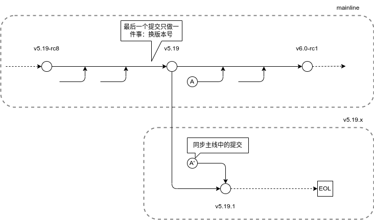
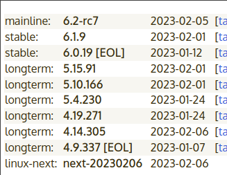
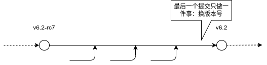

## TL;DR




Linux 主线只有一个分支 master，所以所有特性、bug 都只会合入 master。版本号的命名是这样的：

```sh
$ git tag -l
v5.19
v6.0-rc1
v6.0-rc2
...
v6.0-rc7
v6.0
```

以 5.19 为例，在主线版本 `v5.19` 发布后，主线开始为 `v6.0-rc1` 的发布做开发，也就是说一旦发布，主线就不管 `v5.19` 了，`5.19.x` 会去合入主线的代码。

## intro
从 [Linux kernel](https://www.kernel.org/) 我们可以看到这些:



我们可以看到有这么几类：`mainline` `stable` `longterm` `linux-next`。

我们在使用 `git clone https://git.kernel.org/` 时，只会 clone mainline。所以先说主线。

## 主线

Linux 主线只有一个分支 master，所以所有特性、bug 都只会合入 master。版本号的命名是这样的：

```sh
$ git tag -l
v6.1
v6.2-rc1
v6.2-rc2
...
v6.2-rc7
v6.2
```

所有版本的发布都是在 master 上。也就是说 tag 是打在 master 上的。



`v6.2` tag 打完后，就准备发布 `v6.3` 了，所以 下一个 tag 是`v6.3-rc1`

## longterm
以 5.15 为例，在主线版本 `v5.15` 发布后，照上节说的，主线开始为 `v5.16-rc1` 的发布做开发，也就是说一旦发布，主线就不管 `v5.15` 了。

但是图中我们看到 5.15 的最新版本是 5.15.91，而我们在 linux 仓库中的 tag 中也确实看不到 5.15.91。那这个是哪来的呢？我们可以点开右边的 [changelog](https://cdn.kernel.org/pub/linux/kernel/v5.x/ChangeLog-5.15.91)，就可以看到第二条提交是这样的：

```commit
commit 14cc13e433e1067557435b1adbf05608d7d47a93
Author: Colin Ian King <colin.i.king@gmail.com>
Date:   Fri Dec 2 13:51:49 2022 +0000

    perf/x86/amd: fix potential integer overflow on shift of a int
    
    commit 08245672cdc6505550d1a5020603b0a8d4a6dcc7 upstream.
    
    The left shift of int 32 bit integer constant 1 is evaluated using 32 bit
    arithmetic and then passed as a 64 bit function argument. In the case where
    i is 32 or more this can lead to an overflow.  Avoid this by shifting
    using the BIT_ULL macro instead.
    
    ...
```

注意其中有一句 `commit 08245672cdc6505550d1a5020603b0a8d4a6dcc7 upstream.`。于是可以猜测到：这个提交必定是来自主线的，也就是主线修复了这个 bug 或提交了一些必要的特性，开发人员把这个 commit 也提交到 `v5.4` 之后。所以 `v5.4` 之后的版本都是源自同步上游（upstream）分支（mainline）代码产生的。我们可以验证一下这一猜测：

* `git log 08245672cdc6505550d1a5020603b0a8d4a6dcc7`
* `git fetch origin 14cc13e433e1067557435b1adbf05608d7d47a93`

## linux-next
https://www.kernel.org/doc/man-pages/linux-next.html


