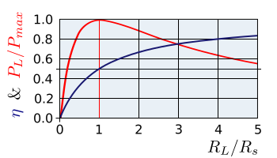

This is a read note of <https://en.wikipedia.org/wiki/Maximum_power_transfer_theorem>

## Maximum Efficiency
* Assumption:
    * direct current
    * load is pure resistor
* notation:
    + $P_\text{L}$ power of load
    + $R_\text{L}$ resistance of load.
    + $R_\text{S}$ resistance of source(e.g battery)

The efficiency is:

$$
\eta = \frac{P_\text{L}}{P_\text{total}}
= \frac{U_{\text{L}} \times I}{U_{\text{emf}} \times I}
= \frac{R_{\text{L}} \times I}{(R_\text{L} + R_\text{s}) \times I}
= \frac{1}{1+R_\text{s}/R_\text{L}}
$$

So we when $R_\text{L} \to \infty$, $\eta -> 1$. Which is as we already know about max efficiency.

## Maximum power transfer
But what if we do not care about efficiency, we just want the power goes to maximum. What is the *power*? Energy provided per time. It's something like speed. While efficiency is like something capacity, like how much you have, like a volume quantity。So it would be better to define the efficiency in this way:
$$
\eta = \frac{E_\text{used}}{E_\text{provided}} 
$$

which of course equal to $P_\text{L}/P_\text{total}$ by dividing time ($T$) in numerator and denominator.

As we have different intuition of these two words, we will discuss that under what want condition will the power be at its maximum? As showed above:

$$
P_\text{L} = U_\text{L}  \times  I
$$

When $R_\text{L}$ goes from $0$ to $\infty$, $U_\text{L}$ will increase, while $I$ will decrease. We cannot get the maximum of $P_\text{L}$ at first time. Thus, it comes to numerical calculation:

Holds the above assumption:
* direct current
* load is pure resistor

$$
P_\text{L} = I ^2 R_\text{L}
= (\frac{U_\text{emf}}{R_\text{L} + R_\text{L}})^2 R_\text{L}
= \frac{U_\text{emf}}{R_\text{L}+2R_\text{s} + R_\text{s}^2 /R_\text{L}}
$$

$P_\text{L}$ max $\Rightarrow$ denominator to minumum

$$
\frac{d (\text{deno})}{dR_\text{L}} =1- \frac{R\text{s}^2}{R_\text{L}^2}
$$

Extreme point of original formular is when the above formula equals to $0$, which is when $R_\text{s} = R_\text{L}$ ($R>0$, omit the negative one). When $R_\text{L} < R_\text{s}$ the derivative is negative, So the original denominator decrease first, then increase. It means that when $R_\text{L} = R_\text{s}$, the original formula goes to it's maximum, which is
$$
P_\text{L} = \frac{U_\text{emf}}{4 R_\text{L}}
$$

While, at this time the efficiency $\eta = \frac{1}{2}$.

Besides, when the efficiency is maximum, the power is $0$

Here is a picture from Wikipedia:

