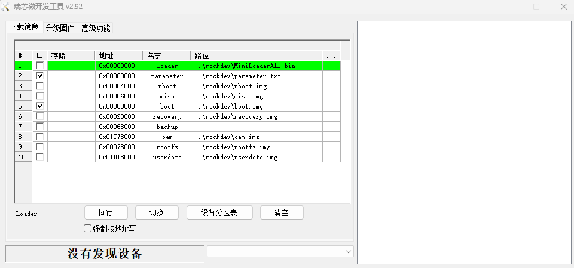
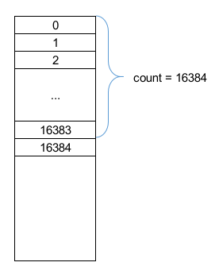

推荐文档：

`Rockchip_Developer_Guide_UBoot_Nextdev_CN.pdf`

以前在 Windows 上 用 `RKDevTool_Release.exe` 烧录镜像时一直有个疑惑： `miniloader` 和 `parameter` 的地址为什么是 `0x0`，好像是烧到其他地方去了，并且 `lsblk` 也看不到这两个文件所在的分区。




```console
$ lsblk
NAME         MAJ:MIN RM  SIZE RO TYPE MOUNTPOINT
mmcblk0      179:0    0 14.6G  0 disk
├─mmcblk0p1  179:1    0    4M  0 part
├─mmcblk0p2  179:2    0    4M  0 part
├─mmcblk0p3  179:3    0   64M  0 part
├─mmcblk0p4  179:4    0  128M  0 part
├─mmcblk0p5  179:5    0   32M  0 part
├─mmcblk0p6  179:6    0   14G  0 part /
├─mmcblk0p7  179:7    0  128M  0 part /oem
└─mmcblk0p8  179:8    0  206M  0 part /userdata
mmcblk0boot0 179:32   0    4M  1 disk
mmcblk0boot1 179:64   0    4M  1 disk
```


这两天在看 uboot 的文档时，`Rockchip_Developer_Guide_UBoot_Nextdev_CN.pdf` 看到 `2.6 存储布局` 这个疑惑接被解决了。

](./figures/partition_tables.png)

原来 minloader 被烧录到 mmcblk0p1 前的分区了，parameter.txt 本身就是分区表，应该就是生成了 GPT 分区表。

## 验证

### `fdisk`

来验证一下

```console
# fdisk -l /dev/mmcblk0
Disk /dev/mmcblk0: 14.56 GiB, 15634268160 bytes, 30535680 sectors
Units: sectors of 1 * 512 = 512 bytes
Sector size (logical/physical): 512 bytes / 512 bytes
I/O size (minimum/optimal): 512 bytes / 512 bytes
Disklabel type: gpt
Disk identifier: 17B18C43-1D24-4484-8883-D0C618E42411

Device            Start      End  Sectors  Size Type
/dev/mmcblk0p1    16384    24575     8192    4M unknown
/dev/mmcblk0p2    24576    32767     8192    4M unknown
/dev/mmcblk0p3    32768   163839   131072   64M unknown
/dev/mmcblk0p4   163840   425983   262144  128M unknown
/dev/mmcblk0p5   425984   491519    65536   32M unknown
/dev/mmcblk0p6   491520 29851647 29360128   14G unknown
/dev/mmcblk0p7 29851648 30113791   262144  128M unknown
/dev/mmcblk0p8 30113792 30535646   421855  206M unknown
```

`fdisk` 的输出很清晰，前三个分区和上图中的加粗项一一对应。之前没主意到的是第一个分区并不是从 `2048` 开始的。

### `dd`

在用 `dd` 验证之前，需要了解一下 `fdisk` 的输出：

`mmcblk0` 一个 sector 的大小是 512 bytes，第一个分区起始 sector 是 16384，占用 `24575 - 16383 = 8192` 个 sector，这里减去 16383 是因为 16384 这个编号的 sector 是第一个分区的第一个 sector，长度是减去不属于第一个分区的最后一个 sector 的编号。再看上面那张图片，整个磁盘的起始 sector 的编号是 0，MBR 占用 1 个 sector；同时，第一个分区前的 sector 的数量是第一个分区的编号。这里说得这么啰嗦是因为后面 `dd` 需要这些参数。再回过头来看第一个分区，第一个分区的大小是 `8192 * 512 B = 8K * 512 B = 4 MB`。再看磁盘最后的位置：最后一个分区后还有 `30535679 - 30535646 = 33` 个分区，也就是 secondary gpt 分区。这里是用 30535679 减，是因为 Disk 那一行中的 30535680 是指长度，由于我们是从 0 开始编号的，所以最后一个分区的编号是 30535679。




1. 使用 dd 获取第一个分区：

因为第一个分区被分区了，所以我们可以直接设定 `if` 为分区

```sh
dd if=/dev/mmcblk0p1 of=./uboot.img bs=512
```

由于我们最终是想读取第一个分区前的数据，所以我们这里通过第一个分区来验证和练习一下：

```console
# dd if=/dev/mmcblk0 bs=512 skip=16384 count=8192 | sha1sum
68b4104cad133f08b54a88161fc0ac8c9fdf2a81  -
```

同时我们校验一下通过分区读出来的镜像 hex，发现也是一样

```console
# sha1sum uboot.img
68b4104cad133f08b54a88161fc0ac8c9fdf2a81  uboot.img
```

由此，我们可以得出以下结论：

`dd` 中 SKIP 的大小 = 需要忽略的 sector 数量 (count) = 想读区域的起始编号（start index），起始编号也就是 fdisk 中的 Start 列。

2. 使用 dd 获取 miniloader ：

```sh
dd if=/dev/mmcblk0 of=./miniloader.img bs=512 skip=64 count=7104
```

呃，有重复部分，但是不是完全一样，需要看一下这两者的区别。（TODO）


