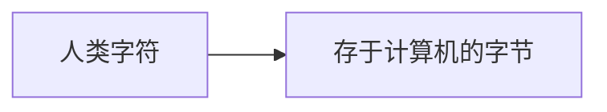
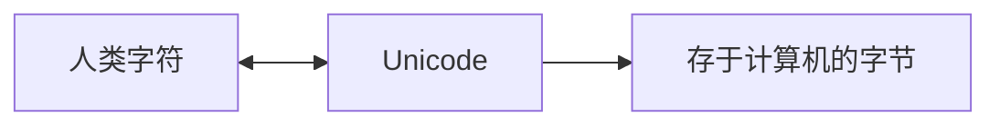
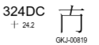
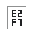
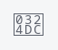
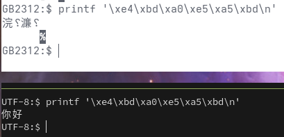
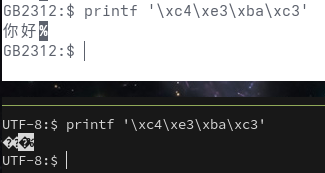
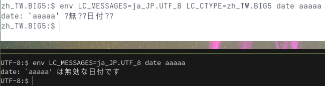

## Introduction
最近遇到了好几次编码的问题，命令行用 `printf` 打印 16 进制，top 内存越界，然后正好有时间，就将这块知识了解了一下。

以及在安装 Linux 的时候经常会设置语言 `zh_CN.UTF-8` 或者 `en_US.UTF-8`。

## TL;DR;
Unicode 前，人类字符存于计算机只有一次编码：



Unicode 后，人类字符存于计算机有两次编码：

1. 人工将人类字符编码成 Unicode，在计算机中就用 Unicode 就代表人类字符。
2. 代表人类字符的 Unicode 存于计算机时，需要编码成其他字节流。



Unicode 是计算机可以描述人类字符的全集。

* 字符集：
    + Unicode 前：等同于编码
    + Unicode 后：Unicode UCS-4 的子集，选用其中的部分字符作为字符集
* 编码：Unicode 字符编号如何实际存储
* 字体：Unicode 编号对应的字形

## 编码和字符集
我们在学校中学过 ASCII 编码，知道 `A` 的 ASCII 码是 `65`。中文数字太多，一个字节编码不够，需要用两个字节，用 GB 2312 编码，来表示一个字节不够，而 ASCII 没有用尽一个字节的所有位数，在高位设置一个 bit，来区分原始的 ASCII 还是 GB 2312。

那么什么是编码？简单来说就是一个映射关系，计算机的语言和人类的语言之间的映射。计算机的语言是 01 这种二进制，而我们人类的语言有中文英文等等。我如何将人类的文字存储到计算机中呢？就需要一个映射，或者简单来说就是一个翻译，知道存在计算机中的某一个数字代表的是什么字符。譬如，现在在计算机中有一个数字 `(0100,0001)b`，转换成十进制就是 `65`，对计算机来说它就是一个纯粹的数字，不代表任何什么，你可以对它做加减乘除各种操作。但是除了数字之外，我们还可以赋予它其他意思，就像之前说的，我需要存一个字符到计算机里，我们指定这个数字表示某一个字符。在 ASCII 编码中，这个数字就被指定为字符 `A`。我们可以看到这种映射关系是任意的，我们完全可以将 65 指定成其他字符，只是， ASCII 是最早的映射关系，对 ASCII 中字符的编码，现在大部分的其他编码仍旧保持数字一致。这里我们可以看到数字有了类型，或者说，数据类型，就像 char, short，int，long 等等，同样一个数字在不同的数据类型的表示下代表不同的含义。

```c
include <stdio.h>
int main(int argc, char *argv[]){
	char c = 'A';
	printf("%c %d\n", c, c);

	unsigned char n = 65;
	printf("%c %d\n", n, n);
	return 0;
}
```

### CJK 编码和乱码

在英文的语境下一切都很不错，ASCII 一个字节足够了，到了中文，一个字节大小的空间总共表示 (2^8=256) 种不同的数字，这远小于中文的字符量。和 short, int 一样，一个字节不够表示一个数字，一个字节不够表示一个字符那怎么办？用两个字节。这就出来了 GB 2312，但是 GB 2312 只表示了中文，繁体中文字符怎么办？日语韩语其他语言怎么办？各家给出了各家不同的编码方案，对于繁体字，我们用了 Big5 编码，查阅资料发现，Big5 也只有两个字节，这够吗？让我们来算一下。这些编码方案为了和 ASCII 保持兼容，会将其中一个字节的 0x00 ~ 0x7F ，即 (0000,0000)b ~ (0111,1111)b 继续用以表示 ASCII，将第一个字节的最高位定位 1，剩下 7 位可以随意变化，第二个字节 8 个也是随意变化，所以总共有总共有 7+8 位，可以有 (2^15=32768) 种数字不同，那么可以映射到这么多个字符。甚至连康熙字典中的四万多个都涵盖不到，更不用说其他异体字和日韩文了。那 Big5 为什么用两字节呢？

> 工程师认为虽其技术可行，但是三字节（超过两字节）长度的内码却会造成英文屏幕画面映射成中文画面会发生文字无法对齐的问题

当然，只表示常用字符两个字节也够了

| Encoding       | Characters |
|----------------|------------|
| Big5           | ~13k       |
| GB2312         | ~7k        |
| Shift JIS      | ~7k        |

所以，为了简单些，一般以只用两字节，但各家有各家自己的字符编码方案，不是统一的，那这就会引入一个问题：乱码。在写入的时候，我用 GB 2312 将中文字符转（编码）成对应的数字，读取的时候我读到这些数字后用 Big5 翻译（解码）。那不是乱套了？事实就是如此，存的、读的是同一个数字，但是显示出来的字符不一样。所以其实不是出错了，而是解码的时候用错了字典，只是看起来是混乱的，底层的数字还是一样的。


### Unicode 的引入，字符集和编码的区分
为了解决乱码问题，出现了 Unicode，早期 UCS-2(Universal Coded Character Set, Unicode；2 表示 2 bytes) 和 GB 2312、Big5 没有本质区别，它也只是一种编码方式，简单来说它的特点是：

* 固定 2 字节长，因此
    + 最高位的 1 不需要固定，所以相较于 GB 2312、Big5 可用空间多了近一倍，总共可以支持 2^16=65536 个字符
    + 和 ASCII 的 1 字节长是不兼容的
* 对各种字符统一编码，因此
    + 各种字符可以统一使用它来编码，而不会出现看不同的文字要用不同的编码
    + 如果统一使用它，那就不会出现乱码。当然它和别的编码之间转还是会有乱码，只是它相较于之前的编码是更全的一个集合

可以这么说，早期的 UTF-16 编码就等同于 UCS-2 字符集，唯一有的区别是大小端。但是后面 Unicode 发现两字节不够描述所有的字符，因而扩充到了 4 字节（32 位），照 ASCII 到 UCS-2 的思路，最简单的就是把一个字符的长度翻倍，这就是 UCS-4，UCS-4 的数字直接存到计算机中就是 UTF-32。而 UTF-16 为了支持 UCS-4 就对高位的 UCS-4 重新编码，和 ASCII 到 GB 2312 用两个字节表示一个字符一样，UTF-16 用两个 UTF-16 表示一个字符，也一样为了兼容性，将 UCS-2 中未用到的数字来表示“组合数”。这时， UTF-16 和 UCS-2 的数字关系就不再是一一对应了。

类比：

| ASCII 到 GB 2312                                 | UTF-16(UCS-2) 到 UTF-16(UCS-4)                          |
|--------------------------------------------------|---------------------------------------------------------|
| 用原始 ASCII 的大小(1B)表示原始的 ASCII          | 用原始 UTF-16(UCS-2) 的大小(2B)表示原始的 UTF-16(UCS-2) |
| 用原始大小(1B)的两倍，即用一对组合数表示扩展字符 | 用原始大小(2B)的两倍，即用一对组合数表示扩展字符        |
| 取出原 ASCII 中未用的部分数字表示组合数          | 取出原 UTF-16 中未用的部分数字来表示组合数              |

这就很难评了，ASCII 到 UCS-2 不考虑兼容性，UCS-2 到 UCS-4 就考虑兼容性了。那不如一开始就考虑，这就是 UTF-8。只能说设计 UTF-16 时太短视了。

就这样，字符集和编码就有了区别，**字符集就是对字符进行数字编码**；同样的，**对字符集中的数字，我们也一样可以编码，让其有向前的兼容性**。而现在第一步对字符的编码大家都已经统一成了 Unicode。也就是说 **现在的 GB 2312、BIG 5 在 Linux 中只代表编码方式，不再代表字符集了。字符集统一使用 Unicode UCS-4。** 当然有时，GB 2312 等被称作字符集(character set)的含义也不再是字符和数字的关系，而是代表在 UCS-4 中的子集（subset)，只代表一个字符范围，而不是重新映射数字。

或者说， **字符集 character set 就是字符集合，只是字符的表示用的是字符在 UCS-4 这个全集中的编号，而非自己新定义编号。**


注意：`iconv` 中的 `UNICODE` 是 UCS-2 的别名，本文的 Unicode 一般指 UCS-4 的字符。

* Man-Pages
    * 字符集：`man 7 charsets`
    * UTF-8: `man 7 UTF-8`

#### UTF-16
> Unicode的编码空间从U+0000到U+10FFFF，共有1,112,064个码位（code point）可用来映射字符。Unicode的编码空间可以划分为17个平面（plane），每个平面包含216（65,536）个码位。17个平面的码位可表示为从U+xx0000到U+xxFFFF，其中xx表示十六进制值从0x00到0x10，共计17个平面。第一个平面称为基本多语言平面（Basic Multilingual Plane, BMP），或称第零平面（Plane 0），其他平面称为辅助平面（Supplementary Planes）。基本多语言平面内，从U+D800到U+DFFF之间的码位区段是永久保留不映射到Unicode字符。UTF-16就利用保留下来的0xD800-0xDFFF区块的码位来对辅助平面的字符的码位进行编码。
>
> <https://zh.wikipedia.org/zh-cn/UTF-16>

所谓辅助平面其实就是“扩展平面”，也就是 UTF-16 存不下所有字符时做的扩展。

对于 BMP，UTF-16 编码保持不变；对 16（0x01~0x10) 个辅助平面中的所有字符重新编码。编码方式为：

|   | 怎么做                                       | 拆分前的数字            | 前 10 位数        | 后 10 位数         |
|---|----------------------------------------------|-------------------------|-------------------|--------------------|
| 0 | 原始的 16 个辅助平面                         | `U+01,0000 ~ U+10,FFFF` |                   |                    |
| 1 | 先将 BMP 的偏移去掉（减 `0x1,0000`）         | `U+00,0000 ~ U+0F,FFFF` |                   |                    |
| 2 | 将这 20 位数拆分成两个 10 位数。             |                         | `0x000 ~ 0x3FF`   | `0x000 ~ 0x3FFF`   |
| 3 | 前 10 位数加 `0xD800`，后 10 位数加 `0xDC00` |                         | `0xD800 ~ 0xDBFF` | `0xDC00 ~ 0xDFFFF` |


##### 手动转换编码的例子：𪜐

```
  ➜  echo -n 𪜐 | iconv -t UCS-4 | xxd
00000000: 0002 a710                                ....
```

```c
// unicode to UTF-16
#include <stdio.h>
int main(int argc, char *argv[]){
	int ucs_4_in_sup = 0x2a710;
	printf("origin text:    0x%x\n", ucs_4_in_sup);

	int ucs_4_in_sup_no_bmp_offset = ucs_4_in_sup - 0x10000;
	printf("without offset: 0x%x\n", ucs_4_in_sup_no_bmp_offset);

	int lead = ucs_4_in_sup_no_bmp_offset >> 10;
	int tail = ucs_4_in_sup_no_bmp_offset & 0x3FF;
	printf("lead: 0x%04x, tail: 0x%04x\n", lead, tail);

	lead+=0xD800;
	tail+=0xDC00;
	printf("lead: 0x%04x, tail: 0x%04x\n", lead, tail);
	return 0;
}

// origin text:    0x2a710
// without offset: 0x1a710
// lead: 0x0069, tail: 0x0310
// lead: 0xd869, tail: 0xdf10
```

```
  ➜  printf '\xd8\x69\xdf\x10' | iconv -f UTF-16BE
𪜐
```

#### UTF-8

UTF-8 也是 Unicode 字符集的一种编码(encoding)。UTF-8 全称 Unicode Transformation Format – 8-bit，意味着把 Unicode 转成某种格式

Code point ↔ UTF-8 conversion

| First code point | Last code point | Byte 1   | Byte 2   | Byte 3   | Byte 4   |
|------------------|-----------------|----------|----------|----------|----------|
| U+0000           | U+007F          | 0yyyzzzz |          |          |          |
| U+0080           | U+07FF          | 110xxxyy | 10yyzzzz |          |          |
| U+0800           | U+FFFF          | 1110wwww | 10xxxxyy | 10yyzzzz |          |
| U+010000         | U+10FFFF        | 11110uvv | 10vvwwww | 10xxxxyy | 10yyzzzz |

* [refs](https://en.wikipedia.org/wiki/UTF-8#Description)

1. 对于每一个 byte 的第一位我们都用 1 表示它不是 ASCII。
2. 对于第一个 byte 的第二位开始，有几个 1 就代表除了当前 byte 还有几个 byte 需要一起表示一个 Unicode 字符。自然，当表示有几个附加 byte 的 1 结束之后就是 0 了。
3. 对于附加 byte，的第二位，我们置 0，用于未来前一个 byte 的位数不够用于表示附加 byte 数量时来使用

p.s. 正常最后 21 位可以表示的范围是 U+010000 ~ U+10FFFF，但因为目前 Unicode 只发布到 17 个平面（高位的 0x01 到 0x10，详见 [UTF-16](https://zh.wikipedia.org/wiki/UTF-16)）也反过来限制了 UTF-8 的定义。

> man 7 utf-8
> UTF-8 encoded UCS characters may be up to six bytes long, however the Unicode standard specifies no characters above 0x10ffff, so  Unicode  characters  can  be only up to four bytes long in UTF-8.

但是 UTF-8 可以完全不受限，甚至未来有需要可以扩展到 8 bytes 的字符 :p，（不过这样的设计，在用 `strstr` 搜索字串会有问题）。

| First code point | Last code point | Byte 1   | Byte 2   | Byte 3   | Byte 4   | Byte 5   | Byte 6   | Byte 7   | Byte 8   |
|------------------|-----------------|----------|----------|----------|----------|----------|----------|----------|----------|
| U+??             | U+??            | 11111111 | 110pqqqq | 10rrrrss | 10sstttt | 10uuuuvv | 10vvwwww | 10xxxxyy | 10yyzzzz |

See also: [What is the difference between UTF-8 and Unicode?](https://stackoverflow.com/a/27939161/13033234)

##### 手动转换编码的例子：𪜐

```
  ➜  echo -n 𪜐 | iconv -t UCS-4 | xxd
00000000: 0002 a710                                ....

utf-8 need 4 bytes as it locates in U+010000 and U+10FFFF
| 11110uvv | 10vvwwww | 10xxxxyy | 10yyzzzz |
| 11110000 | 10101010 | 10011100 | 10010000 |
F0AA9C90

  ➜  printf '\xF0\xAA\x9C\x90'
𪜐
```
##### `strstr` in GB 2312 and UTF-8
GB 2312 会有个问题：前一个字符的第二个字节和后一个字符的第一个字节 match 上，返回找到了，其实两个字符串并不包含。这个问题在其 utf-8 中是不会出现的：


```c
// save the file to GB2312
#include <stdio.h>
#include <locale.h>
#include <string.h>
int main(int argc, char *argv[]){
	setlocale(LC_CTYPE, "zh_CN.GB2312");
	char s1[256]="你好世界"; //c4e3 bac3 cac0 bde7
	char s2[256]="愫檬"; //e3ba c3ca
	printf("%s\n", s1);
	printf("%s\n", s2);
	printf("%s\n", strstr(s1, s2)==0? "Not found": "Founded");
	return 0;
}
```

在 UTF-8 中
`strstr(haystack, needle)`:

对于 `needle` 的 **字符的第一个字节**，开头的几个 bits 只有这两种情况：

* 第一位以 `0` 开始
* 前两位以 `11` 开始

这两种情况不会存在于多字节字符的后续字节中。后续字节均以“10”开头。因此永远不会出现错误的移位，这意味着“needle”中的单词永远不会从“haystack”中的字符中间开始匹配。所以在 UTF-8 中使用 `strstr` 是安全的。这就是所谓的 [Self-synchronizing_code](https://en.wikipedia.org/wiki/Self-synchronizing_code)

#### BOM (Byte Order Mark)
由于 UTF-16 和 UTF-32 和 ASCII 不兼容，同时它们内部还分了两种，大端存储和小端存储，因此我们需要一个 Magic Number 来表示当前文件的是用什么编码方式存储的，我们借用 ZERO WIDTH NO-BREAK SPACE：`U+feff`(`1111,1110`) 来表示 BOM（byte-order mark），放在文件的最开头。它既然是一个字符那么它在 UTF-16/UTF-32 中就遵守对应的原则：


| encoding | value       |
|----------|-------------|
| UTF-16BE | `feff`      |
| UTF-16LE | `fffe`      |
| UTF-32BE | `0000 feff` |
| UTF-32LE | `fffe 0000` |

同时，上述所有情况，都不是 UTF-8 的合法字符，也能和现在最常用的 UTF-8 不混淆

## 字体
字符集定义了：字符和编号的映射关系。但是字符的定义是什么？最简单的就是图片，但是我总不能所有字符都当图片渲染吧，这就引入了字体。

就这样，字符集和编码就有了区别，字符集就是对字符进行数字编码；同样的，对字符集中的数字，我们也一样可以编码，让其有向前的兼容性。而现在第一步对字符的编码大家都已经统一成了 Unicode。也就是说现在的 GB 2312、BIG 5 在 Linux 中只代表编码方式，不再代表字符集了。字符集统一使用 Unicode UCS-4

Unicode 定义了字符的编号，字符的定义是什么？最简单的就是图片，但是我总不能所有字符都当图片渲染吧。这就引入了字体。从 Unicode 的官网上我们可以看到，Unicode 定义的字符标准是以 PDF 发布的出来的，而这些字符都是可以复制的，但对于一些冷门字，我们拷贝出来之后，粘贴到本地或者浏览器中，显示是异常的，也就是说这些字不是图片，而是实实在在，例如位于 [CJK Unified Ideographs Extension J](https://www.unicode.org/charts/PDF/U323B0.pdf) 的 `U+324DC`



从 PDF 复制的字符：

```

```

从 PDF 复制的字符在 Firefox 中显示



之所以 Firefox 中显示异常，而 PDF 中正常，因为 PDF 中内嵌字体，而 Firefox 使用的字体并不包含这个字符对应的形状（glyph），所以无法显示。不过，这里的显示的 E2F7 显然也是错误的，并非真正的 Unicode 码，即从 PDF 中拷贝出来也是有问题的，用这个字符搜索该 PDF，会找到两个字符也验证了这个说法。通过 `gucharmap` 查看 `0xU324DC` 的 tofu 可以看到是这个，Saurce Code Pro Nerd Font 虽然没有画正确的字形，但是还是对这些字符画了 tofu 的：




```
𲓜
```

```console
  ➜  echo -n 𲓜 | iconv -f UTF-8 -t UCS-4 |xxd
00000000: 0003 24dc                                ..$.
```

需要注意的是，从 `gucharmap` 中拷的字符其实是该字符用 UTF-8 编码后的数据。

### bitmap
内核 bitmap （点阵字体、位图字体）来打印字符，所谓 bitmap 就是 用 01 来描述一个字符

#### Linux kernel
[例如](https://github.com/torvalds/linux/blob/master/lib/fonts/font_6x8.c#L668)，大写的 B

```c
// lib/fonts/font_6x8.c
static const struct font_data fontdata_6x8 = {
	{ 0, 0, FONTDATAMAX, 0 }, {
	...
	/* 66 0x42 'B' */
	0x78, /* 011110 */
	0x24, /* 001001 */
	0x24, /* 001001 */
	0x38, /* 001110 */
	0x24, /* 001001 */
	0x24, /* 001001 */
	0x78, /* 011110 */
	0x00, /* 000000 */
    ...
}
```

再例如在 [cjktty-patches](https://github.com/zhmars/cjktty-patches/) 中“你”的 bitmap

```bitmap
0000100010000000
0000100010000000
0000100010000000
0001000111111110
0001000100000010
0011001000000100
0011010000100000
0101000000100000
1001000100101000
0001000100100100
0001001000100100
0001001000100010
0001010000100010
0001000000100000
0001000010100000
0001000001000000
```

./examples/print_bitmap.sh


把 01 替换一下，上面两个图案对应的就是
```
 ████
  █  █
  █  █
  ███
  █  █
  █  █
 ████

    █   █
    █   █
    █   █
   █   ████████
   █   █      █
  ██  █      █
  ██ █    █
 █ █      █
█  █   █  █ █
   █   █  █  █
   █  █   █  █
   █  █   █   █
   █ █    █   █
   █      █
   █    █ █
   █     █
```

然后内核可以通过将位复制到 framebuffer 来绘制字符。(TODO: how?)

#### BIOS

```asm
// https://github.com/cfenollosa/os-tutorial/tree/master/02-bootsector-print
mov ah, 0x0e    ; the higher part of ax ; tty mode
mov al, 'A'     ; lower part of ax
int 0x10
```

`int 0x10` 触发 `0x10` 中断，BIOS 注册了该中断向量，中断服务会识别到寄存器中的 `0x0e 0x41` ，将 `0x41` 转成内置的 bitmap 刷到屏幕上。

### 矢量图
Bitmap 不支持等比例放大缩小，所以需要 8x8，16x16，32x32 等等各种图形，于是人们设计了矢量图，可以等比例放大缩小。


* 轮廓字体（Outline fonts or vector font）：用矢量图描述字形的轮廓
* 基于笔画的字体（Stroke-based fonts）： 用矢量图描述笔画、轮廓、骨架，可以减少贝塞尔曲线的数量。

<https://en.wikipedia.org/wiki/Computer_font>

我们可以用 `fontforge` 来查看 `ttf` 或 `ttc`，尝试编辑一下字形。

矢量图到显示到屏幕上的像素是额外的代码来实现的而不是直接刷到 frame buffer 就好了（TODO：怎么显示的？Xorg 好像有 glamor 加速，那是啥）

#### 制作自己的字体
在 fontconfig 中的 alias 会检查字体是否全，如果不全是会忽略的，所以，如果只写了一个字符，需要将其他字符都填充。或者用下面的 match 方法把它强制关联上

```xml
<match target="pattern">
  <test name="family">
    <string>Alacritty Font</string>
  </test>

  <edit name="family" mode="prepend" binding="strong">
    <string>Ben Font B</string>
  </edit>

  <edit name="family" mode="append">
    <string>SauceCodePro Nerd Font</string>
  </edit>
</match>
```

./fonts/

* Tips:
    * 可能会出现字符看起来很宽，需要配置字符的宽度，默认是 1000，需改成 600。<https://themissy.com/2018/font-tutorial-renaming-font-files-for-duplicates-and-organization>
    * 在制作自己的字体的时候我们会选择编码方式，是 GB 2312 还是 Latin-1 还是 Unicode，注意，这里的编码方式真实含义是字符子集。我们在主界面选择字符时，还是会显示 Unicode（U+开头) 和它的编码(\x开头)。现在的字符，其实这里没有 Unicode 什么事了，只是我们需要有一个 index 类似的东西来代表唯一性。
    * 现代，选字符集只会影响字符范围，而不影响它继续用 Unicode 做 index。旧版的字体确实会有问题。<https://en.wikipedia.org/wiki/Unicode_font>

## 软件内的字符集和编码
理论上，软件内部处理逻辑应该先将 bytes 转成 UCS-4，然后逻辑只操作 UCS-4。但是，事实上，很多软件是用 UTF-8 的逻辑的，这样会更简单。

|                | 支持多种 encoding            | 备注                                      |
|----------------|------------------------------|-------------------------------------------|
| gnome-terminal | ✅                           | Edit->Preference->Compatibility->Encoding |
| alacritty      | ❌(only UTF-8)               |                                           |
| vim            | ✅                           | `:help encoding`                          |
| neovim         | ❌(only UTF-8)               | `:help encoding`                          |
| Windows Kernel | ❌(only UTF-16) 支持输出时转 | Windows API 多是 UTF-16 的 WCHAR          |

* Windows 改用 UTF-8 Encoding: <https://superuser.com/a/1435645/1227634> （TODO:如何影响的）

这节，由于我们还未介绍 `LC_CTYPE`，故而所有的输入均是固定的字节流。更多编码转换的例子详见 [`LC_CTYPE`](#lc_ctype)

### 终端模拟器
终端模拟器的大致工作原理是：终端模拟器这个窗口软件（pts master）会开一个 pts 设备，然后 fork 一个 shell（pts slave），shell 的输入输出设置为 pts 设备。

* 从键盘输入到终端模拟器的 bytes 会被发送到 pts 设备，pts 设备会将 bytes 发送给 pts slave 也就是 shell。shell 解释运行程序。
* 从 shell 输出的 bytes 会被发送到 pts 设备，pts 设备会将 bytes 发送给 pts master 也就是终端模拟器。终端模拟器对收到的 byte 做渲染。

这里的渲染会先将 bytes 用设置的 encoding 转成 Unicode，然后找到字体里面对应的字形，然后画出来。

现在很多终端模拟器都只支持 UTF-8 的编码，而 gnome-terminal 可以支持其他形式的编码(Edit->Preference->Compatibility->Encoding)，所以如果在 gnome-terminal 中选用错误的编码会让显示出问题。

直接让 `printf` 打印不同的 bytes。不同的终端设置会有不同的表现：

```sh
# 你好 UTF-8
printf '\xe4\xbd\xa0\xe5\xa5\xbd\n'
```




```sh
# 你好 GB2312
printf '\xc4\xe3\xba\xc3'
```



在上面的终端模拟器的例子中，我们采用的都是 `\xHH` 直接打印，为什么不直接用 `printf '你好'` 这样呢？因为输入到 shell 里的 `你好` 是由终端模拟器发送给 shell 的，字符串的 bytes 是受输入法和终端模拟器的 `LC_CTYPE` 的影响。详见 [locale](#locale)

### vim
vim 有两种 “encoding”：

* `encoding`：输出到终端模拟器的字节序，从终端模拟器接收的字节序
    + neovim 目前将 encoding 固定成了 UTF-8，这导致了在 GB2312 中的终端模拟器将无法正确显示，毕竟它只会 输出/输入 UTF-8。
* `fileencoding`: 读取文件时，如何解析字节序。fileencoding 的使用有两种：
    * 在打开一个文件之后，如果设置 `set fileencoding=gdk` 为其他，那么我们写下去的时候就会用新的编码方式存入。
    * 通过 `:e ++encoding=gbk` 用特定的编码方式去打开文件，这种方式常用于解决打开文件是乱码的情况，虽然大部分文件的 fileencoding 是可以通过 Magic Number 识别的，但还是会有识别出错的情况。
        + 详见 `:help :e` 和 `:help ++opt`。


## locale
在明白字符集和编码之后，我们可以来看看最初的问题了。`zh_CN.UTF-8` 这些究竟是什么。在 Arch 中我们通过配置 `/etc/locale.gen`，然后使用 `locale-gen` 来启用对应的语言和本地化支持。但是这个配置到底是什么呢？

在`/etc/locale.gen`的最顶上,我们会看到

```conf
# Configuration file for locale-gen
#
# lists of locales that are to be generated by the locale-gen command.
#
# Each line is of the form:
#
#     <locale> <charset>
#
#  where <locale> is one of the locales given in /usr/share/i18n/locales
#  and <charset> is one of the character sets listed in /usr/share/i18n/charmaps
#
#  The locale-gen command will generate all the locales,
#  placing them in /usr/lib/locale.
#
#  A list of supported locales is given in /usr/share/i18n/SUPPORTED
#  and is included in this file. Uncomment the needed locales below.
#
en_US.UTF-8 UTF-8
zh_CN GB2312
zh_CN.UTF-8 UTF-8
```

所以 zh_CN.UTF-8 是 **locale**, `GB2312` 是 **charset**。

我们前面说过，在 Unicode 引入之后，字符集和编码就区分开来了。locale.gen 这里的 `charset` 指的是 `/usr/share/i18n/charmaps` 其实，这里的 `charset` 的含义是：Unicode 字符集的子集和编码方式。

什么是 locale？

> A locale is a set of language and cultural rules.  These cover aspects such as language for messages, different character  sets,  lexicographic  conventions,  and  so  on.  A program needs to be able to determine its locale and act accordingly to be portable to different cultures.
>
> man 7 locale

> Locales are used by glibc and other locale-aware programs or libraries for rendering text, correctly displaying regional monetary values, time and date formats, alphabetic idiosyncrasies, and other locale-specific standards. 
>
> <https://wiki.archlinux.org/title/Locale>

所以 locale 就是一组语言和文化规则，glibc 提供了一些库函数方便转化。

* `LC_ADDRESS`: 地址格式。
* `LC_COLLATE`: 字符在字符表中的顺序。
* `LC_CTYPE`: 选择的字符表 UTF-8/GB 2312，定义了 `char *` bytes 的编码，会影响 bytes 到 unicode 的解码或其他各种情况的编解码。`upper`, `lower` 等字符的转换规则。
* `LC_IDENTIFICATION`: 当前 locale 的 meta data 或者说当前 locale 的属性。
* `LC_MONETARY`: 货币格式。
* `LC_MESSAGES`: `gettext` 时选择的翻译文件，以及"是"或"不是" 的翻译。
* `LC_MEASUREMENT`:国际单位还是英制。
* `LC_NAME`: 人名、称呼的格式。
* `LC_NUMERIC`: 数字的格式，逗号、点。
* `LC_PAPER`:纸张的大小, A4 或其他。
* `LC_TELEPHONE`: 电话的格式。
* `LC_TIME`: 时间格式。
* `LC_ALL`: 以上所有。

可以尝试看看 [`/usr/share/i18n/locales/zh_CN`](https://github.com/bminor/glibc/blob/master/localedata/locales/zh_CN), 大部分都非常好看懂 (man 5 locale)。

其中 `LC_CTYPE` 和 `LC_COLLATE` 相对不好理解:

* `LC_CTYPE` 的作用是如何解释 bytes，在我们用 `mb2wc` 将 `char *` 这个 `bytes` 转成 unicode 时，我们需要知道该用哪个编码表，使用 UTF-8 呢，还是用 GB 2312 还是其他的码表，确定了编码表，我们才知道这几个 bytes 对应的 unicode 是什么。
* `LC_COLLATE` 就会涉及到字符在字符表中的顺序问题，比如我们都知道英文的 26 字母表，但是还有其他字符如 café 中的 é，它在字母表中的顺序是怎么样的呢？中文的字符呢？这些也有一个规则。

那为什么要分出两个来呢？`LC_CTYPE` 在给出编码表的同时给出顺序不就好了？因为不正交，同样的 UTF-8 字符集在 zh_CN 是这个顺序，在 en_US 是另一个顺序。并且 `LC_CTYPE` 定义的是 unicode 和 bytes 之间的关系，而 LC_COLLATE 只需对 unicode 排序即可。

在 Arch 中我们通过配置 `/etc/locale.gen`，然后使用 `locale-gen` 来启用对应的语言和本地化支持。

* Man-Pages:
    + `man 3 nl_langinfo`：查询当前设置的 locale

注意：下面的例子中，使用了其他地区的 locale，先启用才能生效。

### `LC_TIME` 和其他格式相关的 `LC`

以 `LC_TIME` 为例：

```console
  ➜  env LC_TIME=en_US.UTF-8 date
Tue Mar 10 11:55:55 AM CST 2026

  ➜  env LC_TIME=zh_CN.UTF-8 date
2026年 03月 10日 星期二 11:55:55 CST
```

```c
// https://en.cppreference.com/w/c/locale/setlocale.html
#include <locale.h>
#include <stdio.h>
#include <time.h>
#include <wchar.h>

#include <libintl.h>
int main(void)
{
    // the C locale will be UTF-8 enabled English;
    // decimal dot will be German
    // date and time formatting will be Japanese
    setlocale(LC_ALL, "en_US.UTF-8");
    setlocale(LC_NUMERIC, "de_DE.utf8");
    setlocale(LC_TIME, "ja_JP.utf8");

    wchar_t str[100];
    time_t t = time(NULL);
    wcsftime(str, 100, L"%A %c", localtime(&t));
    wprintf(L"Number: %.2f\nDate: %ls\n", 3.14, str);
}
//Number: 3,14
//Date: 火曜日 2026年03月10日 11時58分01秒
```

### `LC_CTYPE`
我们说 `LC_CTYPE` 会同时影响输入和输出的解析，所以对 `printf` 来说就是输入什么字节流就打印什么字节流，无法看出区别。但是，我们可以用 `\u` 和 `\U` 来指定 unicode，这样输入就不再是 bytes，只有输出会是符合 `LC_CTYPE`。另外，`iconv` 的 `-f` 和 `-t` 也可以覆盖 `LC_CTYPE` 的配置。


#### 输入 Unicode，通过 `LC_CTYPE` 控制输出的字节流（`printf`）
##### encoding 是 UTF-8 的终端模拟器

* 输出 UTF-8

```sh
env LC_CTYPE=zh_CN.UTF-8 printf '\u4f60\u597d' ; printf '\n'
env LC_CTYPE=zh_CN.UTF-8 printf '\u4f60\u597d' | xxd
```
```
你好
00000000: e4bd a0e5 a5bd                           ......
```

* 输出 GB 2312

```sh
env LC_CTYPE=zh_CN.GB2312 printf '\u4f60\u597d' ; printf '\n'
env LC_CTYPE=zh_CN.GB2312 printf '\u4f60\u597d' | xxd
```
```
��
00000000: c4e3 ba                                  ...
```

我们可以看到，当 shell 输出 GB 2312 的字节流给终端模拟器后，终端模拟器用 UTF-8 解码，发现并非合法 UTF-8，显示的是替换符号（`\uFFFD`，该符号含义是该字节转成 Unicode 的符号）。

##### encoding 是 GB 2312 的终端模拟器

* 输出 UTF-8

```sh
env LC_CTYPE=zh_CN.UTF-8 printf '\u4f60\u597d' ; printf '\n'
env LC_CTYPE=zh_CN.UTF-8 printf '\u4f60\u597d' | xxd
```
```
浣␦濂␦
      00000000: e4bd a0e5 a5bd                           ......
```

* 输出 GB 2312

```sh
env LC_CTYPE=zh_CN.GB2312 printf '\u4f60\u597d' ; printf '\n'
env LC_CTYPE=zh_CN.GB2312 printf '\u4f60\u597d' | xxd
```
```
你好
00000000: c4e3 bac3                                ....
```

我们可以看到，当 shell 输出 UTF-8 的字节流给终端模拟器后，终端模拟器用 GB 2312 解码，三字节的 UTF-8 的字符的前两个 bytes 被解析出来，并将剩下的一个字节用 [替代字符 ␦](https://en.wikipedia.org/wiki/Substitute_character) 填充。

也就是说，`浣`、`濂` 这两个字其实应该是合法的 GB 2312 的字符，对应的编码应该是

```
e4bd e5a5
```

在 GB 2312 的终端中，验证之后确实是：

```sh
printf '\xe4\xbd\xe5\xa5'; printf '\n'
```
```
浣濂
```

#### 输入 Unicode，通过 `LC_CTYPE` 控制输入的字节流（`iconv`）
`LC_CTYPE` 对 `iconv` 也是一样有影响的，但是，`iconv` 可以通过 `--from-code`/`--to-code` 强制指定输入的编码方式。如果不指定，就用 `LC_CTYPE` 来编解码。

前面，我们说下面的命令在 UTF-8 的终端中会输出不可转义字符 �

```sh
env LC_CTYPE=zh_CN.GB2312 printf '\u4f60\u597d'; printf '\n'
```

我们可以通过 `iconv` 将 `GB 2312` 的结果转换，使得输出给终端模拟器的编码是 UTF-8 的，以下几条都是可以的

```sh
env LC_CTYPE=zh_CN.GB2312 printf '\u4f60\u597d' | env LC_CTYPE=zh_CN.GB2312 iconv -f GB2312 -t UTF-8
env LC_CTYPE=zh_CN.GB2312 printf '\u4f60\u597d' | env LC_CTYPE=zh_CN.GB2312 iconv -t UTF-8
env LC_CTYPE=zh_CN.GB2312 printf '\u4f60\u597d' | env LC_CTYPE=zh_CN.UTF-8  iconv -f GB2312 -t UTF-8
env LC_CTYPE=zh_CN.GB2312 printf '\u4f60\u597d' | env LC_CTYPE=zh_CN.UTF-8  iconv -f GB2312
```

后两条命令中，环境很多时候会配置 LANG，LANGUAGE，LC_ALL 检查一下，如果 unset 掉，不加这两条 `env` 会用默认的 C.ASCII 来解析

#### `LC_CTYPE` 和源码中的 `char *` 字符串
当源码文件和运行环境的编码不统一时，输出的结果是不一样的。

```c
#include <stdio.h>
#include <locale.h>
#include <string.h>
int main(int argc, char *argv[]){
	setlocale(LC_CTYPE, "");
	if ( argc != 2 ){
		printf("%s <strings>\n", argv[0]);
		return 1;
	}
	char s[128]="你好";

	if (strcmp(s, argv[1]) == 0)
		printf("argv[1] is %s\n", s);
	else
		printf("argv[1] is not %s, it is %s\n", s, argv[1]);

	return 0;
}
```

```c
#include <stdio.h>
#include <locale.h>
#include <string.h>
#include <stdlib.h>
int main(int argc, char *argv[]){
	if ( argc != 2 ){
		printf("%s <strings>\n", argv[0]);
		return 1;
	}
    // 用源码的编码 zh_CN.UTF-8 转成 wchar_t
	setlocale(LC_CTYPE, "zh_CN.UTF-8");
	char     s[128]="你";
	wchar_t wc[128]={0};
	mbtowc(wc, s, MB_CUR_MAX);

    // 用当前的 locale 转成 char
	setlocale(LC_CTYPE, "");
	memset(s, 0, sizeof(s)/sizeof(char));
	wctomb(s, wc[0]);

	if (strcmp(s, argv[1]) == 0)
		printf("argv[1] is %s\n", s);
	else
		printf("argv[1] is not %s, it is %s\n", s, argv[1]);

	return 0;
}
```

当然合适的例子应该是用 `iconv` 或者 `gettext` 来转。这个例子只是想说明输入的 encoding 和源代码的 encoding 不同的情况。

#### ls 文件名
文件名其实是文件夹 inode 的 data 部分，和普通文件内的文件是一回事。它也是字符串，我们可以用下面的命令或者在 GB 2312 的终端模拟器中创建一个其他编码文件名的文件：

```sh
touch $(echo 你好|iconv -t GB2312)
```

用 ls 查看会发现文件名是一串奇怪的数字

```
  ➜  ls
''$'\304\343\272\303'
```

这串码其实是八进制数

```
C4 E3 BA C3
```

正是“你好”用 GB 2312 编码的字节，那要如何显示正常呢？对，用 `LC_CTYPE`，让 ls 将从文件夹中读到的 `char *` 的文件名 bytes 解码时用 GB 2312 去解码即可

```
  ➜  env LC_CTYPE=zh_CN.GB2312 ls
���
```

出现了未知字符，当然因为我们用的是 UTF-8 的终端，解析不了 GB 2312 的字节流，如果用的是 GB 2312 编码的终端，这时显示应该是正常了。在 UTF-8 中，我们可以用 iconv 转一下就可以了。

```
  ➜  env LC_CTYPE=zh_CN.GB2312 ls | iconv -f GB2312
你好
```

#### 终端模拟器和输入法
输入字符到终端的过程大概是：

1. Xorg 将键盘键入的字符给到终端管理器
2. 终端窗口将字符字节流传输到 fcitx5 的 dbus port
3. 然后 fcitx5 把中文字符字节流发回给终端模拟器。

中间用的也是字节流，如果终端管理器配置了 encoding 是 GB 2312 但是没有设置 `LC_CTYPE` 会导致无法解析 fcitx5 发回过来的字节流，导致无法输入。（TODO：具体输入法的流程是怎么样的？）


### `LC_COLLATE`

```console
  ➜  echo -e '你\n好' | env LC_COLLATE=en_US.UTF-8 sort
你
好
 ➤ ~/work/codeset_and_translation
  ➜  echo -e '你\n好' | env LC_COLLATE=zh_CN.UTF-8 sort
好
你
```

我们会看到同样是 UTF-8 的编码，在 `zh_CN.UTF-8` 中的排序是以拼音来的。而在 `en_US.UTF-8` 中因为 en_US 的表没有关于中文的，所以大概是按 Unicode 序号编码的。

```console
  ➜  echo -e 'é\ne\nf\nz' | env LC_COLLATE=zh_CN.UTF-8 sort
e
é
f
z
  ➜  echo -e 'é\ne\nf\nz' | env LC_COLLATE=C.UTF-8 sort
e
f
z
é
```

在如果是 C，就是拿 codepoint 直接来比较，而 


### `LC_MESSAGES` 和 `LC_CTYPE` 交叉使用
那么既然分了 LC_MESSAGES 和 LC_CTYPE 了，这两者是否还可以交叉使用？用 `ja_JP.UTF-8` 的翻译文件，但是用 `zh_TW.BIG5` 的 bytes 来输出。

```
# encoding 是 zh_TW.BIG5 的终端模拟器中执行
env LC_MESSAGES=ja_JP.UTF_8 LC_CTYPE=zh_TW.BIG5 date aaaaa
# encoding 是 zh_CN.UTF-8 的终端模拟器中执行
env LC_MESSAGES=ja_JP.UTF_8 date aaaaa
```



我们可以看到，确实，日文翻译中的繁体部分被正确地读取，并用 BIG5 编码出来，终端模拟器正确地解码并渲染出来了。

### `LC_MESSAGES` 和 `gettext`

可以用 `xgettext` 获取源码中的 `gettext` 并生成 `po` 文件，修改 `po` 文件 meta data 的 charset，用于 msgfmt 或者 gettext 时理解文件内的 bytes 的格式，类似 python 的 encoding

```c
#include <locale.h>
#include <stdio.h>
#include <libintl.h>
int main(void)
{
	/* 由于我们没有对 gettext 的参数做本地化转化，所以该参数目前只会影响输出*/
	setlocale(LC_CTYPE, "zh_CN.UTF-8");

	/* 选 mo LC_MESSAGES 的父目录，即用哪个翻译文件 */
	setlocale(LC_MESSAGES, "zh_CN.GB2312");


	/* 设置在哪找这个 text domain */
	bindtextdomain("ben_test", "./locale");
	/* set default text domain */
	textdomain("ben_test");

	/* 设置 gettext 输出的 bytes 的 codeset。如果不设置，就会用 LC_CTYPE 的 bytes 来编码。 */
	//bind_textdomain_codeset("ben_test", "GB2312");

	/* gettext：
	 * 1. 根据 LC_MESSAGES(zh_CN.UTF-8)，找到 <text_domain>.mo
	 * 2. 根据 gettext 的参数 byte by byte 比较 msg_id，找到 msg_str 的 bytes
	 * 	* msgfmt --no-convert 会保留原始 mo 文件的编码格式，而不是统一转换成 UTF-8，原文件不是 UTF-8，并对 gettext 的参数没有转换时有用
	 * 3. 找到 mo 中的 charset（UTF-8/GB2312）作为 iconv 的 from-enconding
	 * 4. 根据 LC_CTYPE/$OUTPUT_CHARSET/bind_textdomain_codeset 作为 iconv 的 to-encoding
	 * 5. iconv 将 mo 中的 bytes 转成输出的 bytes，return
	 */
	char *char_translated = gettext("世");
	//char *char_translated = gettext("Hello world!");

	printf("char_translated=%s\n", char_translated);
	return 0;
}
```

### `C.ASCII` vs `C.UTF-8` vs `en_US.UTF-8`
`C.ASCII` 和后两者的区别就是字符集，C.ASCII 只包含 ASCII 字符，不包含 UTF-8。所以 C.ASCII 无法正确解析非 ASCII 字符，即 UTF-8 中的多字节字符。

`C.UTF-8` 和 `en_US.UTF-8` 用的都是 UTF-8 编码，所以可以正确解析 UTF-8 的 bytes，他们的差别在 locale，也就是区域规则上，例如 C.UTF-8 的 `LC_MONETARY` 的货币符号标志 `currency_symbol` 是空，而 en_US 的货币符号是 `$`，排序也是，`C` 是 bytes by bytes 比较，en_US 是用 `iso14651_t1`

```
/usr/share/i18n/locales/C
/usr/share/i18n/locales/en_US
```

既然有 `en_XX.UTF-8` 那多一个 `C` 虽然用的也是英文也没什么区别吧。

### locale-gen 的原理

我们前面已经使用过 `iconv` 来尝试编码转换。而 Linux 中提供本地化支持的是 glibc ，也就是说 `gettext`，`iconv`, `mbtowc` 这些库函数都是由 glibc 提供的。常见的 LANG、LC_TIME、LC_ADDRESS 这些环境变量的使用者也都是 glibc，这些环境变量的定义都在 POSIX specification 中。

当 glibc 提供编码转换时，那么它必须得知道编码表，只有拿着编码表，它才能将某一字节流转成 unicode，毕竟正如开头所说，同一个编码数字在不同的编码表下对应的字符（或者说 Unicode，因为 Unicode 和字符是一一对应的）是不同的。

`locale-gen` 是 shell scripts，实际用的是 `localedef`，用 `strace` 查到，读取的文件结构如下，设计类似设备树中的 `dtsi`，有默认的和特异化的配置，`dts` 会覆写 `dtsi` 中的配置

```
|- /usr/share/i18n/charmaps/UTF-8.gz                // charset 编码表，定义当前编码表下的字符对应的 bytes
`- /usr/share/i18n/locales/zh_CN                    // 当前 locale 的各种 LC_*
   |- /usr/share/i18n/locales/i18n                  //   默认的各种 LC_*
   |  `- /usr/share/i18n/locales/i18n_ctype         //     默认的 LC_CTYPE
   `- /usr/share/i18n/locales/iso14651_t1_pinyin    //   pinyin 的 LC_COLLATE
      `- /usr/share/i18n/locales/iso14651_t1_common //     默认的 LC_COLLATE
         ...
```

这里我们有 `iso14651_t1_pinyin` 的 LC_COLLATE，而 `zh_TW` 则没有，所以 `zh_TW` 是不按照拼音来排序的。

最后写入到：/usr/lib/locale/locale-archive

>  The full locale-archive is functionally equivalent to the collection of files in the /usr/lib/locale/ directory provided by all language subpackages. 
> <https://www.openeuler.org/en/blog/wangshuo/Using%20glibc%20Locales/Using_glibc_Locales>

* `/usr/share/i18n/locales/zh_CN` 制定规则的方式非常直白，可以参考 `man 5 locale` 看一看，你会发现，诶？这个居然是在这里定义的，特别是 LC_TIME 的“星期”，“月”
* `/usr/share/i18n/charmaps/UTF-8.gz` ，可以参考 `man 5 charmap` 看一看。

## See also
[O'Reilly Fonts & Encodings.pdf](https://www.theswissbay.ch/pdf/Gentoomen%20Library/Misc/O%27Reilly%20Fonts%20%26%20Encodings.pdf)


