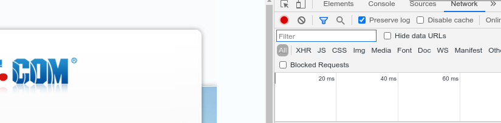
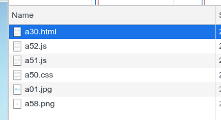
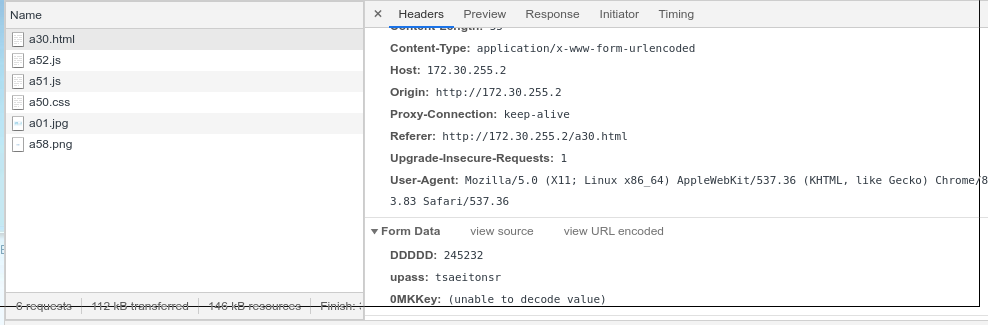
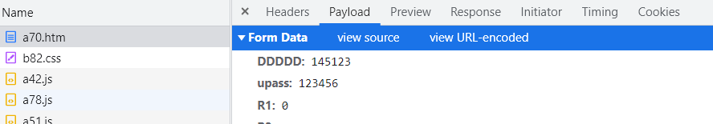
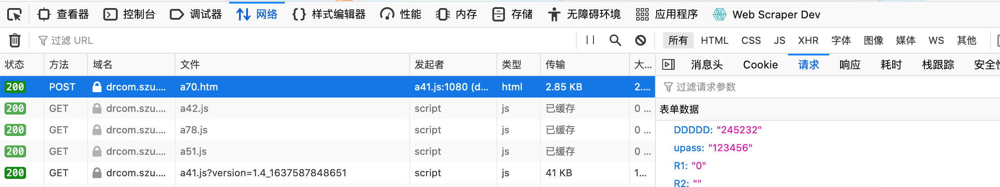
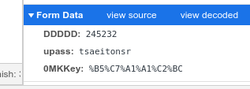

## 问题的出现（碎碎念）
### 1. 校园网登录
校园网需要认证后才能登录上网，在使用 Linux 的时候有一点很麻烦，宿舍区必须使用客户端才能登录，不能像教学区那样可以网页登录，不知道是谁告诉我们宿舍区也可以网页登录，网址是:

```
http://172.30.255.2/a30.html
```

于是宿舍区使用 Linux 的问题得以解决。但是每次断网都要打开浏览器去连接也不是很方便，我想是否可以使用爬虫来实现登录，找着找着发现可以用 `curl` 来实现登录。

### 2. 宿舍电费查询
这个小工具的出现的起因是宿舍如果没电了，夏天早上会断电，我的树莓派会被强制断电，对 SD 卡不好于是我想每天做个定时任务爬一下宿舍电费是多少，一开始也是想用 selenium 爬虫做的，但是 selenium 太吃资源，于是我又找着找着想到了 `curl`，然后就成了。

## `curl` 简介
我们常用 `curl`、`wget` 在 Linux 上下载东西：

```sh
curl www.baidu.com
wget www.baidu.com
```

而我们知道网络里有的不止是从服务器上下载内容，还有提交内容到服务器上。要怎么提交呢？

方法很简单就是使用 `-d` 参数，语法如下：

```sh
curl -d 'variable=value' URL
```

Windows、Linux、Mac 一般都有 `curl` 命令，Windows 没有的话可以去这里下 [https://curl.se/windows](https://curl.se/windows)

## 如何制作
上面说的 `curl` 来贴一个 POST表单，可能很难理解，我们借 drcom 来举一个例子，给大家介绍一下如何制作两个使用 `curl` 的小工具。

### 登录 drcom 校园网

这里再提一下两个登录的网页地址，教学区这个域名默认的网页就是登录界面，但是宿舍区上网自动跳转的界面是让你下载客户端，但是`a30.html`是可以和教学区那样实现网页登录的：

* 教学区： `https://drcom.szu.edu.cn`
* 宿舍区： `http://172.30.255.2/a30.html`

前面说到 `curl` 登录需要提交一份包含登录信息的表单。那这个表单是怎么样的呢？

1. 在浏览器中打开登录网页，并输入帐号密码，**不要登录**。

2. 打开调试，选择`网络 (Network)`， 并勾选`保留日志 (Preserve log)`(Firefox 默认保留）



打开调试的方法：

* Chrome, Firefox: F12
* Mac 的 Safari:
    1. Safari 浏览器 > 偏好设置 > 高级 > 在菜单栏中显示“开发”菜单
    2. 开发 > 显示 JavaScript 控制台

3. 点击登录，调试框内会显示新的各种请求接受包



4. 点最上面的`a30.html`，点`标头 (Headers)`，这是一个`POST`包，并拉到最下面。



* Chrome 和 Firefox 更新了，表单是单列了一条（Payload/请求）
    + Chrome:  
    
    + Firefox:  
    


5. 看到输入的帐号密码（别的地方的 WIFI 可能是被加密过的，但没关系，拷下来就是），以及一个`0MKKEY`，点击`view URL encoded`，`0MKKEY` 显示出来了。



这个就是前面说的 `curl` 需要的表单。


6. 用`curl`登录，在终端（Linux，Mac）cmd（Windows）输入命令，可以在登出后测试。

```sh
curl -d "DDDDD=245235" -d "upass=tsaeitonsr" -d "0MKKey=%B5%C7%A1%A1%C2%BC" http://172.30.255.2/a30.html
# 换上你的帐号密码
```

**update:
可以直接右键复制为 `cURL`**

7. 脚本化
* windows 桌面新建一个`drcom.cmd`，然后把上面这个命令拷进去，下次双击就可以执行啦。
* Linux、Mac 在桌面或者别的地方建一个`drcom.sh`，然后拷贝上面的命令到这个文件里。添加`#!/bin/sh`作为第一行，保存。通过`chmod +x drcom.sh`添加执行权限。
    + Linux 双击或者选择用终端打开就可以了
    + Mac 右键选择打开方式 > 启用：所有应用程序，始终以此方式打开 > 实用工具 > 终端

多说一句那一行的意思，在终端执行`./drcom.sh`时，系统会用`/bin/sh`来解释执行，它等同于在终端使用`/bin/sh drcom.sh`，如果你有 python 程序，在添加`#/bin/python`（自己注意 python 的位置和版本）后，可以使用`./script.py`来用 python 执行，当然`./drcom.sh`的前提是文件有执行权限。

### 查询宿舍电费
第二个例子是“查询宿舍电费”

查询路径：


用同样的方法，只不过这次的脚本相比于登录校园网，需要生成时间，并解析HTML。

```sh
#!/bin/bash

# get from curl
dormitory=1632
roomId=8780

# Send an email when the battery is below 20
mail_threshold=20
mail_address=<mail address>

today=$(date -d today +%Y-%m-%d)
three_days_ago=$(date -d 3-days-ago +%Y-%m-%d)

today_y=$(date -d today +%Y)
three_days_ago_y=$(date -d 3-days-ago +%Y)

#echo $three_days_ago
#echo $today

html=$(curl -s \
	-d "beginTime=$three_days_ago" \
	-d "endTime=$today" \
	-d "type=2" \
	-d "roomId=$roomId" \
	-d "roomName=$dormitory                " \
	-d "client=192.168.84.110" \
	http://192.168.84.3:9090/cgcSims/selectList.do)

# parse HTML
electric_info=$(sed 's/\r//g;s/^[ \t]*//g;/^[[:space:]]*$/d' <(echo "$html") |\
    grep -a -v '[<>]' |\
    awk -v dormitory=$dormitory -v today_y="$today_y" -v three_days_ago_y="$three_days_ago_y" '($0~dormitory),($0~today_y||$0~three_days_ago_y){print $0}')
    #  remove \r space return
    # remove html tags 
    # print between dormitory and year # grammar: comma

# send mail
mail_info=$(tac <(echo "$electric_info") |awk 'NR==1{print "更新时间：" $0};NR==4{print "剩余电量：" $0}')
#electric_reserve=$(tac <(echo "$electric_info") |awk 'NR==4{print $0}')
#echo $mail_info

#echo $electric_reserve
: ${electric_reserve:=$(($mail_threshold+1))}
#echo $electric_reserve
#electric_reserve=$(sed 's/\r//' <<<$(echo "$electric_reserve")) #remove the \r

if [ "$(bc <<<$(echo -e "$electric_reserve < $mail_threshold"))" -eq 1 ]; then
	echo -e "Subject: 宿舍电费\n\n$mail_info\n记得及时充电费哦. \n\nRaspberrypi\n$(date)" | sendmail $mail_address
fi
```


---

## drcom 自动登录
断网了就要重新去点运行脚本好麻烦，那能不能连上校园网断网自动重连呢？

思路是：

* WIFI:
1. 获取当前连着的 WIFI 的名字
2. 如果那个需要登录的 WIFI 名，包含在当前连着的 WIFI 里（分 `172` 和 `192`），就尝试 `ping baidu.com`
3. 如果 `ping` 不通，就用 `curl` 登录

* 以太网：
1. 比较网关的 mac 地址 （分 `172` 和 `192`) 和预存是否一样，这里可能每到一个新地方就要添加一下挺麻烦的。
2. 如果一样，则尝试 `ping baidu.com`
3. 如果 `ping` 不通，就用 `curl` 登录

我已经将它写好了，放在 [github](https://github.com/BenSYZ/tools-in-szu) 上。
* 一般情况把卡号和密码改上，运行一下 install 就可以了，如果有问题欢迎留言和提 issue。
* 需要修改 `drcom.cmd`/`drcom.sh` 里的卡号、密码、以太网的设备名和 mac 地址，保存后然后运行 install
* WIFI 名称不一定非得是 SZU_WLAN, SZU_NewFi，可以加上自己的路由器的 WIFI 名，这样打开电脑，连上这个 WIFI，也会尝试登录的。
* 如果是别的学校的同学可能需要自己修改一下内容啦

需要注意的是：如果你在宿舍跑着这个脚本，就不能在食堂用手机登录啦，会自动踢下线的，但是教学区和宿舍区是分开的（192 和 172 是分开的）。

### Windows
Install 后相关文件：

```
C:\Users\%username%\drcom\drcom_autologin\
C:\Users\%username%\drcom\drcom_autologin\drcom.sh
C:\Users\%username%\drcom\drcom_autologin\drcom.vbs
C:\Users\%username%\AppData\Roaming\Microsoft\Windows\Start Menu\Programs\Startup\drcom.vbs -> C:\Users\%username%\drcom\drcom_autologin\drcom.vbs
```

用`vbs`启动 `cmd`，发送这个`vbs`的快捷方式到开机启动的目录，就可以实现开机自启动了。

### Linux
Install 后相关文件：

```
~/.local/bin/drcom.sh
~/.config/systemd/user/drcom.service
```

#### Requirements
* `ip` in `iproute2`
* `arp` in `net-tools`

通过 user `systemd`，在用户登录时启动脚本，

需要注意的是 **用户级别的** `systemd`在没登录的时候是不会启动的，我之前把树莓派上的 service 从系统级别换成用户级别，每次重启后连上树莓派的热点后都要登录，脚本好像失效了，但登录到树莓派上，又能上网了，那时让我很是困惑。

### Mac
Install 后相关文件：

```
~/.local/bin/drcom.sh
~/Library/LaunchAgents/com.drcom.app.plist
```

#### Requirements
* `ip` in `iproute2mac`

```sh
brew install iproute2mac
```

通过`launchctl`，来实现自动启动脚本。
