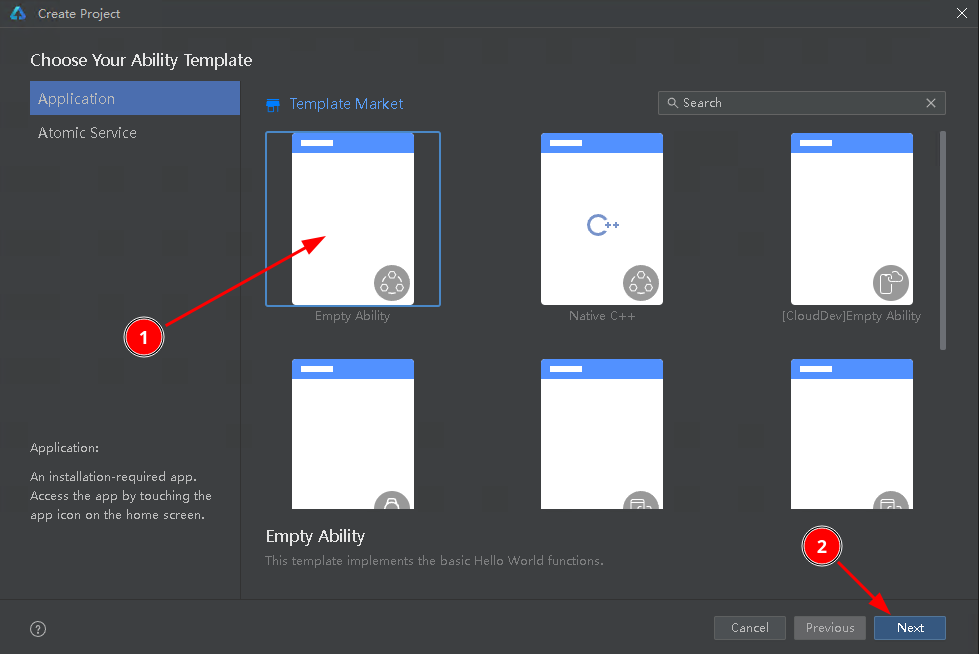
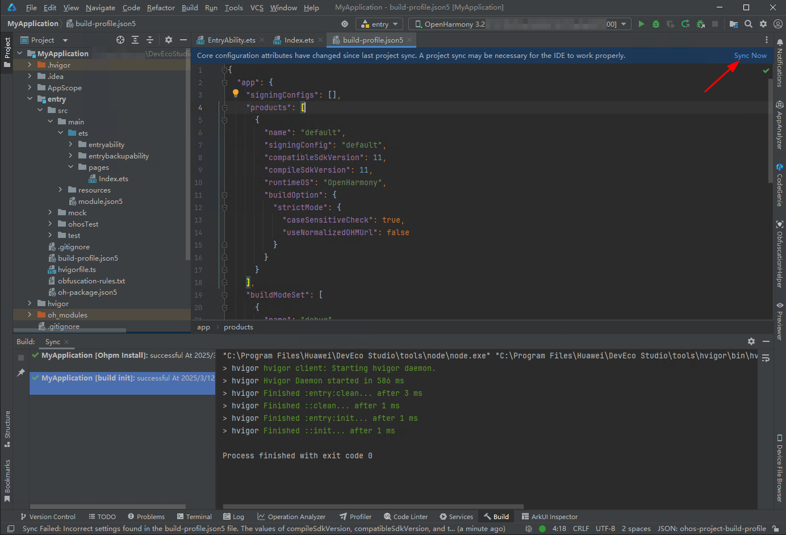

## Introduction
我下载了 OpenHarmony-4.1.2 的 SDK，然后编译了 Hihope/dayu210，并把把生成的镜像烧录到了我们的板子上，板子启动后，现在准备开发上层应用，但是 DevEco Studio 提供的 demo 直接跑不起来，需要做些改动。

[这是华为官方的文档](https://developer.huawei.com/consumer/cn/doc/harmonyos-guides-V5/ide-project-V5)。

### environments

* DevEco Studio: Build Version: 5.0.7.210, built on February 11, 2025
* Soc: rk3588
* Board: Custom Board
* System SDK Version: 4.1.2

## 将 Demo 跑起来的详细步骤
### 创建工程


因为我们的 OpenHarmony-4.1.2 的 Sdk version 是 11，所以这边我们选择 11




(Native C++) 是一样的配置，只是需要多加一个配置，参考[配置 `abiFilters` (选的工程是 Native C++ 时)](#配置-abifilters-选的工程是-native-c-时)

重新创建的路径在：

```pos
ToolBar -> File -> New -> Create Project -> Empty Ability
```

### 下载 SDK


### 连接开发板

默认下载路径是在这里 `C:\Users\username\AppData\Local\OpenHarmony\Sdk`，打开 powershell 输入以下命令

```ps2
.\11\toolchains\hdc.exe kill
.\11\toolchains\hdc.exe start
.\11\toolchains\hdc.exe shell
```

**注意**: 这里需要 start，不要直接 shell，直接 shell，DevEco Studio 那里会始终连不上。

* Notes:
    + `hdc` 和功能和 `adb` 是一样的
    + Linux 上的 SDK 内编译出来的 `hdc` 在这里 `OpenHarmony-4.1.2-Release/prebuilts/ohos-sdk/linux/11/toolchains/hdc`

当 DevEco Studio 右上角的 device 下拉框中是这样时，代表板子连上了。


### 配置 `abiFilters` (选的工程是 Native C++ 时)
根据[官方文档](https://developer.huawei.com/consumer/cn/doc/harmonyos-guides-V5/ide-create-new-project-V5) 最后所述，需要做如下配置

```json5
//<project>/MyApplication/build-profile.json5
{
  "app": {
  //...
    "products": [
      {
        //...
        "buildOption": {
          // ...
          "externalNativeOptions": {
            "abiFilters": ["arm64-v8a"]
          }
          // ...
        }
        //...
      }
    ]
  //...
  }
}
```


### 修改 `runtimeOS` 为 `OpenHarmony`

根据[华为官方文档的这节](https://developer.huawei.com/consumer/cn/doc/harmonyos-guides-V5/ide-create-new-project-V5#section1826317225311) 我们需要配置 `RuntimeOS` 为 `OpenHarmony`

```json5
//<project>/MyApplication/build-profile.json5
{
  "app": {
  //...
    "products": [
      {
        //...
        "compatibleSdkVersion": 11,
        "compileSdkVersion": 11,
        "runtimeOS": "OpenHarmony",
        //...
      }
    ]
  //...
  }
}
```

要把这块的配置


改成：


**注意**：`compatibleSdkVersion` 字段在 `runtimeOS` 为 `HarmonyOS` 时是 string 类型，但在 `runtimeOS` 为 `OpenHarmony` 的时候，该字段为 int。

改完先不管 Linter 的报错，保存然后点右上角 “Sync Now”，会有弹窗，大概意思是要把板子类型改成 “default” 和 “tablet”，然后点 “Yes”。完了之后，Linter 的报错也会消失。




否则这里会报 Sign 之类的错误 TODO

### 配置 SYSCAP
[参考](https://blog.csdn.net/openharmony/article/details/132898745)

SYSCAP 大概是系统的能力，比如我是否支持 3D graphics 或者 refs TODO

去 Linux 下编译好的 SDK 里找 `PCID.sc` 文件，在以下几个目录（这几个文件都一样）：

```
OpenHarmony-4.1.2-Release/out/rk3588/PCID.sc
OpenHarmony-4.1.2-Release/out/rk3588/obj/developtools/syscap_codec/out/rk3588/PCID.sc
OpenHarmony-4.1.2-Release/out/rk3588/packages/phone/system/etc/PCID.sc
```

在 DevEco 中导入上面的 PCID，导入方式，我没找到，但是可以通过 Help 直接跳过去，位置：

```
ToolBar -> Help -> Find Action -> "Import Product Compatibility ID"
```


完了之后，我们需要把最后的 `SystemCapbility.Base` 字段去除，它似乎不太兼容：


最后保存之后点 Sync Now


### 配置签名密钥


**不要**勾选 `Support HarmonyOS`，勾选 `Automatically generate signature`


### 将板子配置成 developer mode
[refs](https://blog.csdn.net/userhu2012/article/details/140957908)

通过 hdc 连接到板子上，输入以下命令配置 developer mode。 

```hdc
param set const.security.developermode.state 1
```

### build & run
直接点击右上角的播放符，开始编译然后运行，demo 就起来啦。


## 相关错误
### code:9568320
不配置签名密钥报错：

```
Install Failed: error: failed to install bundle.
code:9568320
error: no signature file.
```

参考[配置签名密钥](#配置签名密钥)

### code:9568393

```
Install Failed: error: failed to install bundle.
code:9568393
error: verify code signature failed.
The target device does not work with apps with an OpenHarmony signature. Sign the app with a HarmonyOS signature before installing it on the device.
```

参考 [修改 `runtimeOS` 为 `OpenHarmony`](#修改-runtimeos-为-openharmony)

### 右下角弹窗 Please try to match the API version

```
Please try to match the API version of the device and the app. The current
device does not contain the following SysCap attributes in the rpcid.json file:
SystemCapability.ArkUi.Graphics3D. Make sure the device supports all the SysCap
attributes required for running the app.
```

参考 [配置 SYSCAP](#配置-syscap)

### 编译失败
```
> hvigor ERROR: Failed :entry:default@PreBuild... 
> hvigor ERROR: Schema validate failed.
	 Detail: Please check the following fields.
{
  instancePath: 'devices.custom[0].PCID[242]',
  keyword: 'pattern',
  params: {
    pattern: '^SystemCapability\\.[a-zA-Z0-9]+\\.[a-zA-Z0-9]+(\\.[a-zA-Z0-9]+){0,2}$'
  },
  message: 'must match pattern "^SystemCapability\\.[a-zA-Z0-9]+\\.[a-zA-Z0-9]+(\\.[a-zA-Z0-9]+){0,2}$"',
  location: 'C:/Users/kenexs/DevEcoStudioProjects/MyApplication2/entry/src/main/syscap.json:252:34'
} 

> hvigor ERROR: BUILD FAILED in 203 ms 
```

参考 [配置 SYSCAP](#配置-syscap) 去除 `SystemCapbility.Base`


### error: failed to start ability.

```
error: failed to start ability.
Error while Launching ability
```

部分文章包括官方文档的 FAQ 说需要配置 `module.json5` 中的 `exported` 为 `true`，我看了一下都开了，还不行

在板子上，通过 `hilog` 命令查看日志，查看报的错：

```sh
hilog &
aa start -a EntryAbility -b com.bensyz.myapplication
``````

我们会看到

```log
03-12 15:28:07.302   905  1127 E C01300/Ability: [ability_manager_service.cpp(CheckDebugAppInDeveloperMode:9026)]Debugging application cannot run in non developer mode.
03-12 15:28:07.302   905  1127 E C01300/Ability: [ability_manager_service.cpp(StartAbilityInner:861)]Generate ability request local error.
error: failed to start ability.
```

参考 [将板子配置成 developer mode](#将板子配置成-developer-mode)

### code:9568404
如果勾选了 Support HarmonyOS，会需要你登录华为帐号，同时编译完会报

```
Install Failed: error: failed to install bundle.
code:9568404
error: delivery sign profile failed
```


参考[配置签名密钥](#配置签名密钥)，重新点击 `Automatically generate signature` 来重新生成密钥。

### code:9568332
```
Install Failed: error: failed to install bundle.
code:9568332
error: install sign info inconsistent.
```


同名包不同的签名，在板子上卸掉即可
