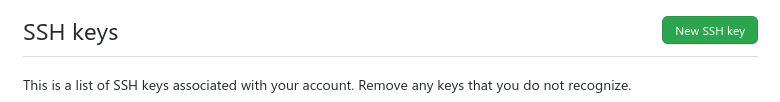

## 问题的出现
github 似乎不能使用帐号密码来push了，我们这里介绍一下如何使用 rsa 密钥对来进行身份认证。

github 上有[文档](https://docs.github.com/cn/authentication/connecting-to-github-with-ssh/adding-a-new-ssh-key-to-your-github-account)

## 如何操作
### 生成密钥对

在`~/.ssh`下生成 rsa 非对称密钥对，可以把密钥名取为`github`，可以不用设置密码
```shell
$ cd ~/.ssh/
$ ssh-keygen -t rsa
Generating public/private rsa key pair.
Enter file in which to save the key (/home/ben/.ssh/id_rsa): github
```

非对称密钥对在我 [ssh 免密登录](../rsa_ssh/)里有讲到一点。

于是我们得到了 `github` 这一密钥 和 `github.pub` 这一公钥。将 `github.pub` 中的内容拷贝出来，一会儿放在 github 上

### 将公钥内容拷贝到 github 上

* 点击路径：头像-> Settings -> 左侧SSH and GPG keys
* 或者直接访问这个链接 [https://github.com/settings/keys](https://github.com/settings/keys)

| | |
|--|--|

然后就是 New SSH key



把内容拷贝到 Key 框下，title 就是自己知道的标记


`Add SSH key` 后这样远端的配置就好啦

### 让本地密钥生效
远端的公钥准备好了，那如何使第一步中生成的密钥在 `git push` 时生效呢

```sshconfig
host github.com
	HostName github.com
	IdentityFile ~/.ssh/github
	User git
	ForwardX11 no
```

[ssh 免密登录](../rsa_ssh/#附不用输入nameip的方法)中有提到这点也有讲到。

github 的目标和 ssh 的差不多的:

```sh
ssh name@ip
git clone git@github.com:BenSYZ/blog.git
```

解释一下 `~/.ssh/config`：

* `host` 的 `github.com` 其实对应的就是这里的`git@github.com`，你可以把它换成任意你喜欢的，但是为了方便，在github 拷贝的 clone 就是 `git@github.com:BenSYZ/blog.git`， 所以我们将它也设置成了 `github.com`
* `Hostname`：是真正访问的地址
* `IdentityFile`：刚刚生成的密钥
* `User`：就是 `git@github.com:BenSYZ/blog.git` 中`@`前的用户名
* `ForwardX11`：若为yes 就等同于 `ssh -X` 这样就可以启动远程的图形界面啦。
