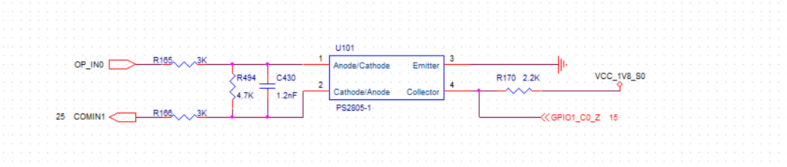
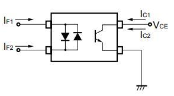
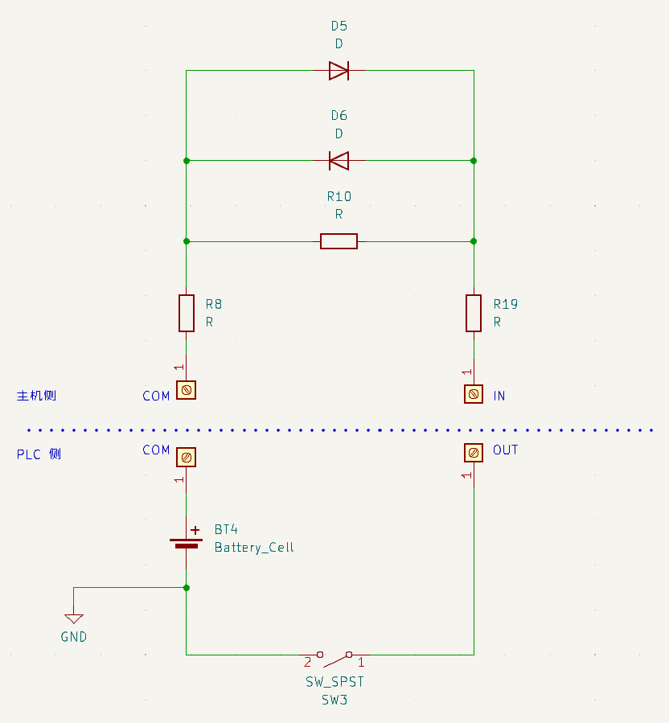
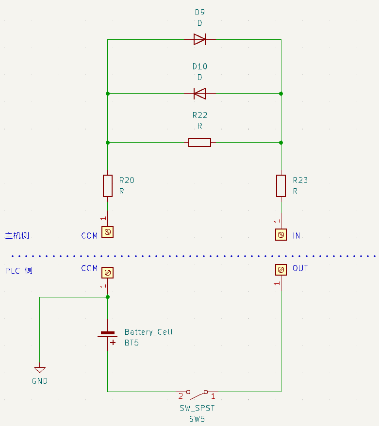
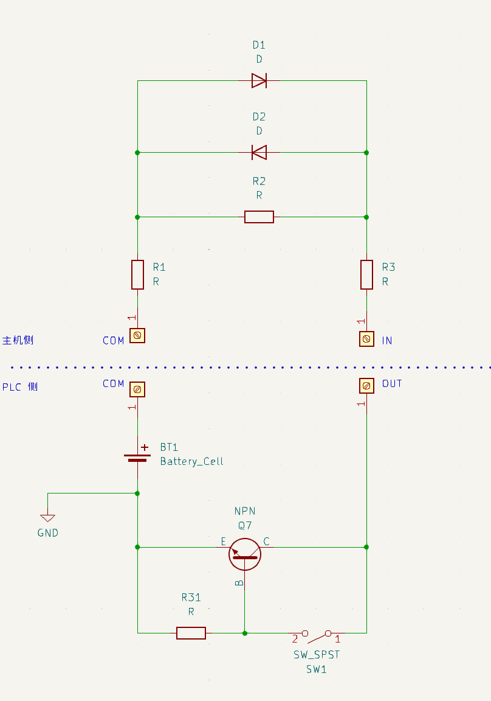
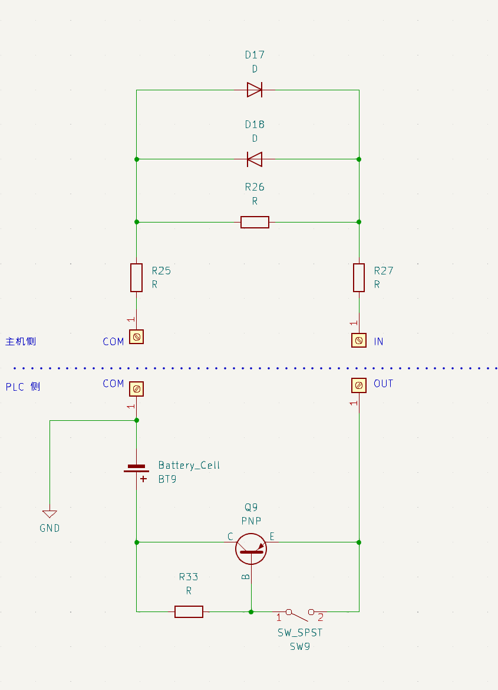
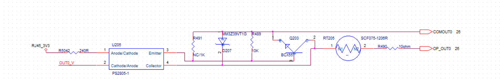
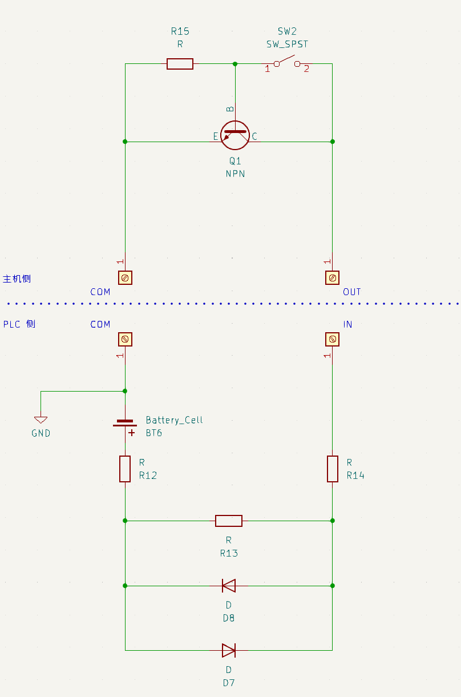
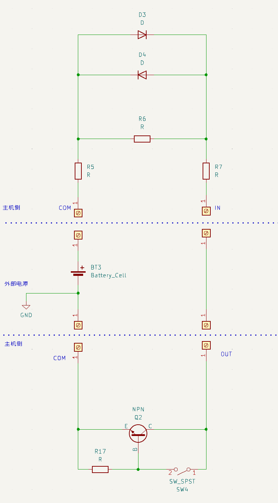

# Intro

在阅读之前有一点需要注意的是，我们的输出、输入，和 PLC 的输出、输入不一样，PLC 的输出和输入是带着电源的，我们的不带电源。这点对输入很好理解，但是对于输出，不能理解成我们输出电压，我们的输出只是一个开关。

## Input

### 一些标记
* 左侧
    + `OP_IN0`：外部看到的 `IN0`
    + `COMIN1`：外部看到的 IN 口的 `COM` 口
* 右侧
    + ⏚ ：地 GND
    + `GPIO1_C0_Z`：连到上级芯片（主芯片）。

* 中间
    + `PS2805`：光耦，如果 `1` `2` 引脚间有电压差，就会发光，会激发 `3` `4` 引脚间的光敏二极管，即 `3` `4` 导通，也就是 **有电压差，开关闭合**

    

### 右（内）侧电路
先说简单的：

* 工作状态：`3` `4` 引脚间的光敏二极管导通，`GPIO1_C0_Z` 的电压等于 3 引脚的 `GND`，低电平
* 停止工作状态：`3` `4` 引脚间的光敏二极管开路断开，`GPIO1_C0_Z` 的电压等于 `VCC_1V8_S0`，高电平

### 左（外）侧电路
* `COMIN1` 高电平
    + `OP_IN0` 低电平，`1` `2` 之间**有**电压差，中间的光耦工作。
    + `OP_IN0` 高电平，`1` `2` 之间**无**电压差，中间的光耦不工作。
* `COMIN1` 低电平，`OP_IN0=1`，`1` `2` 之间有电压差，中间的光耦工作
    + `OP_IN0` 低电平，`1` `2` 之间**无**电压差，中间的光耦不工作。
    + `OP_IN0` 高电平，`1` `2` 之间**有**电压差，中间的光耦工作。

### 整体电路
定义：

* `COMIN1` 为 `COM`
* `OP_IN0` 为 `IN`
* `GPIO1_C0_Z` 为 `GPIO`
* 高电平为 1， 低电平为 0

那么：

 |           | `IN = 1`   | `IN = 0`   |
 |-----------|------------|------------|
 | `COM = 1` | `GPIO = 1` | `GPIO = 0` |
 | `COM = 0` | `GPIO = 0` | `GPIO = 1` |

$\text{GPIO} = \text{IN} \odot \text{COM}$ 同或关系（相同为1）

上升沿和下降沿看的是 `IN`，所以：

* 如果 `COM` 口 是高电平，$\text{GPIO} = \text{IN}$
* 如果 `COM` 口 是低电平，$\text{GPIO} = \overline{\text{IN}}$，那么实际的上升沿和输入到系统的上升沿是反的

---

* `COM` 口 高电平对应的 `PLC` 类型是 `NPN`
* `COM` 口 低电平对应的 `PLC` 类型是 `PNP`

|                 | `IN = 1`   | `IN = 0`   | to soc     |
|-----------------|------------|------------|------------|
| `NPN` `COM = 1` | `GPIO = 1` | `GPIO = 0` | No reverse |
| `PNP` `COM = 0` | `GPIO = 0` | `GPIO = 1` | Reverse    |

### With PLC side
为了理解输出我们需要看完整的电路情况

#### Simple View
| `COM = 1`                                       | `COM = 0`                                       |
|-------------------------------------------------|-------------------------------------------------|
| {width=500px} | {width=500px} |

值：

|                 | `IN = 1` （PLC 开关断开） | `IN = 0` （PLC 开关闭合） | to soc     |
|-----------------|---------------------------|-----------------------|------------|
| `NPN` `COM = 1` | `GPIO = 1`                | `GPIO = 0`            | No reverse |
| `PNP` `COM = 0` | `GPIO = 0`                | `GPIO = 1`            | Reverse    |

延触发：

`NPN`， `COM=1`

| 开关状态     | `IN`   | 外部的沿 | 光耦间电压差 | `GPIO` | to soc   |
|--------------|--------|----------|--------------|--------|----------|
| `断开->闭合` | `1->0` | `下降沿` | 无->有       | `1->0` | `下降沿` |
| `闭合->断开` | `0->1` | `上升沿` | 有->无       | `0->1` | `上升沿` |

`PNP`，`COM=0`

| 开关状态     | `IN`   | 外部的沿 | 光耦间电压差 | `GPIO` | to soc   |
|--------------|--------|----------|--------------|--------|----------|
| `断开->闭合` | `0->1` | `上升沿` | 无->有       | `1->0` | `下降沿` |
| `闭合->断开` | `1->0` | `下降沿` | 有->无       | `0->1` | `上升沿` |

#### Full View
相对更完整的视图

| `COM = 1`, `NPN`                                              | `COM = 0`, `PNP`                                              |
|---------------------------------------------------------------|---------------------------------------------------------------|
| {width=500px} | {width=500px} |

## 输出端：

### 一些标记
* 右（外）侧
    + `OP_OUT0`：外部看到的 `OUT0`
    + `COMOUT0`：外部看到的 OUT 口的 `COM` 口
    + `BCX55`：NPN 三极管

* 左（内）侧
    + `RJ45_3V3`：3.3V
    + `OUT0_V`：连到上级芯片（主芯片），被控制的引脚。

* 中间
    * `PS2805` 同 INPUT

### 左（内）侧电路
+ `OUT0_V` 低电平，`1` `2` 之间**有**电压差，中间的光耦工作。
+ `OUT0_V` 高电平，`1` `2` 之间**无**电压差，中间的光耦不工作。

### 右（外）侧电路
如开始所说，我们的输出的外侧需要接外部电源。由于中间的三极管是 `NPN`，`e`极需接低电平，`c`极需接高电平，所以，`COMOUT0` 需要连低电平，`OP_OUT0 = 1` 需要连接高电平。

* 停止工作状态：`3` `4` 引脚间的光敏二极管开路断开，三极管`NPN` 的 `b` 极电平等于`COMOUT0=0`，三极管截止，`OP_OUT0` 电压等于外部电压也就是 `0`
* 工作状态：`3` `4` 引脚间的光敏二极管导通，三极管`NPN` 的 `b` 极电平等于`OP_OUT0=1`，三极管导通，`OP_OUT0` 的电压等于 `COMOUT0 + 三极管分压 ~0`（有个问题：为什么不是 `COMOUT0` 的电压等于 `OP_OUT0` 的电压？这个问题需要考虑负载，但是通常，`COM` 口会直连电源的正负极，负载会在 `OP_OUT0` 和电源之间，所以这里是 `OP_OUT0` 电平被拉到和 `COMOUT0` 一致。有点绕，因为这里没有地）

| `3` `4` 光敏二极管 | `NPN` 的 `b` 极电压              | 三极管状态 | `OP_OUT0` 电压        |
|--------------------|----------------------------------|------------|-----------------------|
| 断开               | 等于`COMOUT0=0`                  | 截止       | 初始电压 `0`          |
| 导通               | 等于`OP_OUT0` `=1`然后略大于 `0` | 导通       | 拉低 `~0+`(三极管分压) |

### 整体电路
定义：

* `COMOUT0` 为 `COM`
* `OP_OUT0` 为 `OUT`
* `OUT0_V` 为 `GPIO`
* 高电平为 1， 低电平为 0

那么：

|            | `COM = 0` |
|------------|-----------|
| `GPIO = 1` | `OUT = 1` |
| `GPIO = 0` | `OUT = 0` |

### With PLC side

{width=500px}

`COM=0`

| `GPIO` 写 | 光耦间电压差 | 开关状态     | `OUT`  | 外部的沿 |
|-----------|--------------|--------------|--------|----------|
| `1->0`    | 无->有       | `断开->闭合` | `1->0` | `下降沿` |
| `0->1`    | 有->无       | `闭合->断开` | `1->0` | `上升沿` |

## Others
最开始说的我们的输出和输入是不带源的，那么如果想让我们的 Output 输出到 Input，需要做的就是外加一个电源。

{width=500px}

## Summary
### Input
外部 PLC `NPN`， `COM=1`

| 外部的沿 | to soc   |
|----------|----------|
| `下降沿` | `下降沿` |
| `上升沿` | `上升沿` |

外部 PLC `PNP`，`COM=0`

| 外部的沿 | to soc   |
|----------|----------|
| `上升沿` | `下降沿` |
| `下降沿` | `上升沿` |

### Output

| `GPIO` 写 | 外部的沿 |
|-----------|----------|
| `1->0`    | `下降沿` |
| `0->1`    | `上升沿` |

