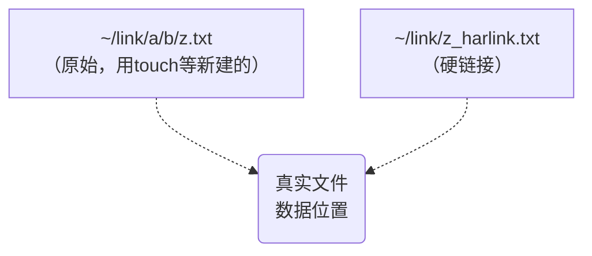
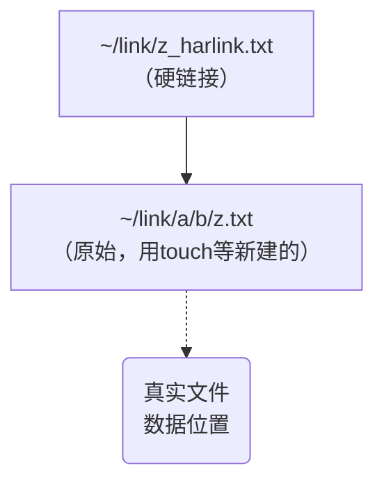

我原先发于 [CSDN](https://blog.csdn.net/BenSYZ)

# 链接 (link)
## 硬链接 (hard link) :
硬链接可以用作备份文件，但不可跨硬盘链接。

### 图示

### 命令
```sh
cp -l [source file] [destination file]
#or
ln [source file] [destination file]
```

## 符号链接 (symbolic link)<font size =1>(不是软链接哦)</font>
即“快捷方式”
符号连接可以跨硬盘建链接，但不能用作备份，原始文件("~ /link/a/b/z.txt")被删除后，链接("~/link/a/b/z.txt")无用了。

### 图示


### 命令
```sh
cp -s [source file] [destination file]
#or
ln -s [source file] [destination file]
```
