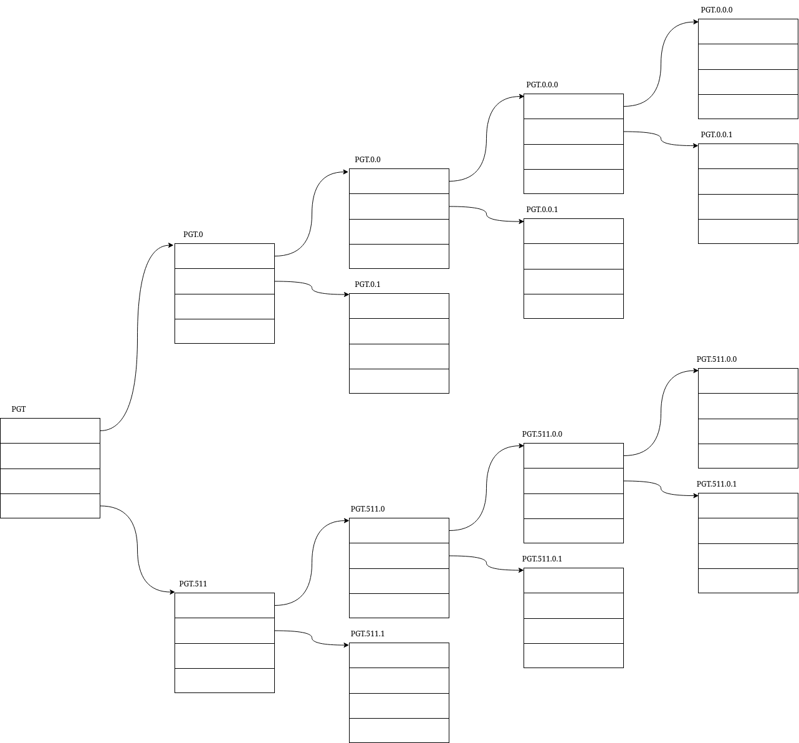

## Introduction
本文主要介绍了虚拟地址和物理地址，以及页表的设计思路和页表的结构。以及如何通过页表找到虚拟地址对应的物理地址。

## 物理地址和虚拟地址
* 物理地址（Physical Address，pa）：内存的地址总线
* 虚拟地址（Virtual Address，va）：虚拟的地址

### 为什么要引入虚拟地址
在引入虚拟地址前，所有的进程都直接跑在物理地址上。这有什么问题呢？

1. 物理内存碎片化导致利用率低：程序在内存中必须占据一段连续的空间。随着程序的不断加载和退出，内存中会产生许多无法被利用的碎片空间。即使系统剩余的总物理内存足够大，但由于没有足够长的连续空间，大程序也无法运行。
2. 缺乏进程隔离与安全性：所有程序都可以随意读写任意物理内存地址。一个有Bug的程序或恶意软件，可以轻而易举地修改其他程序甚至操作系统的内存数据。这会导致数据被意外覆盖、系统崩溃，且毫无安全性可言。

### 虚拟地址的硬件支持
原来 CPU 直接访问内存地址线，直接访问内存。现在硬件在 CPU 和内存地址总线间插入了一个内存管理单元（Memory Management Unit，MMU）。MMU 负责将虚拟地址转成物理地址。

```
             system bus (control/address/data buses)
----+--------------------
    ^
    |
  PA ( phisical address )
    |
┌───────┐
│       │
│  MMU  │
│       │
└───────┘
    ^
    |
  VA ( virtual address )
    |
┌───────┐
│       │
│  CPU  │
│       │
└───────┘
```

所谓的转换，我们可以抽象成：`pa = fn_MMU(va)`

## MMU 的设计思考
在介绍真实的 MMU 之前，我们来想想我们可以怎么构造一个 `fn_MMU`。

### 计算法：构造一个 `fn_MMU` 的函数
就把`fn_MMU`当作是一个函数，每个进程会有一个类似随机数种子的参数，使得不同的进程虽然有相同的 va 但 pa 不同。即：`pa = fn_MMU(va, pid)`。但问题是怎么构造呢？以及听起来就很不灵活。

### 查表法
我们可以把 pa 和 va 的关系存入内存，这样牺牲了一小段内存，但是换来了极大的灵活性。怎么存？

#### 把 pa va 的一起存入内存
首先每个进程都得有一块自己的内存区域来存这个映射表。那么 `fn_MMU` 就成了 `pa = fn_MMU(map_base, va)`，其中 `map_base` 是记录 va 和 pa 关系的起始物理地址，这个物理地址不是记录值的 pa。

对于每个进程，最简单的映射关系就是同时将 pa 和 va 存入内存，就像字典一样，va 作为 key，pa 作为 value。MMU 拿到一个 va 一个一个比较去得到 pa。这样，每一对 pa-va map 就需要 64bit + 64bit=16bytes 的空间来存储。MMU 遍历映射表区域，比较 va，比较成功得到最终的 pa。

但这里有几个问题：

1. 每隔多少个 va 存一个映射。我们不能将每个 va 和每个 pa 的关系都存入内存，因为 pa 的长度是 64 位的，存下一个 pa 需要 8 个字节。而这一个 va 和 pa 本身只表示一个字节的映射关系。
2. MMU 需要遍历比较，会很慢。
3. 同时存下 pa 和 va 内存牺牲有点多，因为 index 就是数字，能否类似数组的形式，只存 pa？这样就同时可以解决第二个问题。

#### 页的大小
第一个问题的本质在于，我们不能那么灵活，不能灵活到每一个 byte 都做一个映射，我们只能每 $m$ 个 bytes 做一个映射，$m$ 个 bytes 得是连续的。即 $\text{va} \in \{ mn \mid n = 0, 1, 2, 3, \dots \}$，不在记录中的映射关系借助前部在表上的映射关系得到基础 pa，再加上偏移。譬如对于 $\text{va} = mn+i, i < m$，我们先通过表查到 $\text{va} = mn$ 的 $\text{pa}_\text{mn}$ 后，再加上 $i$ 就得到 $\text{va}=mn+i$ 的 $pa$ 了，即 $\text{pa}_{mn+i} = \text{pa}_{mn} + i$。

而这里的 $m$ 个 bytes 为最小记录单位的内存，我们称其为**页**。页的 va 和 pa 可以任意映射，页内 va 和 pa 的关系是： va 偏移多少，pa 就偏移多少。

<!--
> 对于第三个问题，我们需要做个简单的计算，我们假定每
> 
> 我们暂定每 4K 个 va 做一个记录，即 $va \in \{ 4096n \mid n = 0, 1, 2, 3, \dots \}$，同时剩余的地址，作为页内的偏移。
-->

#### va 作为偏移，pa 存入内存
然后，我们来看后两个问题。

对于纯数字下标的字典，我们可以将其转成数组，va 作为偏移来作为 index。譬如，我们知道某一个进程的 va-pa 映射区的首地址是 `map_base`，我们只要在 `map_base+va` 的物理内存处存下 `pa` 即可。这样，我们既节省了内存空间，又让 MMU 可以更快地得到 pa 避免反复比较。

$$
\text{address of pa} = \text{map\_base}+\text{va} = \text{map\_base} + mn
$$

但这样就有新的问题了：

* 如果上文中的 $m$ 取大了，那么 va 的偏移速率就会很快，例如假设 m=4K，那么 `pa0 的存储位置 = map_base`, `pa1 的存储位置 = map_base+4K`，而为了内存利用率高，m 不能太小，这就导致了 pa 的记录值会散布在内存中，导致实际可用内存是碎片化的
* 如果物理内存不够，偏移就可能超出可用内存范围了。

有没有什么办法可以将这些映射关系放在一起？有的兄弟，有的。

#### va 去除低位偏移
上节的两个问题的根本在于，va 的变化太快了，那我可不可以把页内偏移直接给它去掉，原来 m 倍的增长，现在每次就是 1 倍的增长了。

也就是说

$$
\text{address of pa} = \text{map\_base}+\text{va}/m = \text{map\_base} + n
$$

即：

* va0 对应的 pa0 存于 `map_base+0` 的位置
* va1 对应的 pa1 存于 `map_base+1` 的位置
* ...

我们前面说我们内存被我们人为地拆分成了页的形式。而这里，页的 va 和 pa 的映射关系被连续地写在一起，这张表，我们便称之为**页表**。页表是存在内存中的，内存又是按页分割的。那么页表所在的页便是**页表页**。

故事到这里就结束了吗？没有。va0 va1 ... 有几项呢？va 可取的值为 $2^{64}$，按 4KiB 一页来分，即上文中的 $m$ 取 $4096$，总共会有 $2^{64}/4096=2^{52}$ 个项，每项存的是 pa，即 64bit，总共需要 $2^{52}*64/8=2^{55}$ 个字节，这也太大了，还没用，就要先分走 $2^5$ PiB 的内存来用于存储页表。即使 m 取大点也只是杯水车薪。那要怎么办？

#### va 的分割和页表的分级
va 需要 $2^5$ PiB 的内存只是理论上的数值。理论上，所有的 va space 全部被占用，就需要那么多的页表来管理，但此时这么大的页表对应的被管理的内存的大小就是 $2^64$ Bytes 即 $2^4$ EiB的内存。但现在哪有那么大的内存。所以，那么多的页表项其实都无用，预留那么多的空间都是无用的。那有什么办法不预留呢？和 C 中创建一个大数组预留转变成使用 malloc 动态分配内存一样，我们也可以动态地分配页表页，按需分配。怎么动态？

我们前面其实遇到过一个类似的问题：va 和 pa 的关系太多了，写不过来。我们当时采用的办法是间隔着记录 va 和 pa 的关系，中间的 pa 直接用记录的 pa + 偏移来得到。现在的问题是页表项太多了，那我们是否可以采用类似的方式？间隔着记录页表项，未记录的页表项用偏移推理得到？不行，因为页表项和地址不同，地址是连续的，页表项是任意的。那么，推理不出来，我们是否可以记录呢？主表间隔着记录，不记录页表项，而是记录子表所在的地址。那么我就不需要推理了。但这对于我们最初的问题有帮助吗？似乎我们除了页表项所在的页，我们还建立主表所在的页了，看起来更多了。但，此时子表的数量可以大大减少，那些每用到的页表项，我无需预留，我可以在主表上指向空。

也就是说，我们从


```
+---------------------+
| Entry 0             |
| Entry 1             |
| ...                 |
| Entry 511           |
+---------------------+
| ...                 |
+---------------------+
| Entry 2^52-512      |
| ...                 |
| Entry 2^52-1        |
+---------------------+
```

变成了

```
+-----------------------------+                +------------------+
|  Master Entry 0             | -------------> | Entry 0          |
|  Master Entry 1             | ----------.    | Entry 1          |
|  Master Entry 2             | -->[0]    |    | ...              |
|  ...                        |           |    | Entry 511        |
|  Master Entry 511           | -->[0]    |    +------------------+
+-----------------------------+           |    +------------------+
|         ...                 |           `--> | Entry 512+0      |
+-----------------------------+                | Entry 512+1      |
|  Master Entry 2^52/512-512  |                | ...              |
|         ...                 |                | Entry 512+511    |
|  Master Entry 2^52/512-1    |                +------------------+
+-----------------------------+
```

页表页的数量从 `2^52/512=2^43` 变成了 `2^52/512/512+2=2^34+2` 个了，大大减少了。

再来一级呢？再再来一级呢？我们会发现每多一级，主表的页数就会除以 512。在讨论 Linux 内核实际用的页表数量前，我们先看一下，这所谓的跳着记录在 va 上的体现是什么？

最早的分页+页内连续偏移：记录的 va 的取值范围是 $\text{va} \in \{ mn \mid n = 0, 1, 2, 3, \dots \}$，其中 $m$ 是跳过的 va 的数量。假设 $m=4*1024$，那么，被记录的 va 的取值是：

```
va_entry_0 = 0x00000
va_entry_1 = 0x01000
va_entry_2 = 0x02000
```

也就是低位的偏移在放入页表时直接忽略，作为“微扰”项。

那么我们多加一级页表的来源是什么？跳过几项页表记录，将跳过的记录放在新页中，保留新页的地址到原来的页表中。跳过的数量为一页中可以记录的 pa 的数量。因为内存的管理是按页来的，我在主表中记录的地址只有一个，这个地址就只能是一页。

那么主表中每一项对应的页表项的 index 为


```
entry_index_of_master_entry_0 = 0
entry_index_of_master_entry_1 = 512
entry_index_of_master_entry_2 = 1024
```

对应的子表中的第一个 va

```
first_va_of_master_entry_0 = va_entry_0    = 0x01000*512*0 = 0x0000 0000
first_va_of_master_entry_1 = va_entry_512  = 0x01000*512*1 = 0x0020 0000
first_va_of_master_entry_2 = va_entry_1024 = 0x01000*512*2 = 0x0040 0000
```

可以看到的是，所谓的跳过，最终反映到 va 上，便是 va 被跳过了更多。也就是说，va 的更多低位被忽略了。主表只管高几位的 va；子表只管次高位的，那些更高位的信息，在主表中被分流到其他子表中去了。


## 实际的页表
x86 的 CPU 中 MMU 采用的是查表法，在使用该 MMU 时，我们需要构造一张页表，并把最高级别的页表的基地址给到 MMU。当 VA 传输给 MMU 时，MMU 就会采用固定的方式去解析这块内存。两个问题：

* 最开始 MMU 要去哪里找页表，即页表的基地址怎么传？
    + 基地址，通过 CR3 寄存器传入。
        - 在用户进程切换时，需要从保存页表基地址，并将即将切换的用户进程的页表基地址写入 CR3
        - 所有内核采用一套地址空间，所以内核本身会有且仅有一个页表基地址。（之前，用户空间和内核空间互相切换时，也需要刷新 CR3，但由于刷新 CR3 就会导致 cache 失效。所以现在有一个 Lazy TLB 的技术。）
* 之前的内核采用的是 4 级页表，现在采用 5 级了，MMU 怎么知道？
    + 通过设置 CR4 中的 bit 位，来启用某种解析方式。
        - 4 级页表 bit 5（Physical Address Extension, [PAE](https://en.wikipedia.org/wiki/Physical_Address_Extension)）
        - 5 级页表 bit 12（57-Bit Linear Addresses, LA57）

更多关于 Control Register 可查阅 [Wikipedia](https://en.wikipedia.org/wiki/Control_register)





图中的 PGT 代表最高级别的 page table 所在的位置，由于它是 per process 唯一的，所以这里用 PGT 代替，而不是类似子表中用数字代替。这个地址就是 CR3 中记录的地址。PGT.0 代表 PGT 中第一个表项，依次类推，PGT.511.0.0.1 代表的含义是：PGD=511，P4D=0，PUD=0，PMD=1，即，在第5级的表中取出第 511 项，第4级的表中第0项，第3级表中的第0项，第2级的表中第一项。然后再根据 PTE 的值在最后这张表中找到对应的表项，得到这个 VA 的 PA。例如上面的 VA 的索引便是：`PGD.511.511.510.2.0`

注意，这些大方框都是在内存上的，一个大方框就是一页。这就意味着，它们也有一定的物理地址。而我们如何访问他们呢？MMU 可以直接访问，CPU 不行，CPU 只能通过虚拟地址访问，MMU 是读端，CPU 是写端。所以他们也一定有他们本身的虚拟地址。他们本身的物理地址也写在这个结构内。页表页也是页，也对应一个页表项，新增一页，占用一项，即损耗为 1/512，完全能填的下。

### 例子
目前 Linux 内核采用五级页表，一般的页大小为 4KiB，对 64 位的系统，每级页表只能包含 512 项 pa，跳过子表的 512 倍的 va。所以，每级页表只管 9 位 va


```
VA     =0xffffffff80200000

reserve                 p4d                  pmd                   offset
--------            -----------           -----------           ---------------
1111 1111 1111 1111 1111 1111 1111 1111 1000 0000 0010 0000 0000 0000 0000 0000
        -----------            -----------           -----------
            pgd                   pud                    pte
PGD = 511
P4D = 511
PUD = 510
PMD = 2
PTE = 0
```

## 页表和页表目录的属性
我们知道页表目录中记录的值是下一级 *页表目录* 或 *页表* 所在的物理地址，页表中记录的是 VA 对应的 PA 所在的物理页。着三个都是放在页上的，页是 4KiB 对齐的，地址按字节编址，也就是说页的物理地址的可取范围是 4096（=2^12） 的倍数。这就意味着，低 12 位的地址始终是 0。我们可以用这 12 位做一些控制信息：

```c
// arch/x86/include/asm/pgtable_types.h
#define _PAGE_BIT_PRESENT	0	/* is present */
#define _PAGE_BIT_RW		1	/* writeable */
#define _PAGE_BIT_USER		2	/* userspace addressable */
#define _PAGE_BIT_PWT		3	/* page write through */
#define _PAGE_BIT_PCD		4	/* page cache disabled */
#define _PAGE_BIT_ACCESSED	5	/* was accessed (raised by CPU) */
#define _PAGE_BIT_DIRTY		6	/* was written to (raised by CPU) */
#define _PAGE_BIT_PSE		7	/* 4 MB (or 2MB) page */
#define _PAGE_BIT_PAT		7	/* on 4KB pages */
#define _PAGE_BIT_GLOBAL	8	/* Global TLB entry PPro+ */
#define _PAGE_BIT_SOFTW1	9	/* available for programmer */
#define _PAGE_BIT_SOFTW2	10	/* " */
#define _PAGE_BIT_SOFTW3	11	/* " */

#define _PAGE_BIT_PAT_LARGE	12	/* On 2MB or 1GB pages */

#define _PAGE_BIT_SOFTW4	57	/* available for programmer */
#define _PAGE_BIT_SOFTW5	58	/* available for programmer */
#define _PAGE_BIT_PKEY_BIT0	59	/* Protection Keys, bit 1/4 */
#define _PAGE_BIT_PKEY_BIT1	60	/* Protection Keys, bit 2/4 */
#define _PAGE_BIT_PKEY_BIT2	61	/* Protection Keys, bit 3/4 */
#define _PAGE_BIT_PKEY_BIT3	62	/* Protection Keys, bit 4/4 */
#define _PAGE_BIT_NX		63	/* No execute: only valid after cpuid check */
```

其中 bit 7 `_PAGE_BIT_PSE` 的含义是把当前页上的记录项直接当作页表项，即把记录值当作目标 PA 所在的页的 PA，而不是下一级页表（或页表目录）的起始地址。这意味着什么？没有了子表，那那些没记录的页怎么找呢？不找了，直接当作连续，剩下的还没用的 VA 直接全部当作 offset。我的映射单元不再是 4KiB 的小页了而是 2MiB 的大页。好处是什么？子页表项不需要建了，没有了 1/512 的损耗。也就是说，我如果有一大段要求物理地址是连续的内存，我可以用一张大页直接管理映射了。内核的初始化代码段就是使用了大页。

bit 12 又是什么？如果我置位了大页，可以用它了？不是的，置位大页只能意味着这个地址对应的页是 2MiB，并不意味着这个页就是 2MiB 对齐的。bit 12 只能用于启用了 2MiB 大页的配置。

当然。更高位的保留的地址空间也可以先用一用。

## Summary
页表是存在内存中的数据结构，它将虚拟地址对应的物理地址存在其内部：虚拟地址反映结构，物理地址存于节点。其多层结构的设计来源是由于虚拟地址空间太大，通过分组的方式来分而治之，将大量未用到的页表用少量父结构统一反映，在指数增长前提前终止。高级别的结构便是页表目录，页表目录中记录的是子目录的地址。通过将虚拟地址的部分位当作页表目录中的偏移，得到下一级别的物理地址，不断地滑动窗口，最终得到页表和页表项中记录的物理地址。由于数学限制，我们并不能每个字节都做记录，只能记录部分映射关系，并把那些未记录的地址当作该记录地址的连续后续。这样的连续内存被称作页。并把最后的几位当作页内偏移。

1. 通过 CR3 找到页表物理内存地址
2. 通过部分 VA 一级一级得到偏移，最终得到 VA 对应的 PA

## 附录：页的大小和一级页表占 VA 的位数

页表项的含义为每 m 个地址做一次记录，一条记录对应一页，那么一页中就有 m 个字节。假设 pa 的位数为 n，那么每级页表中可以放 pa 的数量，即对下级页表的略过数量为：

$$
m*8/n
$$

对应占用 va 中的位数为

$$
log_2(m*8/n) = log_2(m/n) + 3
$$

* 对于 64 位 Linux 和 4KiB 的页，$n = 64$， $m = 4*1024$，占用的位数正是 9 位。
* 对于 64 位 Linux 和 2MiB 的页，$n = 64$， $m = 2*1024*1024$，占用的位数 18 位。
* 对于 32 位 Linux 和 4KiB 的页，$n = 32$， $m = 4*1024$，占用的位数 7 位。

## 附录：RK3576 中的单 DDR
> RK3576 的 32-bit DDR 最高支持 16GiB。32-bit 指的是数据位宽，地址位宽不只 32-bit，外部贴的是 DDR PHY，其 PIN 脚经包含几根 CA（Command/Address Bus）线和 32 根数据线（DQ）。
>
> * CA 总线（Command/Address Bus）：LPDDR4X 通常只有 6 根 CA 线，LPDDR5 通常只有 7 根 CA 线。
> * 时分复用（Time Multiplexing）：DDR PHY 在传输地址时，并不是把所有地址位一字排开同时发出去。它是利用时钟的上升沿和下降沿，分时、分批地把“行地址（Row）”、“列地址（Column）”和“Bank/Bank Group 地址”通过这几根 CA 线分段送进去。

[RK3576 32bit DDR 支持 64位操作系统](./rk3576_32bit_memory_single_ddr_phy.md)


## see also
<https://wiki.osdev.org/Paging>
