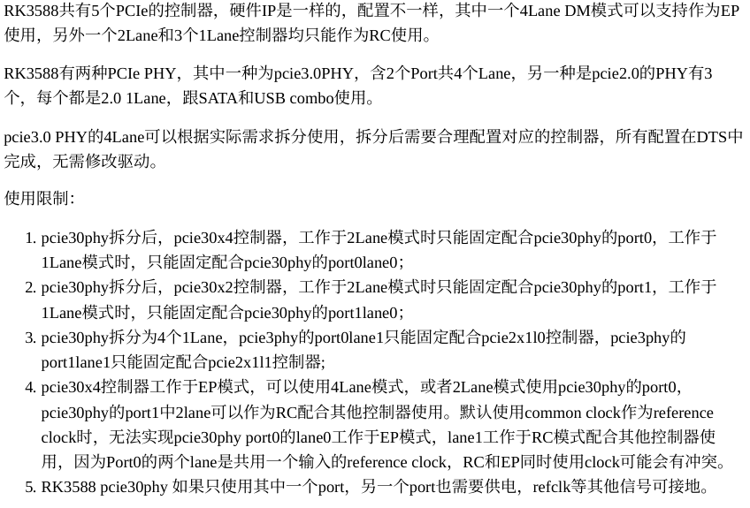
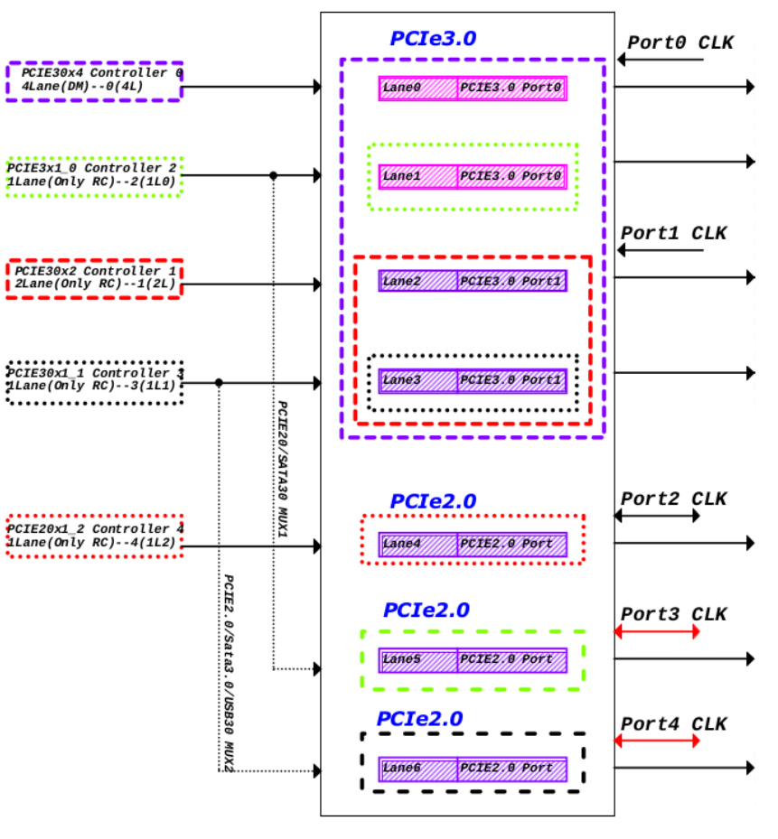
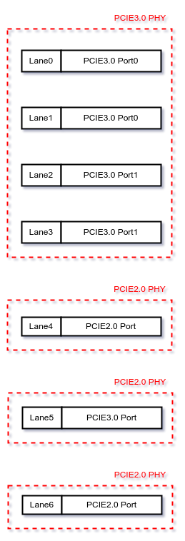
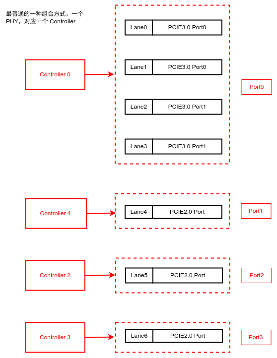
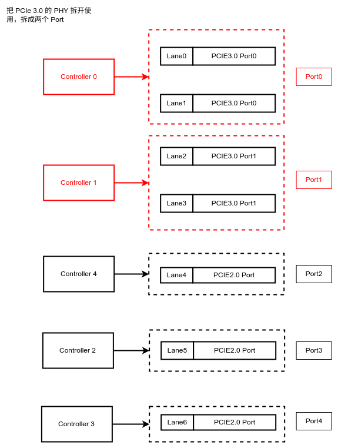
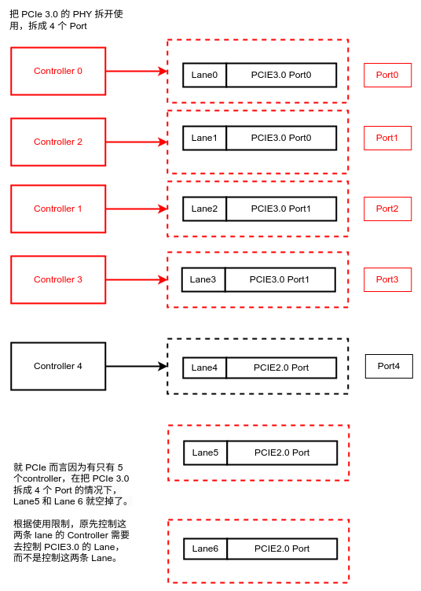
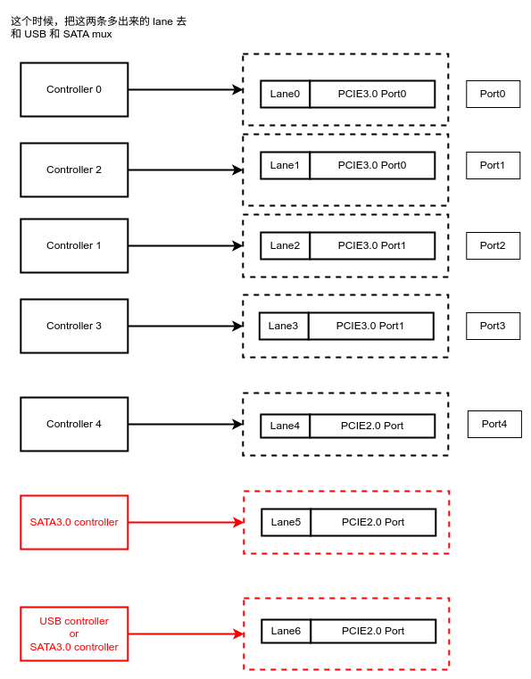
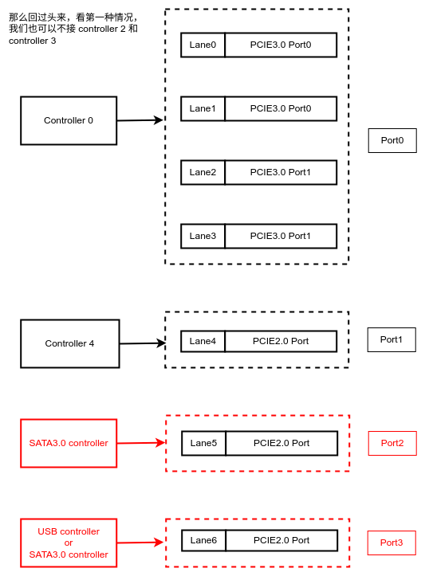
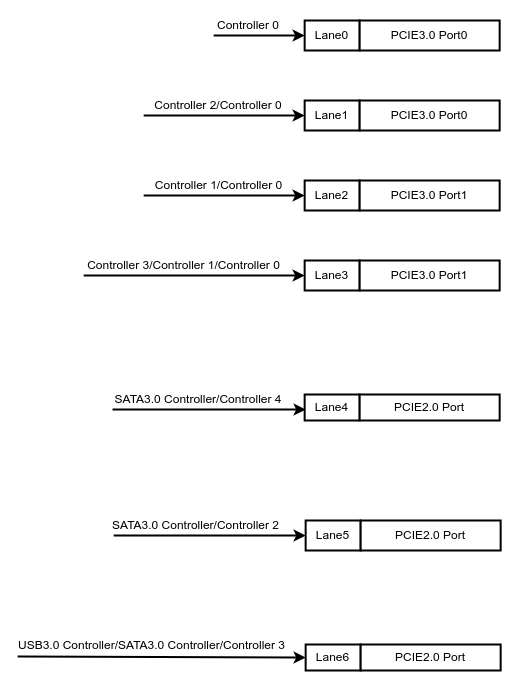

## Intro

起因是发现启动的时候 PCIe 有关于 `fe160000` 的报错信息:

```dmesg
[    1.712561] rk-pcie fe160000.pcie: invalid prsnt-gpios property in node
[    1.728638] rk-pcie fe160000.pcie: IRQ msi not found
[    1.728645] rk-pcie fe160000.pcie: use outband MSI support
[    1.728647] rk-pcie fe160000.pcie: Missing *config* reg space
[    1.728660] rk-pcie fe160000.pcie: host bridge /pcie@fe160000 ranges:
[    1.728670] rk-pcie fe160000.pcie:      err 0x00f1000000..0x00f10fffff -> 0x00f1000000
[    1.728677] rk-pcie fe160000.pcie:       IO 0x00f1100000..0x00f11fffff -> 0x00f1100000
[    1.728686] rk-pcie fe160000.pcie:      MEM 0x00f1200000..0x00f1ffffff -> 0x00f1200000
[    1.728691] rk-pcie fe160000.pcie:      MEM 0x0940000000..0x097fffffff -> 0x0940000000
[    1.728712] rk-pcie fe160000.pcie: Missing *config* reg space
[    1.728739] rk-pcie fe160000.pcie: invalid resource
[    1.934114] rk-pcie fe160000.pcie: PCIe Linking... LTSSM is 0x0
[    1.959670] rk-pcie fe160000.pcie: PCIe Linking... LTSSM is 0x1
[    1.986337] rk-pcie fe160000.pcie: PCIe Linking... LTSSM is 0x0
[    2.013002] rk-pcie fe160000.pcie: PCIe Linking... LTSSM is 0x0
[    2.043004] rk-pcie fe160000.pcie: PCIe Linking... LTSSM is 0x0
[    2.069669] rk-pcie fe160000.pcie: PCIe Linking... LTSSM is 0x0
[    4.629670] rk-pcie fe160000.pcie: PCIe Link Fail
[    4.629679] rk-pcie fe160000.pcie: failed to initialize host
```

于是阅读 RK3588 SDK 中关于 PCIe 的文档 `docs/cn/Common/PCIe/Rockchip_Developer_Guide_PCIe_CN.pdf`，想了解这个错究竟是什么，对于纯新手的我来说不是很好理解，因而边画，边学习，整理如下，如有错误之处，还请谅解并告知于我，十分感谢。

## RK's Intro and  Picture
RK 有一段关于 PCIe Controller 使用限制的说明，和一张 Big Picture，不是太好理解，于是我把这张图拆开来，画了几张图。

[1]
[2]


## PHY and Controller
* PHY: Chip。把控制器发过来的信号做处理，然后再发出去。这种处理是为了方便传输，类似网络中的 rgmii（上游）和 8bit/10bit（下游）。简单来说 PHY 的上下是两种信号。
* 控制器：实现一定的功能的 Chip。
* Cable: 网线。by ChatGPT: difference of PHY and cable: The PHY layer manages the signaling and encoding on the cable, ensuring reliable communication between devices.


### PCIe PHY
* RK3588 有两种 PCIe PHY
    + 一种是 PCIe 3.0 的 PHY 有 1 个
    + 一种是 PCIe 2.0 的 PHY 有 3 个

* PCIe 3.0 有 4 条 Lane
* 每个 PCIe 2.0 只有一条 1 个Lane




### Connect to PCIe Controller

RK3588共有5个PCIe的控制器，硬件IP是一样的，配置不一样，

* 1 个 4 Lane 控制器 支持 DM（dual mode）模式，可以作为 RC(Root Complex) 和 EP(End Point) 使用
* 1 个 2 Lane 控制器 只能作为 RC 使用
* 3 个 1 Lane 控制器 均只能作为 RC 使用

关于 RC 和 EP，可以详见我的这篇文章 [PCIe 和 lspci](./PCIe_and_lspci)。对于 RK3588 这个 PCIe 控制器的 EP 模式，其实此时，是将 RK3588 所在的 PCB 板当作板卡，就像显卡一样，插在其他主机的 PCIe 槽上，作为从设备。就像显卡、RTL8168 系列芯片一样。

PCIe PHY 受 PCIe Controller 控制，所以上面几个 PHY 的上游需要接 PCIe Controller。接法有很多，最简单的接法是这样子的：



* 关于 Port，简单来说一个 Port 接一个设备

也可以把 PCIe 3.0 的 PHY 拆开使用，拆成两个 Port




PCIe 3.0 的 PHY 还可以再细拆，拆成 4 个 Port



由于控制器数量限制，所以有两条 Lane 空出来了。这两条 Lane 空着也是空着，为什么不把它再利用起来呢，于是 RK 把这两条多出来的 Lane 和 USB 和 SATA 做了复用，也就是所谓的 MUX。所谓 MUX 就是同一条物理线路上，我可以传输这种信号，也可以传输另一种信号，我复用了这条线路，但是这里的“可以”和“也可以”只能选一个，不能既选这个又选那个，选了一个就不能选另外一个了。



那么回过头来，看第一种情况，我们也可以不接 controller 2 和 controller 3




所以这个事情就变得非常灵活了。那再来一张相对完整的图片（没有包含使用组合的限制）




## DTS

上面是硬件上的连接，那么软件上也就是设备树上怎么和上面的关联呢？根据 RK 文档，我们可以看到两张表，这里做了简化和修改。

### PHY

| PHY Chip Type | dts alias      | dts point      | Usage           |
|---------------|----------------|----------------|-----------------|
| PCIE3.0       | `pcie30phy`    | `phy@fee80000` | pcie专⽤        |
| PCIE2.0       | `combphy0_ps`  | `phy@fee00000` | 与SATA combo    |
| PCIE2.0       | `combphy1_ps`  | `phy@fee10000` | 与SATA combo    |
| PCIE2.0       | `combphy2_psu` | `phy@fee20000` | SATA/USB3 combo |


comboPHY 就是 PCIE 信号线路和其他信号线路复用的 PHY，当然在使用的时候只能选择一种使用，由硬件设计。

comboPHY dts alias name rule:

* 如果和其他信号复用(mux)，phy 的 alias 名字以 combphy 来表示
* combphy 的后缀表⽰复⽤关系，p、s、u、q分别表⽰PCIe、SATA、USB、QSGMII 

### Controller

| Controller index | dts alias   | dts point       |
|------------------|-------------|-----------------|
| 0                | `pcie3x4`   | `pcie@fe150000` |
| 1                | `pcie3x2`   | `pcie@fe160000` |
| 2                | `pcie2x1l0` | `pcie@fe170000` |
| 3                | `pcie2x1l1` | `pcie@fe180000` |
| 4                | `pcie2x1l2` | `pcie@fe190000` |

dts alias rule:

* `pcie2` PCIE 类型
* `x1` 这个控制器最多能控制的 lane 数
* `l0` lane index 0

关于更详细的配置，目前我并没有细看，因为看明白这点之后，和硬件的同事对了一下，发现一开始说的关于 `fe160000` 的报错问题是因为我们现在的板子相较于那版，少接了一个 3142 芯片，少了两个 USB 口，而这条 Lane 对应的就是 `fe160000`，目前它是空着的。


## References:
* [1] Rockchip_Developer_Guide_PCIe_CN.pdf
* [2] Rockchip_Developer_Guide_PCIe_CN.pdf

## Resources:

本文图片源文件: [rk3588_PCIe_intro.drawio](./res/rk3588_PCIe_intro.drawio)

## ps
本文中摘录了部分 RK 文档中的内容，此部份内容均以 Reference 的形式指向 `Rockchip_Developer_Guide_PCIe_CN.pdf`。私以为并未“超越合理使用范畴”，如 Rockchip 认为“超越合理使用范畴”请联系告知，我将会移除此部份。

RK 文档中的版权声明：

> 版权所有 © 2023 瑞芯微电子股份有限公司
>
> 超越合理使用范畴，非经本公司书面许可，任何单位和个人不得擅自摘抄、复制本文档内容的部分或全部，并不得以任何形式传播。


