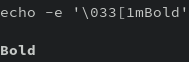
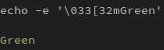
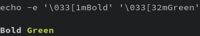
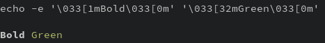
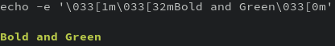
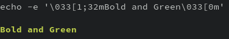
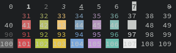
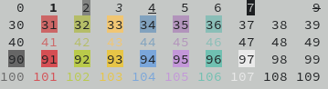

## Introduction

好久没明白 Shell 的格式化输出，这次看了一些资料，整理了一下。

## Method & Result

我们知道 shell 可以用 `-e` 来转义 `\n` 这些符号。由于样式输出也是特殊的输出，所以要使用样式输出也要打开这个开关。那如何表示样式的符号是什么呢？基本格式是这样

```
\033[ + 样式码 + m + "要打印的字符"
```

这里的样式码就是一些数字，比如 `1` 代表加粗，`32` 代表绿色：

```sh
#!/bin/sh
echo -e '\033[1mBold'
echo -e '\033[32mGreen'
```





### 样式的分开

由于这个样式是管它之后的所有输出，所以你如果先加粗后加颜色，那么后面半截也会加粗，比如：

```sh
#!/bin/sh
echo -e '\033[1mBold' '\033[32mGreen'
```



所以就像括号一样我们用无样式(样式码0) 来作为右半边的括号。

```sh
#!/bin/sh
echo -e '\033[1mBold\033[0m' '\033[32mGreen\033[0m'
```



### 样式的合并
根据上面一节，我们知道如何叠加几个样式，比如加粗又加绿:

```sh
#!/bin/sh
echo -e '\033[1m\033[32mBold and Green\033[0m'
```



它有个简略的写法：用分号 `;` 分开两个样式码。比如加粗又加绿:

```sh
#!/bin/sh
echo -e '\033[1;32mBold and Green\033[0m'
```




### 列出 Shell 支持的所有样式：

我们可以用一个小的脚本来列出所有样式

```sh
#!/bin/sh
for i in $(seq 0 109);do
    echo -e '\033['$i'm'$i'\033[0m '
done
```

由于版面有限，我只选取了部分有效段展示：

* 所有颜色：



* 反色：




### Tips

不知发现没有，虽然打印出来好看了，但是脚本却变丑了，很难阅读，因此我们可以把这些样式定义成变量，要用时用变量来格式化输出：

```sh
#!/bin/sh
shellStyleNone='\033[0m'
shellStyleGreen='\033[33m'
shellStyleBold='\033[1m'

echo -e "$shellStyleBold"Bold"$shellStyleNone" "$shellStyleGreen"Green"$shellStyleNone"
```

## Conclusion

格式化输出：

```
\033[ + 样式码 + m +    "要打印的字符"    + \033[ + 无样式码 + m
```

叠加多个样式的话，样式码可以用 `;` 来分开
