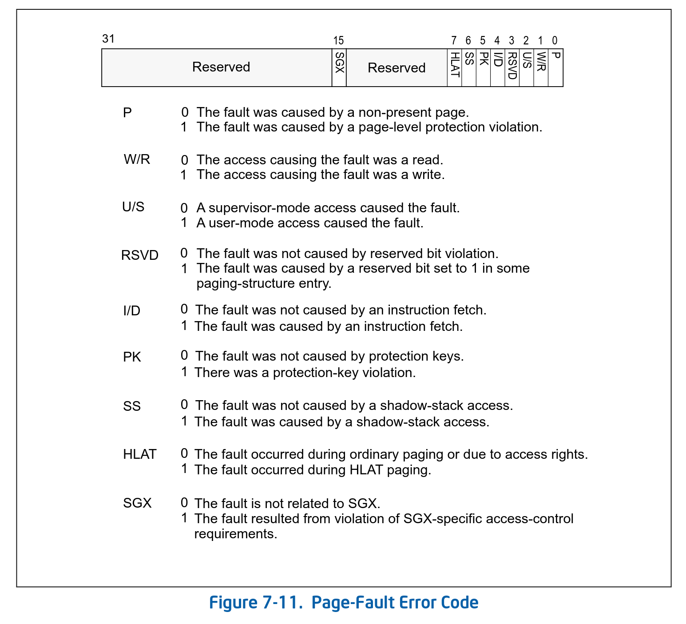

## Introduction

本文主要探究了以下几个问题：

1. 在 CPU 发现 INT 引脚电平变更，中断当前指令片段的执行后，到调用 `do_IRQ` 之间到底发生了什么？
2. do_IRQ 时，被中断的任务，用户栈、内核栈、中断栈之间是如何变更的？
3. 中断当前的指令片段，需要保存寄存器，这些寄存器是如何保存和恢复的？

本文需要的预备知识：

* [asm 中的 mov/lea](./asm_x86_mov_and_lea.md)
* [asm 中函数的传参](./asm_x86_arg.md)
* [asm 中函数的调用和栈的变化](./asm_x86_call_and_stack.md)
* [x86 中寄存器的名字](./asm_x86_reg_name.md)
* [struct 在栈上的顺序](./elements_of_struct_on_stack.md)
* [AT&T 和 intel 汇编](./asm_x86_at_t_vs_intel.md)
* 汇编代码的 “man-pages”：[Intel® 64 and IA-32 Architectures Software Developer’s Manual](https://cdrdv2.intel.com/v1/dl/getContent/671200)，可以查看 x86 的指令定义。

## caller of `do_IRQ`: `common_interrupt`

在 gdb 中 bt 或者目录搜索，我们会发现 do_IRQ 的调用者是汇编的 `common_interrupt`

```asm
// linux-2.6.24/arch/x86/kernel/entry_64.S
ENTRY(common_interrupt)
	//...
	interrupt do_IRQ
	//...
	leaveq
END(common_interrupt)
```

其中 `interrupt` 是一个宏，在调用 `do_IRQ` 前需要做一系列保存寄存器的动作，通过一个宏做了封装，我们只保留了最关键的几行：

```asm
// linux-2.6.24/arch/x86/kernel/entry_64.S
	.macro interrupt func
	//...
	SAVE_ARGS                   # 保存寄存器
	leaq -ARGOFFSET(%rsp),%rdi	# arg1 for handler
	//...
	call \func
	.endm
```

### SAVE_ARGS
从宏命名地来看，`SAVE_ARGS` 是保存 do_IRQ 需要的参数（`struct pt_regs`）也就是，它会在将寄存器保存到栈上

```asm
// linux-2.6.24/include/asm-x86/calling.h
	.macro SAVE_ARGS addskip=0,norcx=0,nor891011=0
	subq  $9*8+\addskip,%rsp
	CFI_ADJUST_CFA_OFFSET	9*8+\addskip
	movq  %rdi,8*8(%rsp) 
	CFI_REL_OFFSET	rdi,8*8
	movq  %rsi,7*8(%rsp) 
	CFI_REL_OFFSET	rsi,7*8
	movq  %rdx,6*8(%rsp)
	CFI_REL_OFFSET	rdx,6*8
	.if \norcx
	.else
	movq  %rcx,5*8(%rsp)
	CFI_REL_OFFSET	rcx,5*8
	.endif
	movq  %rax,4*8(%rsp) 
	CFI_REL_OFFSET	rax,4*8
	.if \nor891011
	.else
	movq  %r8,3*8(%rsp) 
	CFI_REL_OFFSET	r8,3*8
	movq  %r9,2*8(%rsp) 
	CFI_REL_OFFSET	r9,2*8
	movq  %r10,1*8(%rsp) 
	CFI_REL_OFFSET	r10,1*8
	movq  %r11,(%rsp) 
	CFI_REL_OFFSET	r11,0*8
	.endif
	.endm
```

确实，我们在这个宏中看到有很多寄存器被保存到了栈上。但有一个问题：都到这里了那被打断继续执行的 RIP，那里的 RSP 去了哪里了？现在的 RSP 又是哪来的。这部分的内容会在 [该节](#caller-of-irq0xxy_interrupt-x86-cpu)得到解答。

### `leaq -ARGOFFSET(%rsp),%rdi`

我们看到注释说这行是给 function 传参，好，那就先不管等 [下下节](#arguments-of-do_irq-和-leaq--argoffsetrsp-rdi) 再看。

### stack change
我们继续往下看

```asm
// linux-2.6.24/arch/x86/kernel/entry_64.S
	.macro interrupt func
	//...
	SAVE_ARGS
	leaq -ARGOFFSET(%rsp),%rdi	# arg1 for handler
	pushq %rbp
	//...
	movq %rsp,%rbp
	//...
	cmoveq %gs:pda_irqstackptr,%rsp
	push    %rbp				# backlink for old unwinder
	call \func
	.endm
```

终于，我们看到了 rsp 被变更的地方了：`cmoveq %gs:pda_irqstackptr,%rsp`，变栈好变，但是回退要怎么做呢？我们在 [asm 中函数的调用](./asm_x86_call_and_stack.md) 中看到了我们只保存了 rbp 和 rip 在栈上，从而，在函数回退时可以找到他们。但我们并没有保存 rsp，当函数调用发生在同一个栈上时，rsp 是自动退的，不保存也可以，但是如果我们换栈了，rsp 回退不到旧栈了，因为新栈和旧栈不连续。

换栈，意味着在内核栈上，我们改了 rsp 的内容，如果我们不保存，就会有信息丢失，也就回不到旧栈了。所以，在换之前我们需要保存 rsp 到栈上，，ret 之后把保存的通过 rbp+offset 弹出到 rsp。内核采用的是：在内核栈上，做一个 leave （mov %rbp, %rsp, pop %rbp) 需要的结构，然后执行一下 leave（在 common_interrupt 中）。可能是因为 push/pop rsp 有点问题 push 本身改了 rsp 又要把 rsp 压入。（测试来看是没问题的：都是先改内存在改寄存器。）

```
f0 upper function
f1 interrupted function
f2 interrupt function
```

正常函数调用：

```
        kernel stack
     +---------------+
     | rbp of fn0    | ← rbp
     | fn1 stack var |
     | fn1 stack var |
     | fn2 arg var   |
     | fn2 arg var   | ← rsp
     +---------------+
```

正常现在应该 call interrupt，然后压入 rip，但是我们要换栈，先保存 rbp

```
        kernel stack
     +---------------+
     | rbp of fn0    | ← rbp
     | fn1 stack var |
     | fn1 stack var |
     | fn2 arg var   |
     | fn2 arg var   |
     | rbp of fn1    | ← rsp
     +---------------+
```

然后移动 rbp

```
        kernel stack
     +---------------+
     | rbp of fn0    | ← rbp(old)
     | fn1 stack var |
     | fn1 stack var |
     | fn2 arg var   |
     | fn2 arg var   |
     | rbp of fn1    | ← rsp/rbp
     +---------------+
```

`cmoveq %gs:pda_irqstackptr,%rsp` [gs](./asm_x86_reg_gs.md) 偏移 pda_irqstackptr 这么长，拿到 pda->irqstackptr，关于 gs 和 pda 参考[这篇文章](./asm_x86_gs_and_pda_in_linux.md)

```
        kernel stack
     +---------------+
     | rbp of fn0    |
     | fn1 stack var |
     | fn1 stack var |
     | fn2 arg var   |
     | fn2 arg var   |
     | rbp of fn1    | ← rbp
     +---------------+

       irq stack
     +---------------+
     |               | ← rsp/(pda->irqstackptr)
     +---------------+
```

`push %rbp # backlink for old unwinder` 我们先压了也更 rbp，其实可以不用压的，到时候 ret 的时候就指向 stack 的第一个位置，0x0，压了之后，在 ret 之后，rsp 还是指向一个有效值。


```
        kernel stack
     +---------------+
     | rbp of fn0    |
     | fn1 stack var |
     | fn1 stack var |
     | fn2 arg var   |
     | fn2 arg var   |
     | rbp of fn1    | ← rbp
     +---------------+

       irq stack
     +---------------+
     |               | ← rsp(old)
     | rbp of fn2    | ← rsp
     +---------------+
```

call do_IRQ

```
        kernel stack
     +---------------+
     | rbp of fn0    |
     | fn1 stack var |
     | fn1 stack var |
     | fn2 arg var   |
     | fn2 arg var   |
     | rbp of fn1    | ← rbp
     +---------------+

       irq stack
     +---------------+
     |               |
     | rbp of fn2    | ← rsp(old)
     | rip of fn2    | ← rsp
     +---------------+
```

fn 前置准备，push rbp

```
        kernel stack
     +---------------+
     | rbp of fn0    |
     | fn1 stack var |
     | fn1 stack var |
     | fn2 arg var   |
     | fn2 arg var   |
     | rbp of fn1    | ← rbp
     +---------------+

       irq stack
     +---------------+
     |               |
     | rbp of fn2    |
     | rip of fn2    | ← rsp(old)
     | rbp of fn2    | ← rsp
     +---------------+
```

fn 前置准备，mov %rsp, %rbp

```
        kernel stack
     +---------------+
     | rbp of fn0    |
     | fn1 stack var |
     | fn1 stack var |
     | fn2 arg var   |
     | fn2 arg var   |
     | rbp of fn1    | ← rbp(old)
     +---------------+

       irq stack
     +---------------+
     |               |
     | rbp of fn2    |
     | rip of fn2    |
     | rbp of fn2    | ← rsp/rbp
     +---------------+
```

rsp 下移准备临时变量空间


```
        kernel stack
     +---------------+
     | rbp of fn0    |
     | fn1 stack var |
     | fn1 stack var |
     | fn2 arg var   |
     | fn2 arg var   |
     | rbp of fn1    |
     +---------------+

       irq stack
     +---------------+
     |               |
     | rbp of fn2    |
     | rip of fn2    |
     | rbp of fn2    | ← rsp(old)/rbp
     | irq stack var | ← rsp
     +---------------+
```

退出时

leave 之 mov %rbp, %rsp

```
        kernel stack
     +---------------+
     | rbp of fn0    |
     | fn1 stack var |
     | fn1 stack var |
     | fn2 arg var   |
     | fn2 arg var   |
     | rbp of fn1    |
     +---------------+

       irq stack
     +---------------+
     |               |
     | rbp of fn2    |
     | rip of fn2    |
     | rbp of fn2    | ← rbp/rsp
     | irq stack var | ← rsp(old)
     +---------------+
```

leave 之 pop %rbp

```
        kernel stack
     +---------------+
     | rbp of fn0    |
     | fn1 stack var |
     | fn1 stack var |
     | fn2 arg var   |
     | fn2 arg var   |
     | rbp of fn1    | ← rbp
     +---------------+

       irq stack
     +---------------+
     |               |
     | rbp of fn2    |
     | rip of fn2    | ← rsp
     | rbp of fn2    | ← rbp(old)/rsp(old)
     | irq stack var |
     +---------------+
```

ret

```
        kernel stack
     +---------------+
     | rbp of fn0    |
     | fn1 stack var |
     | fn1 stack var |
     | fn2 arg var   |
     | fn2 arg var   |
     | rbp of fn1    | ← rbp
     +---------------+

       irq stack
     +---------------+
     |               |
     | rbp of fn2    | ← rsp
     | rip of fn2    | ← rsp(old)
     | rbp of fn2    |
     | irq stack var |
     +---------------+
```

common_interrupt leave 之 mov %rbp, %rsp


```
        kernel stack
     +---------------+
     | rbp of fn0    |
     | fn1 stack var |
     | fn1 stack var |
     | fn2 arg var   |
     | fn2 arg var   |
     | rbp of fn1    | ← rbp/rsp
     +---------------+

       irq stack
     +---------------+
     |               |
     | rbp of fn2    | ← rsp(old)
     | rip of fn2    |
     | rbp of fn2    |
     | irq stack var |
     +---------------+
```

common_interrupt leave 之 pop %rbp


```
        kernel stack
     +---------------+
     | rbp of fn0    | ← rbp
     | fn1 stack var |
     | fn1 stack var |
     | fn2 arg var   |
     | fn2 arg var   | ← rsp
     | rbp of fn1    | ← rbp(old)/rsp(old)
     +---------------+

       irq stack
     +---------------+
     |               |
     | rbp of fn2    |
     | rip of fn2    |
     | rbp of fn2    |
     | irq stack var |
     +---------------+
```

### arguments of do_IRQ 和 `leaq -ARGOFFSET(%rsp), %rdi`
事实上 do_IRQ 的参数结构不是如上这么简单，rbp 也不是压在栈顶上，

传递给 rdi 的地址是 `-ARGOFFSET(%rsp)`

```
# common_interrupt 中
	SAVE_ARGS
	leaq -ARGOFFSET(%rsp),%rdi	# arg1 for handler
	pushq %rbp
```

```c
// include/asm-x86/calling.h
#define R11 48
#define ARGOFFSET R11
```

也就是 rsp 地址向低位偏移 0x30 个地址编号，也就是对应 6 个 unsigned long, 才是 pt_regs，也就是说 rsp 当前指向的是 r11, 在内核栈上 push rbp 是给 `pt_regs->rbx` 赋值。

```c
struct pt_regs {
	unsigned long r15;
	unsigned long r14;
	unsigned long r13;
	unsigned long r12;
	unsigned long rbp;
	unsigned long rbx;
/* arguments: non interrupts/non tracing syscalls only save upto here*/
	unsigned long r11;
	unsigned long r10;
	unsigned long r9;
	unsigned long r8;
	unsigned long rax;
	unsigned long rcx;
	unsigned long rdx;
	unsigned long rsi;
	unsigned long rdi;
	unsigned long orig_rax;
/* end of arguments */
/* cpu exception frame or undefined */
	unsigned long rip;
	unsigned long cs;
	unsigned long eflags;
	unsigned long rsp;
	unsigned long ss;
/* top of stack page */
};
```

为啥要有这个偏移？为什么不直接 `movq %rsp, %rdi`，我们可以从两方面看到：

1. 在 `pt_regs` 中可以看到，system call 只设置了最前的几个变量。
2. 在 `SAVE_ARGS` 中有很多 if else，在 `system_call` 时，`SAVE_ARGS` 是带参数的，有很多寄存器是被跳过的。

对于 common_interrupt，虽然 SAVE_ARGS 中所有的参数看起来都没有跳过，其实我们可以看到 `SAVE_ARGS` 中

```
	subq  $9*8+\addskip,%rsp
```

`rsp` 留出的空间是 8*9 个地址，一个地址一个字节，那就是留出了 72 个字节。而 pt_regs 中的寄存器都是 64 bit 的，也就是 8 个字节一个寄存器。所以 rsp 留出的空间是 9 个寄存器。如果 rsp 指向 r11 的话，只留出了从 rdi 到 r11 的空间。

虽然，我们的 do_IRQ 在新栈上，但是 pt_regs 是在旧栈上的。（符合汇编栈上参数在上级函数处）

### RESTORE_ARGS 和 iretq
从 gdb 运行结果来看很多的如果没有发生 reint，后续基本就是 restore_args 和 iret 了


### summary of `common_interrupt`

```asm
// linux-2.6.24/arch/x86/kernel/entry_64.S
	.macro interrupt func
	//...
	SAVE_ARGS                       # 在 interrupt 中，保留了 rdi 到 r11（system call 另说）
	leaq -ARGOFFSET(%rsp),%rdi      # 把做好的 pt_regs 结构的地址存入了 rdi 寄存器，linux 用 rdi rxi 传参
	pushq %rbp                      # 把 rbp 压入栈（位于 pt_regs->rbx），用于退出中断时调用 leaveq(2. pop %rbp)
	//...
	movq %rsp,%rbp                  # 把栈顶地址存入 rbp，用于退出中断时调用 leaveq(1. movq %rbp, %rsp)
	//...
1:	incl	%gs:pda_irqcount        # Process Data Area 中断计数+1，Irq nesting counter, include/asm-x86/pda.h
	cmoveq %gs:pda_irqstackptr,%rsp # 切换到 pda_irqstackptr 栈
	push    %rbp                    # 在新栈上压入 rbp # 可以不用，func 里面也会 push %rbp (backlink for old unwinder）
	call \func                      # 在新栈上压入 rip
	.endm


    ENTRY(common_interrupt)
	//...
	interrupt do_IRQ
ret_from_intr:
	//...
	cli                             # CLear Interrupt Flag
	//...
	decl %gs:pda_irqcount           # Irq nesting counter - 1
	leaveq                          # 是 interrupt 中的 movq 和 pushq 的逆操作
    ///...
restore_args:
	RESTORE_ARGS 0,8,0
iret_label:	
	iretq
```

## caller of `common_interrupt`: `IRQ0xXY_interrupt`
全局搜搜 common_interrupt 发现，它只在这里出现

```c
#define BUILD_IRQ(nr) \
asmlinkage void IRQ_NAME(nr); \
__asm__( \
"\n.p2align\n" \
"IRQ" #nr "_interrupt:\n\t" \
	"push $~(" #nr ") ; " \
	"jmp common_interrupt");
```

展开上述的 `BUILD_IRQ`，以得到 `IRQ0xXY_interrupt`：

```c
// BUILD_IRQ(0x30)
void IRQ_NAME(0x30);
__asm__(...)
```

```asm
.p2align
    IRQ0x30_interrupt:
        push $~(0x30)
        jmp common_interrupt
```

Break `push $~(0x30)` down:

* 0x30 = interrupt number
* ~(0x30) = bitwise NOT
  * ~0x30 = 0xffffffffffffffcb
* `$` = immediate value

So this instruction:

```
push $0xffffffffffffffcb
```

Reason to do bitwise Not:

In common_interrupt:

* Negative → IRQ
* Non-negative → exception error code

所以这里做的是将 `~(0x30)` 压入栈，然后跳转到 common_interrupt

从 gdb 中我们也可以看到确实压了

```
# break at common_interrupt

(gdb) bt
#0  0xffffffff8020c480 in common_interrupt ()
#1  0xffffffffffffffcb in ?? ()

(gdb) x/xg $rsp
0xffffffff80563f10 <init_thread_union+7952>:    0xffffffffffffffcb
```

压入了哪个位置？在 common_interrupt 中，我们偏移 rsp 保留了 rdi 到 r11 的寄存器，那么在 jmp 前，rsp 指向的内存对应的是 pt_regs 中的 orig_rax，这也和 do_IRQ 中通过 `unsigned vector = ~regs->orig_rax;` 取到 vector 一致。

## Construct and  register `IRQ0xXY_interrupt`
在讨论是谁调用 `IRQ0xXY_interrupt` 前我们需要看一下 `IRQ0xXY_interrupt` 是如何被构造，以及它注册到了哪里。

### Construct `IRQ0xXY_interrupt` and convert `IRQ0xXY_interrupt` to `void* (interrupt[])()`
通过一系列宏，构造了 224 个名为 `IRQ0xXY_interrupt` 的中断函数

并做了一个名为 interrupt 的函数指针表，其中包含 `IRQ0xXY_interrupt` 函数名

```c
// arch/x86/kernel/i8259_64.c
#define BUILD_IRQ(nr) \
asmlinkage void IRQ_NAME(nr); \
__asm__( \
"\n.p2align\n" \
"IRQ" #nr "_interrupt:\n\t" \
        "push $~(" #nr ") ; " \
        "jmp common_interrupt");

#define BI(x,y) \
        BUILD_IRQ(x##y)

#define BUILD_16_IRQS(x) \
        BI(x,0) BI(x,1) BI(x,2) BI(x,3) \
        BI(x,4) BI(x,5) BI(x,6) BI(x,7) \
        BI(x,8) BI(x,9) BI(x,a) BI(x,b) \
        BI(x,c) BI(x,d) BI(x,e) BI(x,f)

                                      BUILD_16_IRQS(0x2) BUILD_16_IRQS(0x3)
BUILD_16_IRQS(0x4) BUILD_16_IRQS(0x5) BUILD_16_IRQS(0x6) BUILD_16_IRQS(0x7)
BUILD_16_IRQS(0x8) BUILD_16_IRQS(0x9) BUILD_16_IRQS(0xa) BUILD_16_IRQS(0xb)
BUILD_16_IRQS(0xc) BUILD_16_IRQS(0xd) BUILD_16_IRQS(0xe) BUILD_16_IRQS(0xf)
/* 以上一系列宏用于构造 IRQ0xXY_interrupt */

/* 上面是用 BUILD_IRQ 拼成函数名的，下面是用 IRQ 拼成函数名的。数量上都是 224。*/
/* 不太合适：名字、数量是分离的*/

/* 以下几个宏用于是构造 interrupt 这个函数指针数组指向 IRQ0xXY_interrupt */
#define IRQ(x,y) \
        IRQ##x##y##_interrupt

#define IRQLIST_16(x) \
        IRQ(x,0), IRQ(x,1), IRQ(x,2), IRQ(x,3), \
        IRQ(x,4), IRQ(x,5), IRQ(x,6), IRQ(x,7), \
        IRQ(x,8), IRQ(x,9), IRQ(x,a), IRQ(x,b), \
        IRQ(x,c), IRQ(x,d), IRQ(x,e), IRQ(x,f)

#define NR_VECTORS 256
#define FIRST_EXTERNAL_VECTOR        0x20
static void (*interrupt[NR_VECTORS - FIRST_EXTERNAL_VECTOR])(void) = {
                                          IRQLIST_16(0x2), IRQLIST_16(0x3),
        IRQLIST_16(0x4), IRQLIST_16(0x5), IRQLIST_16(0x6), IRQLIST_16(0x7),
        IRQLIST_16(0x8), IRQLIST_16(0x9), IRQLIST_16(0xa), IRQLIST_16(0xb),
        IRQLIST_16(0xc), IRQLIST_16(0xd), IRQLIST_16(0xe), IRQLIST_16(0xf)
};
```
至此，我们实现了：
* 一系列 `IRQ0xXY_interrupt` 被构造出来，被转换成了 `void* (interrupt[])()` 函数指针表，存了起来。
* 不同的 `IRQ0xXY_interrupt` 会压入不同的 vector number（取反的）。


### Register `void* (interrupt[])()` (`IRQ0xXY_interrupt`) to CPU
搜索全文我们并没有找到 `IRQ0xXY_interrupt` 的调用点，但是看到了 interrupt 函数指针表的调用，也一样，注册一堆函数指针到别处，非常像 device driver。

```c
start_kernel;
  init_IRQ;
    set_intr_gate;
      _set_gate(&idt_table[nr], GATE_INTERRUPT, (unsigned long) interrupt[i], 0, 0);
```

```asm
ENTRY(idt_table)
	.skip 256 * 16

	.section .bss.page_aligned, "aw", @nobits
	.align PAGE_SIZE
```

```c
// arch/x86/kernel/setup64.c
struct desc_ptr idt_descr = { 256 * 16 - 1, (unsigned long) idt_table };
```

```c
start_kernel();
    trap_init();
        cpu_init();
            load_idt((const struct desc_ptr *)&idt_descr);
                asm volatile("lidt %w0"::"m" (*ptr));


start_secondary()
    cpu_init();
        load_idt((const struct desc_ptr *)&idt_descr);
            asm volatile("lidt %w0"::"m" (*ptr));
```

所以这张函数指针表是被加载到 idtr(interrupt descriptor table register) 中。当 CPU 发生中断时会读取 idtr 中保存的内存地址（对应的正是一系列 `IRQ0xXY_interrupt`），然后 CPU 会然后跳转到该地址（+ vector 偏移）执行正确的 `IRQ0xXY_interrupt`。

#### internal vector
我们在构造 `IRQ0xXY_interrupt` 时看到

```c
#define FIRST_EXTERNAL_VECTOR        0x20
```

也就是说外部的中断是从 0x20 开始到 0xff，共 224 个，前面几个是 CPU 内部的中断

```c
// arch/x86/kernel/traps_64.c
start_kernel;
    trap_init;
        set_intr_gate(0,&divide_error);
            _set_gate(&idt_table[nr], GATE_INTERRUPT, (unsigned long) func, 0, 0); 
        // (1..13)
        set_intr_gate(14,&page_fault);
        // (15..19)
```

在 `trap_init` 中我们可以看到很多 exception 的处理函数被写入 `idt_table`，在 cpu_init 时一起加载到 idtr 中

```gdb
set $i=0
set $number_of_vectors=256
while ($i < $number_of_vectors)
    set $idt_func = ((unsigned long long)idt_table[$i].offset_high << 32) | \
                ((unsigned long long)idt_table[$i].offset_middle << 16) | \
                (unsigned long long)idt_table[$i].offset_low
    printf "vector=0x%02x: ", $i
    x/a $idt_func
    set $i=$i+1
end
```


```gdb
(gdb) source print_interrupt_table.gdb
vector=0x00: 0xffffffff8020d090 <divide_error>:	0xf85058d4850006a             ← internal interrupt
# ...
vector=0x13: 0xffffffff8020ced0 <simd_coprocessor_error>:	0xf3c058d4850006a ← the last vector(19) that trap_init set
vector=0x14: 0xffffffff802001c0 <early_idt_handler>:	0x7402000000443d83    ← 在 x86_64_start_kernel 中初始化的
# ...
vector=0x21: 0xffffffff80211617 <IRQ0x21_interrupt>:	0x6affffae62e9de6a    ← 外部中断处理函数
# ...
vector=0x7f: 0xffffffff802118a9 <IRQ0x7f_interrupt>:	0x68ffffabd0e9806a
vector=0x80: 0xffffffff80226170 <ia32_syscall>:	0xfc50c089fbf8010f
vector=0x81: 0xffffffff802118ba <IRQ0x81_interrupt>:	0xabbce9ffffff7e68
# ...
vector=0xee: 0xffffffff80211cfc <IRQ0xee_interrupt>:	0xa77ae9ffffff1168
vector=0xef: 0xffffffff8020cba0 <apic_timer_interrupt>:	0x8348fcffffff1068
# ...
```

## caller of `IRQ0xXY_interrupt`: x86 CPU
到 IDT 似乎一切都完成了，但是我们还遗留几个问题：

1. pt_regs 中的 最下部 ss 到 rip 是谁保存的
2. pt_regs 是在哪个栈上？内核栈。但如果现在在执行用户代码，怎么跳转到内核栈的？

这两个问题都定义在了 intel 的 x86 和 x86_64 的手册（[Intel® 64 and IA-32 Architectures Software Developer’s Manual](https://cdrdv2.intel.com/v1/dl/getContent/671200)）中！

在 INT 引脚被识别后，在调用 `IRQ0xXY_interrupt` 前。这段时间内，所有的行为都是 CPU 硬件自动完成的，这种 CPU 硬件的行为当然定义在了硬件手册中。

手册中关于中断的描述在 Volume 1 中的 6.5 节 INTERRUPTS AND EXCEPTIONS，简单来说这节说到，INT 被识别到后：

1. 栈会切换
    * ring 级别不够时，会从 [TSS](./gdt_tss_and_switch_to.md) 中读取内核栈的地址，切换到内核栈
    * 如果够（一般是在 ring0 内核态），就直接在内核栈上压入
2. 会将如下的寄存器会压入栈
3. 执行注册的中断函数
    * 即 jmp 到 idt 中记录的地址

```
        (high address)
                          ← RSP before
     +------------------+
     |   SS             |
     |   ESP            |
     |   EFLAGS         |
     |   CS             |
     |   EIP            |
     +------------------+
     |   Error Code     | ← RSP after
     +------------------+

        (low address)

Figure 6-7. Stack Usage on Transfers to Interrupt and Exception Handling Routines
```

Error Code 可能有，可能无，在 Volume 3A 的 7.13 ERROR CODE 节中有如下描述：

> When an exception condition is related to a specific segment selector or IDT
> vector, the processor pushes an error code onto the stack of the exception
> handler (whether it is a procedure or task). The error code has the format
> shown in Figure 7-7. The error code resembles a segment selector; however,
> instead of a TI flag and RPL field, the error code contains 3 flags:

在 7.15 EXCEPTION AND INTERRUPT REFERENCE 中对各种 Exception 或者说 CPU 内部的 interrupt 作了描述，例如 Divide Error Exception(#DE)这种是不会压入 Exception Error Code 的。而 Page-Fault Exception (#PF) 是会压入一个 Error Code 的，格式如下：



<!--
P       0 The fault was caused by a non-present page.
        1 The fault was caused by a page-level protection violation.
W/R     0 The access causing the fault was a read.
        1 The access causing the fault was a write.
U/S     0 A supervisor-mode access caused the fault.
        1 A user-mode access caused the fault.
RSVD    0 The fault was not caused by reserved bit violation.
        1 The fault was caused by a reserved bit set to 1 in some
I/D     0 The fault was not caused by an instruction fetch.
        1 The fault was caused by an instruction fetch.
PK      0 The fault was not caused by protection keys.
        1 There was a protection-key violation.
SS      0 The fault was not caused by a shadow-stack access.
        1 The fault was caused by a shadow-stack access.
HLAT    0 The fault occurred during ordinary paging or due to access rights.
        1 The fault occurred during HLAT paging.
SGX     0 The fault is not related to SGX.
        1 The fault resulted from violation of SGX-specific access-control requirements
Figure 7-11. Page-Fault Error Code
-->

[ring 和虚拟机](./ring_and_vm.md)

### TSS
* TSS(Task State Segment): 在内存中，per task，CPU 有定义它需要的结构，Linux 负责做好这里的数据。在 context_switch 时会修改这里的数据。
* GDT: TSS 在内存中的地址存于 GDT 中，per CPU

## Conclusion
至此，一切皆明朗，让我们来总结一下在 INT 引脚被 CPU 检测到后发生的事情吧

### Q1: INT 到 `do_IRQ`
> 1. 在 CPU 发现 INT 引脚电平变更，中断当前指令片段的执行后，到调用 `do_IRQ` 之间到底发生了什么？

1. CPU 通过 GDT 取到当前 Task 的 TSS，并取到内核栈所在的内存地址，切换到内核栈
2. CPU 压入基础寄存器，并跳转到 idtr 中记录的地址（带偏移），该地址上的数据由 Linux 构造，是 `IRQ0xXY_interrupt`
3. `IRQ0xXY_interrupt`: 压入 interrupt vector（取反）
4. `common_interrupt`:
    1. 压入所有剩余的寄存器
    2. 准备 `do_IRQ` 的参数 (`struct *pt_regs`)
    3. 切换栈，以及退出后的恢复
4. `do_IRQ`: 拿到 `pt_regs -> orig_rax` 中保存的 `vector`

### Q2: 栈的变更和寄存器的保存
> 2. do_IRQ 时，被中断的任务，用户栈、内核栈、中断栈之间是如何变更的？
> 3. 中断当前的指令片段，需要保存寄存器，这些寄存器是如何保存和恢复的？

1. 被中断的如果是普通用户的任务，CPU 会从 GS 拿到 TSS 地址（per core），从 TSS 中拿到 内核栈地址（per task），并由 CPU 硬件压入基础寄存器到内核栈
2. IRQ0xXY_interrupt 压入中断向量
3. common_interrupt 继续压入所有剩余的寄存器，并做好换栈前的准备
4. common_interrupt 从 GS 中拿到中断栈地址（per core），然后切换到中断栈

详见 [gdb 追踪栈和栈上数据](#gdb-追踪栈和栈上数据)

### 调用 `do_IRQ` 前的准备结果
#### `pt_regs`

```c
struct pt_regs {
	unsigned long r15;
	unsigned long r14;
	unsigned long r13;
	unsigned long r12;
	unsigned long rbp;
	unsigned long rbx;
/* arguments: non interrupts/non tracing syscalls only save upto here*/
	unsigned long r11;
	unsigned long r10;
	unsigned long r9;
	unsigned long r8;
	unsigned long rax;
	unsigned long rcx;
	unsigned long rdx;
	unsigned long rsi;
	unsigned long rdi;
	unsigned long orig_rax;
/* end of arguments */
/* cpu exception frame or undefined */
	unsigned long rip;
	unsigned long cs;
	unsigned long eflags;
	unsigned long rsp;
	unsigned long ss;
/* top of stack page */
};
```

* 栈底的 5 个寄存器，由 CPU 硬件压入
* `orig_rax` 由 `IRQ0xXY_interrupt` 压入
* 剩余的上半部寄存器由 `common_interrupt` 中的 `SAVE_ARGS` 压入

#### 设置 `rdi` 指向 `pt_regs`
使用 `leaq` 算出 该结构在内存中的地址，存入 rdi，作为 do_IRQ 的第一个参数

## gdb 追踪栈和栈上数据
### at `IRQ0xXY_interrupt`

```
(gdb) bt
#0  0xffffffff80211680 in IRQ0x30_interrupt ()
#1  0xffffffff80587a7f in tty_init () at drivers/char/tty_io.c:4111
#2  0xffffffff8056c119 in x86_64_start_kernel (real_mode_data=0x0) at arch/x86/kernel/head64.c:73
#3  0x0000000000000000 in ?? ()
(gdb) x/16gx $rsp
0xffffffff80563f58 <init_thread_union+8024>:	0xffffffff80587a7f	0x0000000000000010
0xffffffff80563f68 <init_thread_union+8040>:	0x0000000000000246	0xffffffff80563f80
0xffffffff80563f78 <init_thread_union+8056>:	0x0000000000000018	0xffffffff8056c9d5
0xffffffff80563f88 <init_thread_union+8072>:	0x0000000000000000	0xffffffff805900a0
0xffffffff80563f98 <init_thread_union+8088>:	0xffff810000000000	0x0000000000013120
0xffffffff80563fa8 <init_thread_union+8104>:	0x0000000000000000	0x0000000000000000
0xffffffff80563fb8 <init_thread_union+8120>:	0xffffffff80563fe8	0xffffffff8056c119
0xffffffff80563fc8 <init_thread_union+8136>:	0x80208e00001001c0	0x00000000ffffffff
```

栈上有：

* `0xffffffff80587a7f` 是 PC (RIP, EIP, instruction pointer)

| Stack Address      | Value              | Register Equivalent       |
|--------------------|--------------------|---------------------------|
| 0xffffffff80563f58 | 0xffffffff80587a7f | RIP (Instruction Pointer) |
| 0xffffffff80563f60 | 0x0000000000000010 | CS (Code Segment)         |
| 0xffffffff80563f68 | 0x0000000000000246 | RFLAGS (Status Flags)     |
| 0xffffffff80563f70 | 0xffffffff80563f80 | RSP (Stack Pointer)       |
| 0xffffffff80563f78 | 0x0000000000000018 | SS (Stack Segment)        |

因为是 interrupt 不是 exception 所以这里没有压 Error code

确实符合 intel 手册中所说，这些寄存器确实是被压入了。再贴一下 intel 手册中说的

```
                          ← RSP before
     +------------------+
     |   SS             |
     |   ESP            |
     |   EFLAGS         |
     |   CS             |
     |   EIP            |
     +------------------+
     |   Error Code     | ← RSP after
     +------------------+

Figure 6-7. Stack Usage on Transfers to Interrupt and Exception Handling Routines
```

### at `common_interrupt`
到 common_interrupt
```
(gdb) bt
#0  0xffffffff8020c480 in common_interrupt ()
#1  0xffffffffffffffcf in ?? ()
#2  0xffffffff80587a7f in tty_init () at drivers/char/tty_io.c:4111
#3  0xffffffff8056c119 in x86_64_start_kernel (real_mode_data=0x0) at arch/x86/kernel/head64.c:73
#4  0x0000000000000000 in ?? ()
(gdb) x/8x $rsp
0xffffffff80563f50 <init_thread_union+8016>:    0xffffffffffffffcf      0xffffffff80587a7f
0xffffffff80563f60 <init_thread_union+8032>:    0x0000000000000010      0x0000000000000246
0xffffffff80563f70 <init_thread_union+8048>:    0xffffffff80563f80      0x0000000000000018
0xffffffff80563f80 <init_thread_union+8064>:    0xffffffff8056c9d5      0x0000000000000000
```

因为是 jmp 过来的所以栈就乱了，因为 common_interrupt 没有栈上参数，所以推测栈顶存的是上层函数的 rip，但它是 vector (0xffffffffffffffcf)，再根据符号表 (Symbol Table) 判断不是，所以打印 ??，再往上找，

```
(gdb) info symbol *(unsigned long *)($rsp+8)
console_init in section .init.text
(gdb) p/a *(unsigned long *)($rsp+8)
$6 = 0xffffffff80587a7f <console_init>
(gdb) x/i *(unsigned long *)($rsp+8)
   0xffffffff80587a7f <console_init>:   push   %rbp
```

此时的汇编代码

```
0xffffffff8020c480 <common_interrupt>           cld
0xffffffff8020c481 <common_interrupt+1>         sub    $0x48,%rsp
0xffffffff8020c485 <common_interrupt+5>         mov    %rdi,0x40(%rsp)
0xffffffff8020c48a <common_interrupt+10>        mov    %rsi,0x38(%rsp)
0xffffffff8020c48f <common_interrupt+15>        mov    %rdx,0x30(%rsp)
0xffffffff8020c494 <common_interrupt+20>        mov    %rcx,0x28(%rsp)
0xffffffff8020c499 <common_interrupt+25>        mov    %rax,0x20(%rsp)
0xffffffff8020c49e <common_interrupt+30>        mov    %r8,0x18(%rsp)
0xffffffff8020c4a3 <common_interrupt+35>        mov    %r9,0x10(%rsp)
0xffffffff8020c4a8 <common_interrupt+40>        mov    %r10,0x8(%rsp)
0xffffffff8020c4ad <common_interrupt+45>        mov    %r11,(%rsp)
0xffffffff8020c4b1 <common_interrupt+49>        lea    -0x30(%rsp),%rdi
0xffffffff8020c4b6 <common_interrupt+54>        push   %rbp
0xffffffff8020c4b7 <common_interrupt+55>        mov    %rsp,%rbp
0xffffffff8020c4ba <common_interrupt+58>        testl  $0x3,0x88(%rdi)
0xffffffff8020c4c4 <common_interrupt+68>        je     0xffffffff8020c4c9 <common_interrupt+73>
0xffffffff8020c4c6 <common_interrupt+70>        swapgs
0xffffffff8020c4c9 <common_interrupt+73>        incl   %gs:0x20
0xffffffff8020c4d1 <common_interrupt+81>        cmove  %gs:0x28,%rsp
0xffffffff8020c4db <common_interrupt+91>        push   %rbp
0xffffffff8020c4dc <common_interrupt+92>        call   0xffffffff8020f027 <do_IRQ>
0xffffffff8020c4e1 <common_interrupt+97>        cli
0xffffffff8020c4e2 <common_interrupt+98>        decl   %gs:0x20
0xffffffff8020c4ea <common_interrupt+106>       leave
0xffffffff8020c4eb <common_interrupt+107>       mov    %gs:0x10,%rcx
0xffffffff8020c4f4 <common_interrupt+116>       sub    $0x1fd8,%rcx
0xffffffff8020c4fb <common_interrupt+123>       testl  $0x3,0x58(%rsp)
```

#### dwarf and cfi

[Debugging using DWARF-2012](https://dwarfstd.org/doc/Debugging%20using%20DWARF-2012.pdf)

> with gemini:
>
> How does gdb bt know 0xffffffff80587a7f is upper rip? In my mind. it should goes up to $rbp+0x8 to get the upper rip.
>
> Your logic regarding $rbp + 0x8 is exactly how a "standard" frame pointer-based backtrace works. However, in the output you provided, GDB is navigating a Kernel Interrupt Stack Frame, which follows different rules than a standard function prologue.
>
> GDB isn't guessing; it's using DWARF Unwind Records. These records tell GDB: "If you are inside common_interrupt, the return address isn't at RBP+8; it's at RSP+8 because the CPU pushed a hardware frame." The value 0xffffffffffffffcf (which GDB shows as Frame #1) is likely the result of the kernel pushing a "trap number" or "error code" onto the stack right before the RIP, which GDB is trying its best to interpret.
>
> DWARF Call Frame Information (CFI) is a standardized data format used by debuggers (like GDB) and exception handlers to unwind the stack, allowing them to map machine states back to source code across function calls. It describes how to restore registers and find the Call Frame Address (CFA) at any point in a program
>
> Directives: Assembler directives (e.g., .cfi_startproc, .cfi_def_cfa, .cfi_offset) allow programmers to manually encode this information in handwritten assembly.

#### before `incl	%gs:pda_irqcount`
ni 到执行 `incl %gs:0x20` 前（swapgs 这里被 je 跳过了）

从 qemu 中拿到 GS 是 `0xffffffff8052a000`

```
(gdb) # 查看 nesting irq counter 从 -1 变成了 0
(gdb) x 0xffffffff8052a000+0x20
0xffffffff8052a020 <boot_cpu_pda+32>:   0x00000000ffffffff
(gdb) ni # incl	%gs:pda_irqcount
0xffffffff8020c4d1 in common_interrupt ()
(gdb) x 0xffffffff8052a000+0x20
0xffffffff8052a020 <boot_cpu_pda+32>:   0x0000000000000000
```

#### 换栈前的栈上数据和 pt_regs

```
(gdb) x/16xg $rsp
0xffffffff80563f00 <init_thread_union+7936>:    0xffffffff80563fb8      0x0000000000000012
0xffffffff80563f10 <init_thread_union+7952>:    0xffffffff805deba0      0xffffffffffffffff
0xffffffff80563f20 <init_thread_union+7968>:    0x0000000000000000      0x0000000000000046
0xffffffff80563f30 <init_thread_union+7984>:    0x00000000fffedb85      0xffffffff805ef768
0xffffffff80563f40 <init_thread_union+8000>:    0x0000000000000096      0xffffffff805004c8
0xffffffff80563f50 <init_thread_union+8016>:    0xffffffffffffffcf      0xffffffff80587a7f
0xffffffff80563f60 <init_thread_union+8032>:    0x0000000000000010      0x0000000000000246
0xffffffff80563f70 <init_thread_union+8048>:    0xffffffff80563f80      0x0000000000000018
# pt_regs
(gdb) x/21xg $rdi
0xffffffff80563ed8 <init_thread_union+7896>:	0x0000000000000086	0xffffffff804f3d00
0xffffffff80563ee8 <init_thread_union+7912>:	0x0000000000000096	0x0000000000000000
0xffffffff80563ef8 <init_thread_union+7928>:	0xffffffff805900a0	0xffffffff80563fb8
0xffffffff80563f08 <init_thread_union+7944>:	0x0000000000000012	0xffffffff805deba0
0xffffffff80563f18 <init_thread_union+7960>:	0xffffffffffffffff	0x0000000000000000
0xffffffff80563f28 <init_thread_union+7976>:	0x0000000000000046	0x00000000fffedb85
0xffffffff80563f38 <init_thread_union+7992>:	0xffffffff805ef768	0x0000000000000096
0xffffffff80563f48 <init_thread_union+8008>:	0xffffffff805004c8	0xffffffffffffffcf
0xffffffff80563f58 <init_thread_union+8024>:	0xffffffff80587a7f	0x0000000000000010
0xffffffff80563f68 <init_thread_union+8040>:	0x0000000000000246	0xffffffff80563f80
0xffffffff80563f78 <init_thread_union+8056>:	0x0000000000000018
```

##### 此时的 bt

```gdb
(gdb) x/32xg $rdi
0xffffffff80563ed8 <init_thread_union+7896>:	0x0000000000000086	0xffffffff804f3d00
0xffffffff80563ee8 <init_thread_union+7912>:	0x0000000000000096	0x0000000000000000
0xffffffff80563ef8 <init_thread_union+7928>:	0xffffffff805900a0	0xffffffff80563fb8
0xffffffff80563f08 <init_thread_union+7944>:	0x0000000000000012	0xffffffff805deba0
0xffffffff80563f18 <init_thread_union+7960>:	0xffffffffffffffff	0x0000000000000000
0xffffffff80563f28 <init_thread_union+7976>:	0x0000000000000046	0x00000000fffedb85
0xffffffff80563f38 <init_thread_union+7992>:	0xffffffff805ef768	0x0000000000000096
0xffffffff80563f48 <init_thread_union+8008>:	0xffffffff805004c8	0xffffffffffffffcf
0xffffffff80563f58 <init_thread_union+8024>:	0xffffffff80587a7f	0x0000000000000010
0xffffffff80563f68 <init_thread_union+8040>:	0x0000000000000246	0xffffffff80563f80
0xffffffff80563f78 <init_thread_union+8056>:	0x0000000000000018	0xffffffff8056c9d5
0xffffffff80563f88 <init_thread_union+8072>:	0x0000000000000000	0xffffffff805900a0
0xffffffff80563f98 <init_thread_union+8088>:	0xffff810000000000	0x0000000000013120
0xffffffff80563fa8 <init_thread_union+8104>:	0x0000000000000000	0x0000000000000000
0xffffffff80563fb8 <init_thread_union+8120>:	0xffffffff80563fe8	0xffffffff8056c119
0xffffffff80563fc8 <init_thread_union+8136>:	0x80208e00001001c0	0x00000000ffffffff
(gdb) bt
#0  0xffffffff8020c4b1 in common_interrupt ()
#1  0x000000000000000e in ?? ()
#2  0xffffffff805deba0 in printk_buf ()
#3  0xffffffffffffffff in ?? ()
#4  0x0000000000000000 in ?? ()
(gdb) info register
r10            0xffffffff805deba0  -2141328480
```

gdb 一直往上找，直到栈上存着 r10 的值，以为是 rip，就解析位了 printk_buf，再下一几个就是 0xffffffffffffffff 和 0x0000000000000000，GDB 有一个内部限制，如果它认为栈已经损坏或到达了 0 地址，就会停止。

手动把 0 改掉

```
(gdb) set *0xffffffff80563f20=0xffffffffffffffff
(gdb) p *0xffffffff80563f20
$7 = -1
(gdb) bt
#0  0xffffffff8020c4db in common_interrupt ()
#1  0xffffffff80563fb8 in init_thread_union ()
#2  0x0000000000000012 in ?? ()
#3  0xffffffff805deba0 in printk_buf ()
#4  0xffffffffffffffff in ?? ()
#5  0x00000000ffffffff in ?? ()
#6  0x0000000000000046 in ?? ()
#7  0x00000000fffedb85 in ?? ()
#8  0xffffffff805ef768 in boot_tvec_bases ()
#9  0x0000000000000096 in ?? ()
#10 0xffffffff805004c8 in curr_clocksource ()
#11 0xffffffffffffffcf in ?? ()
#12 0xffffffff80587a7f in tty_init () at drivers/char/tty_io.c:4111
Backtrace stopped: previous frame inner to this frame (corrupt stack?)
(gdb) p $rbp
$8 = (void *) 0xffffffff80563f00 <init_thread_union+7936>
(gdb) set *0xffffffff80563f20=0x0
```

一般情况的 gdb bt 的逻辑大概是这样的：

```
set $tmp_rbp=$rbp
set $tmp_rip=$rip

while ($tmp_rbp != 0)
    print/x $tmp_rip
    set $tmp_rip=*(unsigned long *)($tmp_rbp+0x8)
    set $tmp_rbp=*(unsigned long *)($tmp_rbp)
end
```

但这里有 DWARF，所以找的方式不是完全按照这个方式的，我们先不深究了。


#### rsp 切换到中断栈

同样从 qemu 中拿到 GS 是 `0xffffffff8052a000`，偏移 0x28 就是 `irqstackptr`

```
(gdb) x $rsp
0xffffffff80563f00 <init_thread_union+7936>:    0xffffffff80563fb8
(gdb) x 0xffffffff8052a000+0x28 # %gs:pda_irqstackptr
0xffffffff8052a028 <boot_cpu_pda+40>:   0xffffffff805c0fc0
(gdb) ni # cmoveq %gs:pda_irqstackptr,%rsp
0xffffffff8020c4db in common_interrupt ()
(gdb) x $rsp
0xffffffff805c0fc0 <boot_cpu_stack+16320>:      0x0000000000000000
(gdb) ni # push %rbp
(gdb) x/2xg $rsp
0xffffffff805c0fb8 <boot_cpu_stack+16312>:	0xffffffff80563f00	0x0000000000000000
(gdb) bt
#0  0xffffffff8020c4dc in common_interrupt ()
#1  0xffffffff80563f00 in init_thread_union ()
#2  0x0000000000000000 in ?? ()
(gdb) x/xg $rdi
0xffffffff80563ed8 <init_thread_union+7896>:    0x0000000000000086
```

rsp 记录的内存中存的是 rbp 内核栈正常运行的程序的 rbp

#### 退出 do_IRQ
在 do_IRQ 后面打个断点，如果在 common_interrupt 停太久会触发嵌套 interrupt

```b
b *0xffffffff8020c4ea
```

##### leave 前

```
(gdb) p $rsp
$10 = (void *) 0xffffffff805c0fb8 <boot_cpu_stack+16312>
(gdb) x/gx $rbp
0xffffffff80563f00 <init_thread_union+7936>:    0xffffffff80563fb8
(gdb) bt
#0  0xffffffff8020c4ea in common_interrupt ()
#1  0xffffffff80563f00 in init_thread_union ()
#2  0x0000000000000000 in ?? ()
```

此时 rbp 已经回到内核栈上了，rsp 还在中断栈上，而且并没有归位到传入时的位置，但是无所谓，因为马上就会被 common_interrupt 减回了。

此时 rbp 指在存放被中断函数的 rbp 的内存上，是在 common_interrupt 压入的

##### leave 后

```
(gdb) ni # leaveq
0xffffffff8020c4eb in common_interrupt ()
(gdb) p $rsp
$12 = (void *) 0xffffffff80563f08 <init_thread_union+7944>
(gdb) p $rbp
$13 = (void *) 0xffffffff80563fb8 <init_thread_union+8120>
(gdb) bt
#0  0xffffffff8020c4eb in common_interrupt ()
#1  0x0000000000000013 in ?? ()
#2  0xffffffff805deba0 in printk_buf ()
#3  0xffffffffffffffff in ?? ()
#4  0x0000000000000000 in ?? ()
```

* rbp 已经恢复到了内核栈正常运行的程序的 rbp （也就是 leaveq 前的 (x/gx $rbp)）
* rsp 也恢复到了内核栈 push rbp 前的 rsp，（也就是 leaveq 前的 ($rbp+0x8)）

#### 恢复寄存器和 iret
```
// ...
0xffffffff8020c517 <common_interrupt+151>       cli
0xffffffff8020c518 <common_interrupt+152>       mov    (%rsp),%r11
0xffffffff8020c51c <common_interrupt+156>       mov    0x8(%rsp),%r10
0xffffffff8020c521 <common_interrupt+161>       mov    0x10(%rsp),%r9
0xffffffff8020c526 <common_interrupt+166>       mov    0x18(%rsp),%r8
0xffffffff8020c52b <common_interrupt+171>       mov    0x20(%rsp),%rax
0xffffffff8020c530 <common_interrupt+176>       mov    0x28(%rsp),%rcx
0xffffffff8020c535 <common_interrupt+181>       mov    0x30(%rsp),%rdx
0xffffffff8020c53a <common_interrupt+186>       mov    0x38(%rsp),%rsi
0xffffffff8020c53f <common_interrupt+191>       mov    0x40(%rsp),%rdi
0xffffffff8020c544 <common_interrupt+196>       add    $0x50,%rsp
0xffffffff8020c548 <common_interrupt+200>       iretq
```
#### iret 前

```
(gdb) bt
#0  0xffffffff8020c548 in common_interrupt ()
#1  0xffffffff80587a7f in tty_init () at drivers/char/tty_io.c:4111
#2  0xffffffff8056c119 in x86_64_start_kernel (real_mode_data=0x0) at arch/x86/kernel/head64.c:73
#3  0x0000000000000000 in ?? ()
(gdb) x/16gx $rsp
0xffffffff80563f58 <init_thread_union+8024>:	0xffffffff80587a7f	0x0000000000000010
0xffffffff80563f68 <init_thread_union+8040>:	0x0000000000000246	0xffffffff80563f80
0xffffffff80563f78 <init_thread_union+8056>:	0x0000000000000018	0xffffffff8056c9d5
0xffffffff80563f88 <init_thread_union+8072>:	0x0000000000000000	0xffffffff805900a0
0xffffffff80563f98 <init_thread_union+8088>:	0xffff810000000000	0x0000000000013120
0xffffffff80563fa8 <init_thread_union+8104>:	0x0000000000000000	0x0000000000000000
0xffffffff80563fb8 <init_thread_union+8120>:	0xffffffff80563fe8	0xffffffff8056c119
0xffffffff80563fc8 <init_thread_union+8136>:	0x80208e00001001c0	0x00000000ffffffff
```

栈和刚进 IRQ0x30_interrupt 一样


### Error Code
由于 Error Code 是可选的，我们对比一下 Divide Error 和 Page Fault 这两种 Exception 在交给汇编前的栈上数据的区别

#### Divide Error Exception
写一个简单的除以 0 的 C 程序，并在 `divide_error` `do_divide_error` 上打断点，前者是 CPU 跳转的位置，汇编代码（类似 `IRQ0xXY_interrupt`），后者是内核的 C 代码部分（等同于 `do_IRQ`）

在 Divide Error 中

```
(gdb) x/8gx $rsp
0xffff8100078d9fd8:     0x000000000040028b      0x0000000000000033
0xffff8100078d9fe8:     0x0000000000010246      0x00007ffff1ea3a10
0xffff8100078d9ff8:     0x000000000000002b      0x0000000000000000
0xffff8100078da008:     0x0000000000000000      0x0000000000000000
```

continue 至 do_divide_error 中

```
(gdb) p/x *regs
$5 = {r15 = 0x0, r14 = 0x400940, r13 = 0x400900, r12 = 0x0, rbp = 0x7ffff1ea3a10, rbx = 0x7ffff1ea3a40, r11 = 0x14, r10 = 0x4, r9 = 0x2f2f2f2f2f2f2f2f, r8 = 0xfefefefefefefeff, rax = 0xa, rcx = 0x0, rdx = 0x0, rsi = 0x7ffff1ea3cd8, rdi = 0x1, orig_rax = 0xffffffffffffffff, rip = 0x40028b, cs = 0x33, eflags = 0x10246, rsp = 0x7ffff1ea3a10, ss = 0x2b}
```

可以看到压上的只有 rip，并没有 error code

#### Page-Fault Exception

At `page_fault`

```
(gdb) x/8gx $rsp
0xffff81000797ffd0:     0x0000000000000007      0x00000000004b1625
0xffff81000797ffe0:     0x0000000000000033      0x0000000000010206
0xffff81000797fff0:     0x00007fff60bbade0      0x000000000000002b
0xffff810007980000:     0x0000000000000000      0x0000000000000000
```

At `do_page_fault`

```
(gdb) p/x *regs
$10 = {r15 = 0x81fc28, r14 = 0x0, r13 = 0x81fbf0, r12 = 0x7fff60bbade0, rbp = 0x7fff60bbae50, rbx = 0x0, r11 = 0x246, r10 = 0x85f900, r9 = 0x1d4, r8 = 0x0, rax = 0xd1fdea5a, rcx = 0x4b15c2, rdx = 0x85ed1fdea5a, rsi = 0x0, rdi = 0x1200011, orig_rax = 0xffffffffffffffff, rip = 0x4b1625, cs = 0x33, eflags = 0x10206, rsp = 0x7fff60bbade0, ss = 0x2b}
```

可以看到栈上多了个 0x7，并没有 error code，相关的含义，在贴一下：


