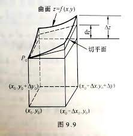
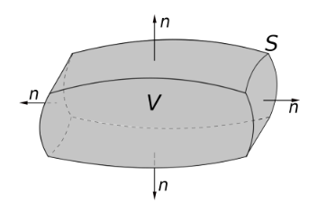
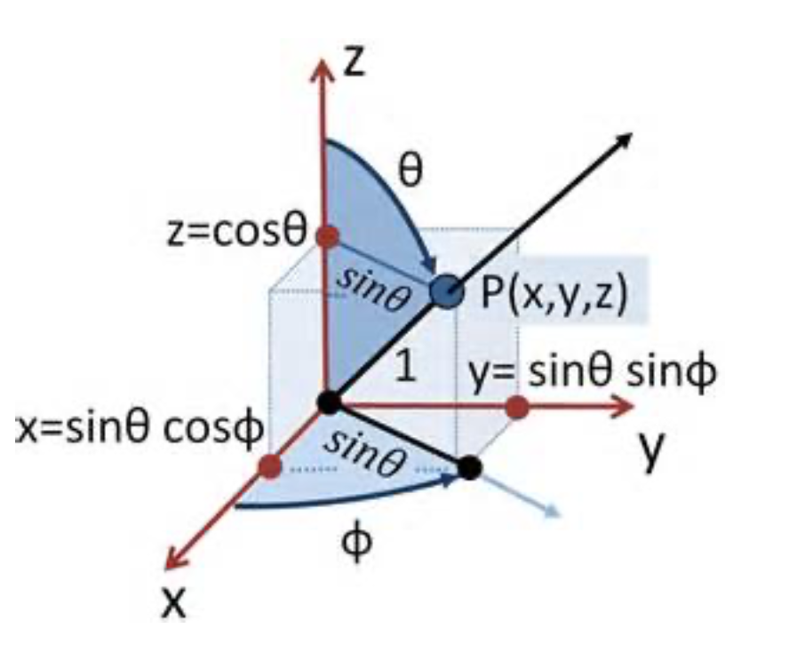

## Vector Analysis
Review
Triple product

* Vector triple product
$$
A \times (B\times C) = B(A \cdot C) - C (A \cdot B)
$$

Proved by expand $ABC$

* Scalar triple product
$$
A \cdot (B \times C) = B \cdot(C \times A)
$$
* 轮换

----

Q1. Show that
$$
(a \times b) \times (a\times c) = (a \cdot(b\times c))a
$$

$$
(a \times b) \cdot (c\times d) = (a \cdot c)(b \cdot d) - (a \cdot d)(b \cdot c)
$$

---

* Relation of divergences
$$
\nabla \cdot (fA) = (\nabla f) \cdot A + f(\nabla \cdot A)
$$

$\nabla$ operate on f, that's gradient, from the gradient definition.

* Relation of curls
$$
\nabla \times (fA) = (\nabla f) \times A + f(\nabla \times A)
$$

$\nabla$ operate on f, that's still gradient

### Second derivatives
| | |
|-|-|
|div grad f   curl grad f| $\nabla \cdot (\nabla f) = \nabla^2 f = \Delta f$   $\nabla \times (\nabla f) =0$ (可以看成两个相同的矢量相乘）|
|grad div A| $\nabla (\nabla \cdot A)$|
|div curl A   curl curl A| $\nabla \cdot  (\nabla \times A) =0$   $\nabla \times (\nabla \times A) = \nabla(\nabla \cdot  A) - \nabla^2 A$|

$\nabla \times (\nabla \times A) = \nabla(\nabla \cdot  A) - \nabla^2 A$的证明似乎也要展开，而不能使用$A \times(B \times C)$?不是的，
$$
A \times (B\times C) = B(A \cdot C) - C (A \cdot B)
$$
也可以写成

$$
A \times (B\times C) = B(A \cdot C) - (A \cdot B) C
$$

当$A \cdot  B$ 是数的时候，两个可以互换，但当他们是算符的时候就会丧失一定的一般性。

有二重导可以想想上面几个公式。

* **Note**: Extra for Laplace,$\nabla^2$:
* scalar: $\nabla^2f = \nabla \cdot (\nabla f)$
* vector: $\nabla^2 A \equiv (\nabla \cdot \nabla)A = \nabla (\nabla \cdot A) - \nabla \times (\nabla \times A)$

---

Q2. From Maxwell's equations
$$
\left\{\begin{matrix}
\nabla \cdot E = 0; \nabla \times E = - \frac{\partial B}{\partial t} \\
\nabla \cdot B = 0; \nabla \times B = \mu_0 \epsilon_0 \frac{\partial E}{\partial t} \\
\end{matrix}\right.
$$

Derive the wave equations:
$$
\begin{matrix}
\nabla^2 E = \mu_0\epsilon_0\frac{\partial^2 E}{\partial^2 t} \\
\nabla^2 B = \mu_0\epsilon_0\frac{\partial^2 B}{\partial^2 t} \\
\end{matrix}
$$

Solve:

Cross product to dot product: $\nabla \times (\nabla \times A) = \nabla(\nabla \cdot  A) - \nabla^2 A$

$$
\nabla \times (\nabla \times E)=-\mu_0 \epsilon_0 \frac{\partial^2 E}{ \partial t^2}
$$

So

$$
\nabla^2E= \mu_0 \epsilon_0 \frac{\partial^2 E}{ \partial t^2} + \nabla(\nabla \cdot E)
$$

While the divergence of $E$ is $0$, because:

$$
\begin{aligned}
\nabla \times \frac{\hat{r}}{r^2} &= \nabla \times \frac{\bold{r}}{r^3} \\
&=\nabla \times \left(\nabla \frac{1}{r}\right)\\
&=0
\end{aligned}
$$

* **NOTE**: How to understand $\nabla^2 A$? $\Rightarrow$ $(\nabla \cdot \nabla)E$

---

## Integral Calculus

Newton-Leibniz formula: 1D

$$
\int_{x_1}^{x_2} f(x) dx = F(x)|_{x_1}^{x_2}
$$

**Meaning**: Only care about the value on two side point. What about 3D?
$$
\int_{?}^{?}f(x,y,z)?dxdydz
$$

In 3D, three types of integrals

* Line (or path) integrals
* Surface integrals (or flux)
* Volume integrals

### line integrals
$$
\int_{a \mathcal{P}}^{b}v \cdot dl
$$

For a closed loop:
$$
\oint_\mathcal{P} \bold{v} \cdot d \bold{l} = 0
$$

Conservative(保守场):
$$
\int_{a \mathcal{P}}^b \bold{v} \cdot d \bold{l}
=\int_{a \mathcal{P'}}^b \bold{v} \cdot d \bold{l}
$$

不同路径的值是一样的

### Surface Integral
$$
\int_{\mathcal{S}} v \cdot dS
$$

Flux

* $dS$ surface define a direction
* $v$ or $E$ has a direction

Surface integral for a closed surface
$$
\oint_{\mathcal{S}} \bold{v}\cdot d\bold{S}
$$

### Volume Integrals
$$
\int_{\mathcal{V}}TdV
$$

### Fundamental theorem of gradient, divergence and curl

Like Newton-Leibniz equation, we only cares about the two side of, and there is no need to care about things in.

Meaning: 降维

$$
\int_{aP}^{b}\nabla f \cdot  d\bold{l}=f(b)-f(a)
$$
$$
\oint_{P} \nabla \mathcal{f} \cdot  d\bold{l}=0
$$

$$
\int_\mathcal{V}(\nabla \cdot \bold{v} )dV = \oint_\mathcal{S} \bold{v} \cdot  d \bold{S}
$$

$$
\int_{\mathcal{S}} (\nabla \times \bold{v}) \cdot d \mathcal{S} = \oint_{\mathcal{P}} \bold{v} \cdot  d \bold{l}
$$

---

### Proofs:
#### Fundamental theorem of gradient:

From the beginning $\nabla f \cdot dl \equiv df$
$$
\begin{aligned}
\int df \cdot dl =& \int_{r(x,y,z)}^{r'(x,y,z)} \frac{\partial f}{ \partial x} dx + \frac{\partial f}{ \partial y} dy + \frac{\partial f}{ \partial z} dz\\
=& \int \frac{\partial f}{ \partial x} dx + \ldots \\
=& f(x_1,y_0,z_0) - f(x_0,y_0,z_0) \\
&+f(x_1,y_1,z_0) - f(x_1,y_0,z_0)\\
&+ f(x_1,y_1,z_1)-f(x_1,y_0,z_0)\\
=& f(x_1,y_1,z_1) - f(x_0,y_0,z_0)
\end{aligned}
$$
最后一步的图像类似：

---
#### Fundamental theorem of divergence:

$$
\int_\mathcal{V}(\nabla \cdot \bold{v} )dV = \oint_\mathcal{S} \bold{v} \cdot  d \bold{S}
$$

先看通量，右边

* 对一个面$v$ has 3 values
	+ $v_x(x,y,z)$
	+ $v_y(x,y,z)$
	+ $v_z(x,y,z)$

* Surface vector points out forward of a small volume

$$
\begin{aligned}
\bold{v} \cdot  d\bold{S} &= [v_x(x_2) - v_x(x_1)]dydz\\
&+ [v_y(y_2) -v_y(y_1)] dxdz\\
&+ [v_z(z_2) -v_z(z_1)] dxdy\\
&= \left[\frac{\partial v_x}{ \partial x} + \frac{\partial v_y}{ \partial y} + \frac{\partial v_z}{ \partial z}\right] dxdydz\\
&= \nabla v \cdot  dV
\end{aligned}
$$

这也是**散度**这么定义的来源

Why $v(x)$ from left to right:
$$
v = v_x \hat{x} + v_y\hat{y} + v_z\hat{z}
$$

#### Fundamental theorem of curl:
$$
\int_\mathcal{S} (\nabla \times  \bold{v}) \cdot d \bold{S} = \oint_P \bold{v} \cdot  d \bold{l}
$$

同样从右边看，看一个小的环路的积分，微元加起来，重复的边界 cancel 掉了

## Curvilinear Coordinates
### Spherical polar coordinates (SPC):
$$
\begin{aligned}
x &= r\sin \theta \cos \phi\\
y &= r \sin \theta \sin\phi\\
z &= r \cos \theta
\end{aligned}
$$

Direction of $\theta$ is increase of theta

Unlike Descartes(笛卡尔) coordinates, the SPC coordinates changes with $r$ ,$\theta$ $\phi$,坐标轴会变。

If we want to calculate the value of infinite small volume, because $\theta$ $\phi$ are not length, we need to 要算体积微元, $dl$ $dl_\theta$ $dl_\phi$

$$
\begin{aligned}
dl_r &= dr = h_1 dr\\
dl_\theta &= r d\theta =h_2 d\theta\\
dl_\phi &= r \sin \theta d \phi = h_3 d\phi
\end{aligned}
$$

Here $h_1,h_2,h_3$ are geometrical factors

For Cylindrical coordinates:

* 和$x$ 夹角$\phi$
* $r$投影到$x-y$ 平面长度
* z
$$
\begin{aligned}
dl_s &= ds = h_1 ds\\
dl_\phi &= s d\phi =h_2 d\phi\\
dl_z &= d z = h_3 dz
\end{aligned}
$$
